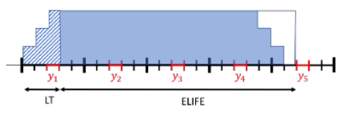

# Multi-year investments

Multi-year investments refer to making investment decisions at different points in time, such that a pathway of investments can be modeled. This is particularly useful when long-term scenarios are modeled, but modeling each year is not practical. Or in a business case, investment decisions are supposed to be made in different years which has an impact on the cash flow.

There are two tutorials related to multi-year investments: [Capacity planning Tutorial](https://spine-tools.github.io/SpineOpt.jl/latest/tutorial/capacity_planning/) and [Multi-year investments](https://spine-tools.github.io/SpineOpt.jl/latest/tutorial/capacity_planning/#Multi-year-investments). This section covers the concepts of multi-year investments in SpineOpt, but we highly recommend checking out these tutorial for a more thorough understanding of how the model is set up.

## Basic idea

SpineOpt offers flexibility to the users so that different things can be modeled given specific set-ups and inputs of the model. This flexibility can be greatly illustrated by the multi-year investments modeling. We apply the same mathematical formulation for any capacity planning exercises, as shown in [Capacity planning Tutorial](https://spine-tools.github.io/SpineOpt.jl/latest/tutorial/capacity_planning/). For the multi-year model, what you would need differently from a single-year model is mainly the specification of the temporal structure, i.e., the investment period and operational period, and the rest works very much similarly to a single-year model.

## Economic representation

### Parameters
It can be tricky to put the correct cost parameters into the model since factors like discounting and end-of-lifetime effects have to be taken into account. For that purpose, SpineOpt has incorporated some dedicated parameters for economic representation. Set the parameter `multiyear_economic_discounting` with a corresponding valid value will activate these paramters.

**Discounted annuities**

This factor translates the overnight costs of investment into discounted (to the discount_year) annual payments, distributed over the total lifetime of the investment. For a merely demonstrative example, we assume a case where investment payments increase linearly over the lead-time, and decrease linearly towards the end of the economic lifetime. This is illustrated in the figure below:

In such a case, we first calculate the fraction of payment per year (e.g. something like 0.25, 0.5, 0.75, 1 over the lead time; 1 for the economic lifetime minus the lead time, and 0.75, 0.5, 0.25 and 0 for the remaining economic lifetime). Each payment fraction is then multiplied by the discounting factor of the payment year with respect to the discounting year (e.g. start of optimization).

**Salvage fraction**

As we consider (discounted and annuitized) overnight costs in the objective function, it can happen that the lifetime of a unit exceeds the model horizon. In such cases, the salvage fraction needs to be deducted from the objective function. In principle, this means, that the annuities "already paid", which exceed the modelling horizon, are recuperated.

**Discounted durations**

The discounted duration is used to discount operational costs within a certain investment period to the discount year (e.g. beginning of the optimization). If milestone years are used for investments, the discounted duration is calculated for each investment period as defined by investment temporal blocks, otherwise, it will be calculated on a yearly basis.

**Technology specific discount factors**

The technology specific discount factor can be used, if e.g. investments in a certain technology are particularly risky. The default value for this parameter is 1.

### Adaptions objective terms

When `multiyear_economic_discounting` is set to a valid value:

- Investment costs are multiplied with discounted annuties conversion factor and the technological discount factor and (1 - salvage fraction).

- Operational cost terms are multiplied with the discounted duration factor.

### Additional information

More information can be found in the following files.

- [Economic discounting in SpineOpt](https://github.com/Spine-project/SpineOpt.jl/files/9130471/Spine_invest.3.pdf) contains the details of the calculation of the economic prameters. Note that this document covers more concepts than what is currently available in SpineOpt (the available ones are the parameters listed above and the adaptions in the objective), the rest is under development.

- [Economic parameters calculation tool](https://github.com/Spine-project/SpineOpt.jl/files/9130469/parameter_illustration.2.xlsx) is an excel tool that you can use to calculate the economic parameters on your own.

!!! warning
    Please also note that the use of economic representation in SpineOpt does not support rolling horizon and Benders' decomposition, which warrants future improvements.