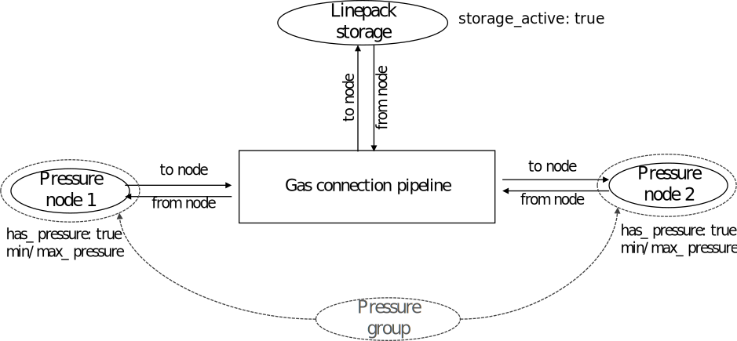

# [Pressure driven gas transfer](@id pressure-driven-gas-transfer)

The generic formulation of SpineOpt is based on a trade based model. However,
network physics can be different depending on the traded commodity.
This chapter specifically addresses the use of pressure driven gas transfer
models and enabling linepack flexibility in SpineOpt. To this date, investments in pressure driven pipelines are not yet supported within SpineOpt. The use of multiple feed-in nodes, e.g. to represent multiple commodity flows through a pipeline is not yet supported.

For the representation of pressure driven gas transfer, we use the MILP formulation, as described in [Schwele - Coordination of Power and Natural Gas Systems: Convexification Approaches for Linepack Modeling](https://doi.org/10.1109/PTC.2019.8810632). Here, the non-linearities associated with the Weymouth equation are convexified through an outer approximation of the Weymouth equation through fixed pressure points.

## [Key concept](@id key-concepts-advanced-gas)
Here, we briefly describe the key objects and relationships required to model pressure driven gas transfers in SpineOpt.

1. **[connection](@ref)**: A connection represents the gas pipeline being modelled. Usually the direction of flow is not known a priory. To ensure that the flow through the gas pipeline is unidirectional, the parameter [has\_binary\_gas\_flow](@ref) needs to be set to `true`.
2. **[node](@ref)**: Nodes with different characteristics are used for the representation of pressure driven gas transfer.
    - For each connection, there will be two nodes representing the start and end point of the pipeline. Associated with these nodes are the following parameters: the [has\_pressure](@ref) parameter, which needs to be set to true, in order to create the variable [node\_pressure](@ref); the [max\_node\_pressure](@ref) and [min\_node\_pressure](@ref) to constrain the pressure variable.
    - To leverage linepack flexibility, a third node is introduced representing the linepack storage of the pipeline. To trigger the storage linepack and hence, [node\_state](@ref) variables, the [has\_state](@ref) parameter needs to be set to `true`.
3. **[connection\_\_to\_node](@ref) and [connection\_\_from\_node](@ref)** To enable flows through the pipeline and into the linepack storage, each [node](@ref) has to have both these relationships in common with the connection pipeline. These relationships will trigger the generation of [connection\_flow](@ref) variables in all possible directions.
4. **[connection\_\_node\_\_node](@ref)** This relationship is key to the pressure driven gas transfer, holding the information about the pipeline characteristics and bringing the elements into interaction.
    - The parameter [connection\_linepack\_constant](@ref) holds the linepack constant and triggers the generation of the [line pack storage constraint](@ref constraint_storage_line_pack). Note that the first node should be the linepack storage node, while the second node should be a [node\_group](@ref Introduction-to-groups-of-objects) of both, the start and the end node of the pipeline.
    - The linearization of the Weymouth equation through outer approximation relies on the use of fixed pressure points. For this purpose, the two parameters [fixed\_pressure\_constant\_1](@ref) and [fixed\_pressure\_constant\_0](@ref) hold the fixed pressure constants and trigger the generation of the [constraint\_fix\_node\_pressure\_point](@ref constraint_fixed_node_pressure_point). The constraint introduces the relationship between pressure and gas flows. Note, that the pressure constants should be entered in a way, that the first node represents the origin node, the second node the destination node. Each connection should have a [connection\_\_node\_\_node](@ref) to each combination of its start and end nodes (and associated parameters). (See [Schwele - Coordination of Power and Natural Gas Systems: Convexification Approaches for Linepack Modeling](https://doi.org/10.1109/PTC.2019.8810632))
    - By default, pipelines are considered to be passive. However, a compression station between two pipeline pressure nodes can be represented by defining a [compression\_factor](@ref). The relationship should be defined in such a manner, that the first node represents the sending node, the second node represents the receiving node, which pressure is equal or smaller to the pressure at the sending node times the compression factor.
    - Lastly, to ensure the balance between incoming/outgoing flows and flows into the linepack, the ratio between the flows need to be fixed. The average incoming flows of the node group (of the pressure start and end nodes) have to equal the flows into the linepack storage, and vice versa. Therefore, the [fix\_ratio\_out\_in\_connection\_flow](@ref) needs to be set to a value (typically 1) for the (pressure group, linepack storage) node pair, and for the (linepack storage, pressure group) node pair.

A gas pipeline and its connected nodes are illustrated below. A complete mathematical formulation can be found [here](@ref pressure-driven-gas-transfer-math).

