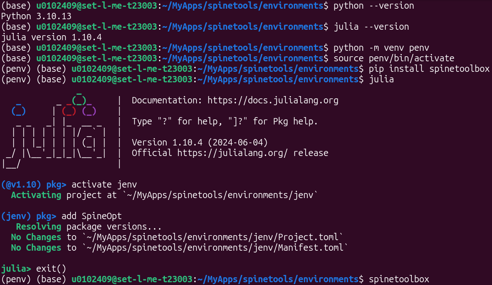
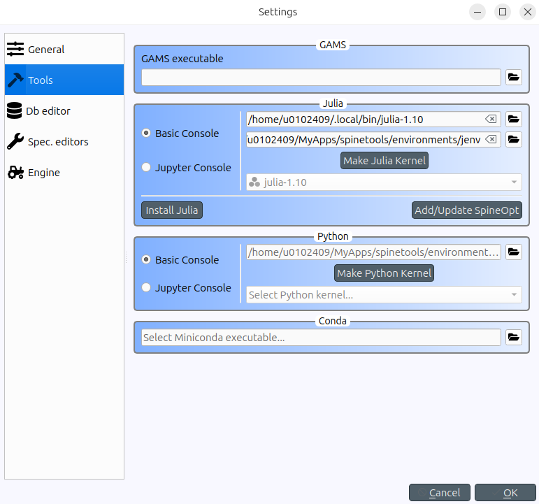

# [Installation](@id installation)

There are different ways to install and run SpineOpt. Here, we cover the recommended installation process with Spine Toolbox. For more advanced installations, we refer to the [Spine Installation Tools repository](https://github.com/spine-tools/spine-installation-tools).

The process consists of a few simple steps:

* Install prerequisites
* Prepare the (optional) folder structure
* Install Spine Toolbox
* Install SpineOpt
* Configure Spine Toolbox for SpineOpt

The figures below are a summary of this process that will be further explained in the following sections. Take note of the path in which the terminal is openend, i.e. an environments folder in a spinetools folder, as well as the environments that are active, indicated by the brackets at the start of the line, e.g. (jenv). Also note that the code in the image is for Linux; for Windows the terminal will look a bit different and the line `source penv/bin/activate` needs to be replaced by `call penv\Scripts\activate`.





## Prerequisites
Spine Toolbox needs [Python](https://www.python.org/) (version 3.10 or above) and SpineOpt needs [Julia](https://julialang.org/) (version 1.10 up to 1.11).

To check whether these are installed properly, open the terminal and type:

```bash
python --version
julia --version
```

!!! warning
    We try to keep up with the latest versions of these programming languages. But sometimes we need a little time. For instance, at the time of writing, Julia 1.12 has been released but SpineOpt is not yet compatible with that version. If you have a version that is too new, you may need to install an older version. Check the Project.toml file in the SpineOpt repository for the exact version requirements and compatibility.

!!! tip
    Typically you'd install Julia from the [website](https://julialang.org/downloads/).

    However, on Linux, it may be more convenient to install Julia through Python:
    ```
    pip install jill
    jill install
    ```

    And, on Windows, it may be more convenient to install Julia from the Windows store (as that automatically configures the registry as well).

## Prepare the folder structure

This step is not strictly necessary as you can install spine tools in any folder and any environment. Feel free to choose your own structure. Though for a first installation, it may be easier to follow along.

Let's start with making the folder `spinetools` in your user directory. On a system administered computer, ask IT for a folder where an application has reading and writing permissions and create the folder there.

To ensure that spine tools do not interfere with other python/julia packages on the system, we'll be installing spine tools in [virtual environments](https://www.geeksforgeeks.org/python/python-virtual-environment/) and we'll store these environments in a folder originally named `environments`. We'll need a separate environment for Python and for Julia and we'll give the folders that contain these environments the equally original names `penv` and `jenv`. During the creation of the environments, the folders will be created automatically so we don't need to do that now. However, we can already make them now to have an idea of what our folder structure will look like.

The resulting folder structure that we will use, looks something like this:

* spinetools
    * environments
        * penv
        * jenv

## Install Spine Toolbox

As mentioned before, we'll install Spine Toolbox in a virtual environment. Navigate to the environments folder and open the terminal inside that folder. Once the terminal is open, check that the terminal shows the path to the environments folder. Otherwise use the cd command to navigate to that folder. Below you find an example for how that command would look like on Linux:

```bash
cd ~/spinetools/environments
```

To create a Python environment for Spine Toolbox we use the simple command:

```bash
python -m venv penv
```

!!! info
    To explain the code above a bit more, venv is a python command to create a virtual environment in the path penv that we created before. We don't need to create the path upfront and we don't need to navigate to the environments folder as we can simply add the path directly to the venv command and it will create the path if it does not exist already.

    ```bash
    python -m venv ~/spinetools/environments/penv
    ```

We have created the environment, but we are not inside the environment yet. We need to activate it first. This is different on Linux/mac and Windows. We continue from the same terminal. If you had closed it in the meanwhile, you need to open the terminal again and navigate back to the environments folder.

On Linux (and mac?), we can activate the environment with the activation script that has been created somewhere in the penv folder. To use the activation script, we call the 'source' command.

```bash
source penv/bin/activate
```

On Windows, we can call the 'call' command (notice that the dashes are reversed on Windows).

```cmd
call penv\Scripts\activate
```

The terminal should now show that the penv environment is active by (penv) at the start of the line. Spine Toolbox can now simply be installed with pip.

```bash
pip install spinetoolbox
```

To open Spine Toolbox, simply call spinetoolbox from within the Python environment.

```bash
spinetoolbox
```

!!! warning
    Every time you want to open Spine Toolbox, you'll have to activate the Python environment first.

!!! tip
    To ease the process, you can make a 'run_spinetools' script that automatically does this for you. An example can be found in the [Spine Installation tools repository](https://github.com/spine-tools/spine-installation-tools).

    For Linux, create a 'run_spinetools.sh' (bash) file. The following lines of code should be pasted in that file. Make sure to adjust the path to the actual path of the Python environment that you used to install Spine Toolbox.

    ```bash
    #!/bin/bash
    cd path/to/environments
    source penv/bin/activate
    spinetoolbox
    ```

    You'll also have to give the file the necessary permissions. Depending on your distribution, there may be a built-in way to do this. Otherwise run the 'chmod' command:

    ```bash
    chmod +x path/to/script_folder/run_spinetools.sh
    ```

    For Windows, create a 'run_spinetools.bat' file (you can make a text file and change the extension from '.txt' to '.bat'). The following lines of code should be pasted in that file. Make sure to adjust the path to the actual path of the Python environment that you used to install Spine Toolbox. Note that the `call` command is necessary in a script like this whereas it is optional when you enter these commands manually, in which case you can simply type the path to the activate file.

    ```cmd
    cd path/to/environments
    call penv/Scripts/activate
    spinetoolbox
    ```

    

## Install SpineOpt

The process for installing SpineOpt is very similar. If you close Spine Toolbox in the previous step, you can use the same terminal for the installation of SpineOpt. The terminal should indicate that you are still in the `environments` folder (it does not matter whether the python environment is still active or not). Otherwise, open a new terminal and navigate to the `environments` folder again.

For the creation of the Julia environment and the installation of SpineOpt, we will be using the Julia REPL. To activate the Julia REPL, simply call 'julia' from the terminal.

```bash
julia
```

We can call the package manager with julia code but we can also enter package manager mode of the REPL by pressing the `]` key. the first line should change from 'julia>' to 'pkg>'.

To create the Julia environment, we simply type:

```julia
activate jenv
```

The environment should be created and we enter the environment automatically as indicated by (jenv) at the start of the line.

Now we can add the SpineOpt package to the environment as you would normally install a Julia package.

```julia
add SpineOpt
```

SpineOpt is now available as a Julia package in the jenv environment. Similar to Spine Toolbox, every time you want to use the package you'll have to activate the jenv environment. In Julia, the command to activate the environment is the same as the command to create the Julia environment.

!!! info
    SpineOpt can also be installed from within Spine Toolbox. Spine Toolbox follows a very similar procedure as the one described above but guides you with a wizard. We showed the underlying principle such that you can also install SpineOpt independently from Spine Toolbox.

## Configure Spine Toolbox for the use of SpineOpt

In order to use SpineOpt from within Spine Toolbox, we need to point Spine Toolbox to the Julia environment in which we installed SpineOpt. Additionally we can install a plugin with some predefined scripts to run SpineOpt as a Spine Toolbox tool.

Open the Python environment and open Spine Toolbox. If you are still in the same terminal you can simply type `spinetoolbox`. Otherwise, open a new terminal, activate the python environment and then open Spine Toolbox. For example, on Linux:

```bash
source ~/spinetools/environments/penv/bin/activate
spinetoolbox
```

We'll point Spine Toolbox to the Julia environment in the settings. Navigate to 'File > Settings > Tools'. Under 'Julia' there are two paths. The first is for the Julia installation itself. There should be no problems with this path but to be sure do check that it is correct. The second is for the Julia environment. If it is empty it shows 'Using Julia default project'. Put the path to the jenv environment here.

To add the SpineOpt plugin, navigate to 'Plugins > Install plugin ...' and select the SpineOpt plugin.

## Next steps

That brings an end to the installation process of Spine Toolbox and SpineOpt. However, before starting a tutorial, we recommend to [verify](@ref recommended_workflow) the installation first. If there are any troubles with the installation, you can try [troubleshooting](@ref troubleshooting).
