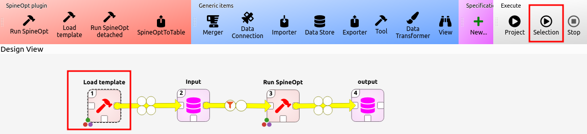
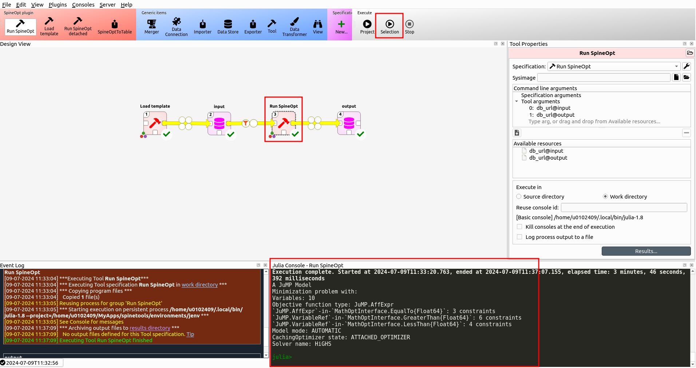
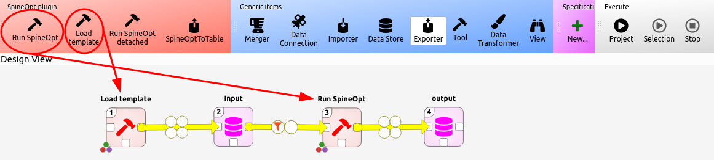

# [Verify installation](@id recommended_workflow)

Now that we've installed Spine Toolbox and SpineOpt, let's make sure that everything truly works by running an example. We'll be using an existing example to ensure that any issues we may encounter at this point are related to the installation. If you indeed encounter any problems, check the [troubleshooting](@ref troubleshooting) section. On the other hand, if you are able to successfully complete this example, you can continue to a first hands on experience with the tutorials.

In short, we'll create a new project in Spine Toolbox where we'll set up a simple workflow for using SpineOpt. We'll create an input database with meaningful data in the SpineOpt format, run SpineOpt on that input and examine the output. The steps to take are:
1. Open Spine Toolbox and create a new project: File > New Project
2. Drag 2 *Data Store* items, the *Load Template* tool and the *Run SpineOpt* tool from the *ribbon* to the *design view*. Each time you drag an item to the design view you are prompted to choose a name for the item. The default names are ok but for clarity we'll name the Data Store items 'input' and 'output'.
3. Connect the items with (yellow) arrows as following: Load Template > input > Run SpineOpt > output
    
4. For each Data Store item
    1. select the Data Store item in the design view by a single click on the item, you should see a *Data Store properties* window (typically to the right of the design view).
    2. Choose the SQL database dialect (sqlite is a local file and works without a server).
    3. Click *New Spine DB* to create a new database (and save it, if it's sqlite).
    
5. For each tool
    1. select the tool in the design view by a single click on the tool, you should see a *Tool properties* window (typically to the right of the design view).
    2. Drag the available sources (i.e. the databases) to the *tool arguments*. The order of matters. Make sure that the input is the first argument and the output is the second argument.
    
6. Select the Load Template tool and press the 'Run Selection' button in the ribbon (and wait until the process is done).
    
7. Download the [data of an existing example](https://github.com/spine-tools/SpineOpt.jl/blob/master/examples/simple_system.json) (click on the link, and in the GitHub page that opens, press the icon in the upper right corner that shows a downward arrow).
8. Double click the input database to open the *spine db editor*.
    1. File > Import
    2. Navigate to the downloaded file and wait until Spine Toolbox indicates that it has imported the data
    3. Save the imported data by pressing the 'commit' button.
    4. Close the spine db editor
    
9. Select the 'Run SpineOpt' tool and press the 'Run Selection' button in the ribbon (or press the 'Run Project' button)
    

The remainder of this section explains each of these steps in more detail with the aim to get more familiar with the use of Spine Toolbox and SpineOpt.

## Create a workflow for SpineOpt in Spine Toolbox

To create a workflow, we first need to open spinetoolbox and create a new project: File > New project

Our workflow in this project is going to consist of 2 databases (*Data Store*) and 2 tools (*Load Template* and *Run SpineOpt*). Drag these items from the ribbon to the *design view*. Everytime you drag a tool or database to the design view, Spine Toolbox will ask for a name for the tool. We'll call one database 'input' and the other 'output'. For the tools we can accept the default names. In the design view it is possible to connect these tools and databases by dragging yellow arrows between them (click on the white square connections). Connect them as following: Load Template > input > Run SpineOpt > output




Each of the databases need to be initialised:
1. Select the database, you should see the *Data Store Properties* window (typically on the right of the design view).
2. Choose the SQL database dialect (sqlite is a local file and works without a server).
3. Click *New Spine DB* to create a new database (and save it, if it's sqlite).


Each of the tools need to be connected to the databases. The connections we made before were only the available connections, we need to explicitly tell our tools to use these available connections.
1. Select the tool, you should see the *Tool Properties* window (typically on the right of the design view). Now that you've initialised the databases, you should also see the *available resources*.
2. Drag the available sources to the *tool arguments*. The order of matters. Make sure that the input is the first argument and the output is the second argument.


To summarize, we've created a workflow where we first format the spine database to a SpineOpt database by loading the SpineOpt template into that database. Remember that a SpineOpt database is a spine database but a spine database is not necessarily a SpineOpt database. A spine database only provides an abstract data structure with entity classes, entities, parameter definitions, parameter values, alternatives, scenarios etc. A SpineOpt database additionally includes entity classes (e.g., "unit", "node", "unit__to_node") and parameter definitions (e.g., "number_of_units", "fuel_cost", etc.) that introduce the energy system concepts used in SpineOpt. In the next section we'll manually intervene at this point to add meaningfull data to this database. Once we have the input database with meaningful data in the SpineOpt format, we run SpineOpt. SpineOpt will then write its results in the output database.

!!! info
    If no 'Data Store' is specified for the output, the results of SpineOpt will be written by default to the input 'Data Store'. However, it is generally preferable to define a separate output data store for results.


## A meaningful input database for SpineOpt

To prepare the input database for SpineOpt we are going to do 2 things:
1. We'll format the spine Database to a SpineOpt database.
2. We'll import and examine data from an existing example (i.e. the simple system tutorial).

To format the spine Database, select and execute the *Load template* tool. To execute the tool, we do not need to run the entire project, instead we can run the selection. (No worries if you accidentally ran the entire project. The Run SpineOpt tool may fail or the output database is meaningless. But that will resolve itself in the next steps.)


Note that the *Load template* tool makes use of SpineOpt. This is therefore the first part where we may run into troubles if SpineOpt is not installed correctly. If we select the tool, we can see the console output of the tool (typically on the lower right) and can follow along what it is doing.

!!! warning
    SpineOpt is written in Julia. Every Julia session, i.e. everytime you run a Julia tool in Spine Toolbox for the first time since Spine Toolbox is active, Julia needs to compile the SpineOpt package before the tool actually runs. That compilation process takes time. It is possible to precompile Julia but that is quite advanced.
    
    During compilation, SpineOpt displays some warnings that can be ignored, i.e.:
    ```Julia
    WARNING: using JuMP.parameter_value in module SpineInterface conflicts with an existing identifier.
    WARNING: using JuMP.Parameter in module SpineInterface conflicts with an existing identifier.
    ```

Now it is time to add information to import meaningful data to the input database. To that end we'll first need to get a file with the data. We can find that file on the SpineOpt repository on github. There is an examples folder with functioning examples. Let's take the [simple system tutorial](https://github.com/spine-tools/SpineOpt.jl/blob/master/examples/simple_system.json). It does not matter where you save this file on your system but it is possible to place it in the folder of your spine project.

!!! info
    These example files are part of our tests for the master branch so they should always work correctly.

To import a '.json' file to a spine database, take the following steps:
1. Double click on the input database to open the *spine db editor*.
2. In the spine db editor go to: File > Import
3. Navigate to your file and wait until Spine Toolbox indicates that it has imported the data
4. Save the imported data by pressing the 'commit' button.


Now, let's examine what we see in the spine db editor. Typically you'll see a list of entities on the left, a table of parameters in the middle and alternatives/scenarios on the right. Something that will also be particularly useful (in the beginning) is the *graph view*. Click the 'graph' button in the ribbon on top to open the graph view. The view only shows what has been selected (as well as what is connected to that selection) so we won't see much yet. If you select 'root' in the list of entities on the left, you'll see everything. There is some stuff in the database that is typically hidden which clutters up the view so that is not particularly useful. Instead select 'unit'.

In the graph view you should now see a small energy system with a fuel node, two power plants and an electricity node. As you would expect, this is a system which chooses the cheapest power plant to supply the demand in the electricity node. As we can see in the parameters for the unit, each plant has a different variable operation cost (vom) and capacity. In other words, the system will choose the plant with the lowest vom cost until it is limited by its capacity. Then the system will choose the other plant.


Besides the data for the system, the database also contains data for the optimization model. To view that data select 'model' in the list of entities.

In the graph view you should now see a model at the center and different structures attached to it. The model entity contains information on, e.g., the solver to be used by the model. SpineOpt has a flexible temporal and stochastic structure, allowing for the use of different data structures to represent time and uncertainty within the model (for more details, see [Temporal Framework](https://spine-tools.github.io/SpineOpt.jl/latest/advanced_concepts/temporal_framework/) and [Stochastic Framework](https://spine-tools.github.io/SpineOpt.jl/latest/advanced_concepts/stochastic_framework/)). These are specified through the respective entities. If you select each of these entities, you can see that they are only connected to the model. That means that for this system, all entities use the same temporal structure by default. But if we want, we can add a specific temporal structure for a specific entity. The same holds for the stochastic structure. The stochastic structure manages the scenarios it is connected to. Here, there is only one scenario implying we are using a deterministic system. Finally, the model is also connected to a report. The report determines what is written to the output database when SpineOpt runs. In particular, any output entity connected to the report will appear in the output database.


!!! warning
    There is a difference between *scenarios* in SpineOpt and SpineToolbox! Spine Toolbox uses 'alternatives' and SpineOpt uses 'entities'.
    
    The Spine Toolbox scenarios can be used for, e.g., a Monte Carlo analysis. To use the Spine Toolbox scenarios, create a new alternative in the (typically) right panel and add it to a scenario (typically panel below the alternatives). You can then access these alternatives in the alternative field of a parameter.

    The SpineOpt scenarios are used for robust solutions of the SpineOpt model. To use the SpineOpt scenarios, create a new scenario entity and connect it to a stochastic structure entity. You can then use a map of scenarios and values in the value field of a parameter.

    For the latter there will be a tutorial later on.


!!! info
    For more information about creating and managing Spine Toolbox database, see the [documentation for the spine database editor](https://spine-toolbox.readthedocs.io/en/latest/spine_db_editor/index.html)

## Run SpineOpt

Back in the Spine Toolbox workflow, we now have a meaningful input database for SpineOpt. We can therefore run SpineOpt. Select the 'Run SpineOpt' tool and press the 'Run Selection' button in the ribbon.

While the tool runs, you can keep an eye on the console (typically lower right panel). A lot of information is displayed here. Amongst others, there is information on building the model and the optimality. Any errors will also appear here.


!!! warning
    Not only does this process take a while to run due to the compilation time but also to build the model. That is because the flexible structure is quite complex. SpineOpt is therefore less suited for simple models but should perform well for more complex models.

## Examine the output of SpineOpt

Finally, we can also take a look at the output of SpineOpt. You can view the data the same way as you do for the input data. By double clicking the output database you open the spine db editor. There is not much to see in the graph view, so we'll look at the table of parameters. This time we can select the root (on the left) and we'll see all the output of the database in the table (on the middle).

For this example, we see the flows throughout the system. We can look at the production of each powerplant. We may need to scroll but eventually we see that the values are 'time series'. By double clicking on these values we get the values of this time series as well as a plot of the values.

Indeed, the power plant with lower vom cost is used at its maximum and the other plant is used whenever necessary.
