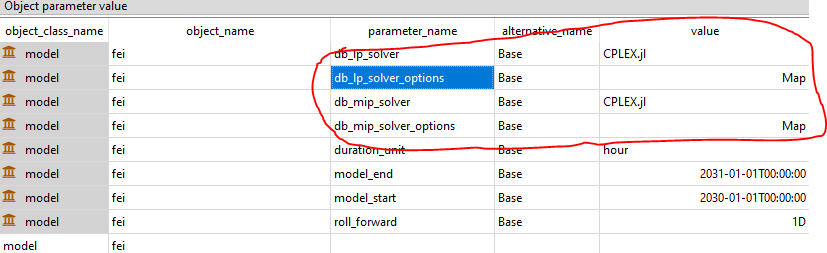

# [How to change the solver](@id how-to-change-solver)

If you want to change the solver for your optimization problem in SpineOpt, here is some guidance:
- You can change the solvers in your input datastore using the `db_lp_solver` and `db_mip_solver` parameter values of the `model` object.
- You can specify solver options via the `db_lp_solver_options` and `db_mip_solver_options` parameters respectively. These are map parameters where the first key is the solver name exactly as the `db_mip_solver` or `db_lp_solver` name, the second key is the solver option name and the value is the option value.
- You can get a head start by copying the default map values for `db_lp_solver_options` and `db_mip_solver_options`. You can access the default values by clicking on the 'Object parameter definition' tab.
- If you were trying to change the solver using the arguments to `run_spineopt()`, this is not the recommended way and will soon be deprecated.
- The solver name corresponds to the name of the Julia package that you will need to install. Some like HiGHs.jl are self contained and include the binaries. Others like CPLEX.jl and Gurobi.jl you will need to point the package to your locally installed  binaries - the julia packages have the instructions to do this.

The first option is the easiest. The more advanced way of using the solver options is illustrated below.

Set the model parameter values to choose the solvers and set the solver options:

This is what the solver options map parameter value looks like:

To get a head start with solver options, you can copy their default map values from the parameter definition tab like this:

