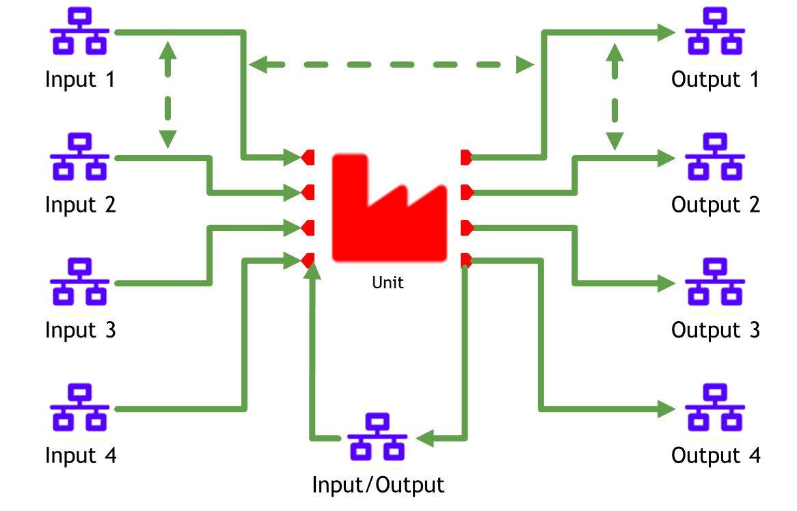
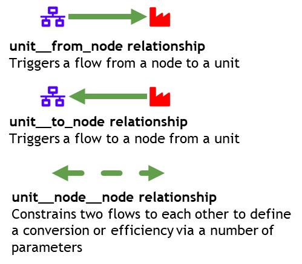
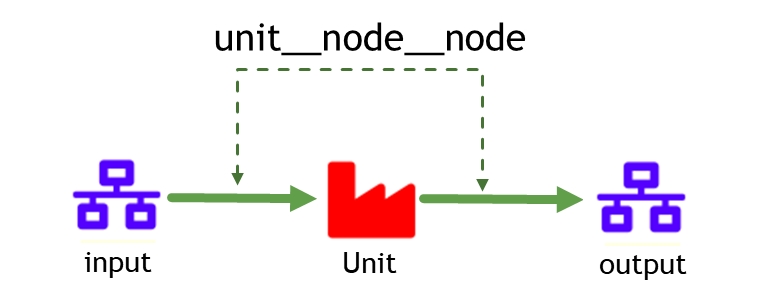
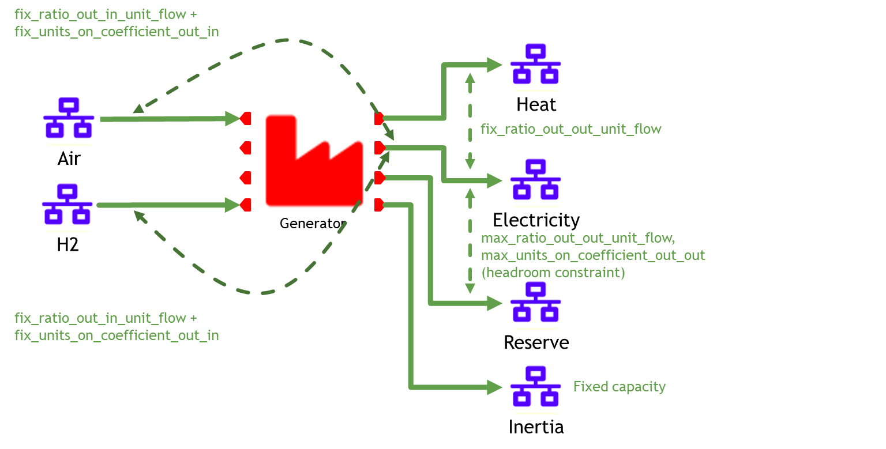

# How to define an efficiency

## relationships between the inputs and outputs of a unit

The image below shows an overview of the possible relationships between the inputs and outputs of a unit.

The key capability requirements are:
 - Easily define arbitrary numbers of input and output flows
 - Easily create piecewise affine linear relationships between any two flows
 - Anything more complicated can be done via user_constraints

## unit\_flow\_\_unit\_flow relationship

 (NOTE! The figure uses the old input data structure)

The [flow\_ratio\_equality\_coefficient](@ref) parameter of the [unit\_flow\_\_unit\_flow](@ref) relationship class allows you to constrain two [unit\_flow](@ref var_unit_flow) relationships to each other. Ordering of the [unit\_flow](@ref var_unit_flow) entities in the [unit\_flow\_\_unit\_flow](@ref) relationship matters: 
- [node\_\_to\_unit](@ref) ǀ [unit\_\_to\_node](@ref): equivalent to an (incremental) heat rate when the unit is the same in both.*Input\_flow = [flow\_ratio\_equality\_coefficient](@ref) * output\_flow + [flow\_ratio\_equality\_online\_coefficient](@ref) * [units\_on](@ref var_units_on).* It can be piecewise linear, used in conjunction with [operating\_points](@ref) with monotonically increasing coefficients (not enforced). Used in conjunction with [flow\_ratio\_equality\_online\_coefficient](@ref) triggers a fixed flow when the unit is online and [flow\_ratio\_start\_flow](@ref) triggers a flow on a unit start (start fuel consumption).
- [unit\_\_to\_node](@ref) ǀ [node\_\_to\_unit](@ref): equivalent to an efficiency when the unit is the same in both. *`output_flow` = [flow\_ratio\_equality\_coefficient](@ref) * `input_flow` + [flow\_ratio\_equality\_online\_coefficient](@ref) * [units\_on](@ref var_units_on).* The units online variable coefficient is added with [flow\_ratio\_equality\_online\_coefficient](@ref).
- In addition to [node\_\_to\_unit](@ref) ǀ [unit\_\_to\_node](@ref) and [unit\_\_to\_node](@ref) ǀ [node\_\_to\_unit](@ref) relationships, you can also define the [flow\_ratio\_equality\_coefficient](@ref) parameter for [node\_\_to\_unit](@ref) ǀ [node\_\_to\_unit](@ref) and [unit\_\_to\_node](@ref) ǀ [unit\_\_to\_node](@ref) relationships.
- Furthermore, you can have [flow\_ratio\_less\_than\_coefficient](@ref) and [flow\_ratio\_greater\_than\_coefficient](@ref) for any two [unit\_flow](@ref var_unit_flow) entities. For example: [flow\_ratio\_less\_than\_coefficient](@ref) for [node\_\_to\_unit](@ref) ǀ [unit\_\_to\_node](@ref) creates the following constraint:
*`input_flow` < [flow\_ratio\_less\_than\_coefficient](@ref) * `output_flow` + [flow\_ratio\_less\_than\_online\_coefficient](@ref) * [units\_on](@ref var_units_on)*

## real world example: Compressed Air Energy Storage

To give a feeling for why these functionalities are useful, consider the following real world example for Compressed Air Energy Storage:

