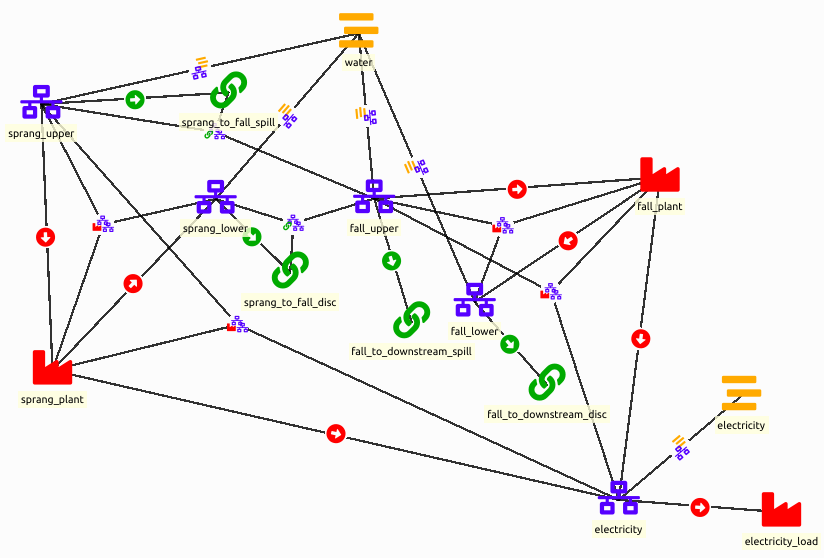
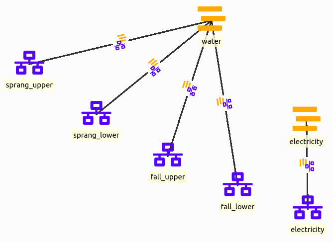
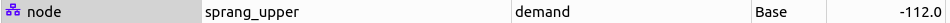
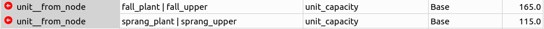
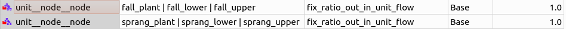
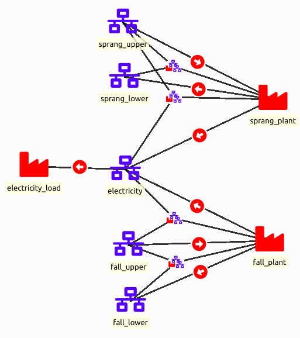

# How to model hydro power coupling

This how-to aims at demonstrating how we can model a hydropower system
in Spine (*SpineOpt.jl* and *Spine-Toolbox*) with different assumptions and
goals. It starts off by setting up a simple model of system of two
hydropower plants and gradually introduces additional features.

!!! info
    In each of the next sections, we perform incremental changes to the
    initial simple hydropower model. If you want to keep the database that
    you created, you can duplicate the database file (right-click on the
    input database and select **Duplicate and duplicate files**) and perform
    the changes in the new database. You need to configure the workflow
    accordingly in order to run the database you want (please check the
    Simple System tutorial for how to do that).

## Context

The goal of the model is to capture the combined operation of two hydropower
plants (Språnget and Fallet) that operate on the same river as shown in
the picture bellow. Each power plant has its own reservoir and generates
electricity by discharging water. The plants might need to spill water,
i.e., release water from their reservoirs without generating
electricity, for various reasons. The water discharged or spilled by the
upstream power plant follows the river route and becomes available to
the downstream power plant.

## Setting up a Basic Hydro power Model

The picture below shows how such a system of hydro power plants translates to a SpineOpt model.
It looks quite daunting at first glance, but we'll break it down in smaller parts in the following subsections.

### Model

Before we can create the hydro power system, we'll have to define a model, temporal structure and stochastic structure. The basic model in the templates will do. Though, we'll change the temporal resolution to 6h and the model start / end to for 1 day as an example.

As for the report, we are typically interested in the outputs *node\_state*, *unit\_flows* and *connection\_flows*.

### Nodes and commodities

Nodes are at the center of a SpineOpt system, so let's start with that. There are other ways to model hydro power plants but here we represent each hydro power plant with 2 nodes, an 'upper' node to represent the water arriving at each plant and a 'lower' node to represent the water that is discharged and becomes available to the next plant. The general idea of splitting these in 2 nodes is to be able to simulate a time delay between the entrance and the exit (although in this tutorial we will not go in detail in this time delay).

Additionally we need a node for electricity.

Optionally, we can indicate that we are dealing with water flows and electricity production through *commodities*. Note that commodities are only indicative and are not strictly necessary. As in the picture below, we define a 'water' and an 'electricity' commodity and we connect these to the nodes with *node\_\_commodity* relations.

### Flows by means of connections

We'll ensure a correct flow between the nodes through *connections*. The flows include:
+ local inflows in the reservoirs,
+ internal flows in the hydro power plants (between the 'upper' and 'lower' nodes),
+ the discharge flow that exits the Språnget hydro power plant at the lower node and flows to the upper node of the Fallet hydro power plant,
+ the spill flow that bypasses the Språnget hydro power plant at the upper node and flows to the upper node of the Fallet hydro power plant,
+ the discharge flow that exits the Fallet hydro power plant at the lower node and flows to the downstream river,
+ the spill flow that bypasses the Fallet hydro power plant at the upper node and flows to the downstream river.

For the local inflows in the reservoirs, we actually do not need a connection. Instead we can model this as a negative demand in one of the nodes of the power plant. For examlpe, consider an inflow of -112 for Språnget and one of -2 for Fallet.

The flow within each hydro power plant, i.e. the discharge flow between the 'upper' and the 'lower' node to generate the electricity, will also not be handled by the connection but by the units. In fact, anything that happens between the 'upper' and 'lower' nodes will be handled by the units.

For each of the remaining flows we create a *connection* entity. These *connections* need to be connected to *nodes* to function properly. To that end we'll use the *connection\_\_from\_node*. As the name suggests, we connect the connection to the node where the flow comes from, e.g. the 'lower' node of the Språnget hydro power plant to the connection between the 'lower' node of the Språnget and the 'upper' node of the Fallet hydro power plant. The result is shown in the picture below.

As the flows are unbound by default, we also need to define the relation between the nodes and the flows with the *connection\_\_node\_node* entities. We need one between the 'upper' node of the Språnget hydro power plant and the 'upper' node of the Fallet hydro power plant for the corresponding spill connection. We also need one between the 'lower' node of the Språnget hydro power plant and the 'upper' node of the Fallet hydro power plant for the corresponding discharge connection.

We bind the flows by setting the *fix_ratio_out_in_flow* to 1.0.

The result should look like this:

### Energy conversion by means of units

Each hydro power plant uses a *unit* to convert the flow of water to electricity. These units are connected to the 'upper' and 'lower' nodes of the hydro power plants and the 'electricity' node. Water enters the 'upper' node, so the 'upper' node is connected to the unit through the *unit\_\_from\_node*. Water is then discharged, so the 'lower' node is connected to the unit through the *unit\_\_to\_node*. As the water discharges, electricity is produced, so the 'electricity' node is also connected to the unit through the *unit\_\_to\_node*. Below is a figure of these units. There is another unit connected to the electricity node but we'll get back to that later.

Through the relations between the units and the nodes, we can set the capacity for the water flow and the electricity generation.

For example, the capacity of the water flow from the 'upper' node to the the unit is 115 for Språnget and 165 for Fallet.

For example, the capacity of the electricity production from the unit to the 'electricity' node is 112.2 for Fallet and 69 for Språnget.

Additionally, we add a unit to represent the income from selling the electricity production in the electricity market. The electricity price will be represented by a negative variable operation and maintenance (VOM) cost. That parameter needs to be set at the *unit\_\_from\_node* between the electricity node and the unit. Any (negative) value is fine, but we show an example below.

Again, by default the flows are unbound, so we have to bind them with *unit\_\_node\_node* entities. The discharge flow from the 'upper' node flows in its entirety to the 'lower' node. As such the *unit\_\_node\_node* relation between the hydro power plant unit and the 'upper' and 'lower' node gets a value of 1.0 for the *fix\_ratio\_out\_in\_unit\_flow*.

For the conversion from water flow to electricity, we need to take the conversion efficiency of the plant into account. For example, the *fix\_ratio\_out\_in\_unit\_flow* for the *unit\_\_node\_node* entity between the unit, the 'upper' node and the 'electricity' node is 0.6 for the Språnget hydro power plant and 0.68 for the Fallet hydro power plant.

The result should look like this:

### Storage in nodes

To model the reservoirs of each hydropower plant, we leverage the *state* feature that a node can have to represent storage capability. We only need to do this for one of the two nodes that we have used to model each plant and we choose the *upper* level node. To activate the storage functionality of a node, we set the value of the parameter *has\_state* as True (be careful to not set it as a string but select the boolean true value). Then, we need to set the capacity of the reservoir by setting the *node\_state\_cap* parameter value.

Depending on the constraints of your hydro power plant, you can also fix the initial and final values of the reservoir by setting the parameter *fix\_node\_state* to the respective values (use *nan* values for the time steps that you don't want to impose such constraints). When fixing the initial value of a reservoir value, the value should be fixed at ‘t-1’ instead of ’t0’. That is because the initial value of a reservoir means the previous value before the first hour. 

### Examining the results

At this point the model should be ready to run and you can examine the results in the output database with the Spine DB editor.

## Maximisation of Stored Water

Instead of fixing the water content of the reservoirs at the end of the
planning period, we can consider that the remaining water in the
reservoirs has a value and then maximize the value along with the
revenues for producing electricity within the planning horizon. This
objective term is often called the **Value of stored water** and we can
approximate it by assuming that this water will be used to generate
electricity in the future that would be sold at a forecasted price. The
water stored in the upstream hydropower plant will become also available
to the downstream plant and this should be taken into account.

To model the value of stored water we need to make some additions and
modifications to the initial model.

-   First, add a new node (see [adding nodes](../index.md#Nodes)) and give it a
    name (e.g., *stored\_water*). This
    node will accumulate the water stored in the reservoirs at the end
    of the planning horizon. Associate the node with the water
    commodity (see [node__commodity](../index.md#Assinging-commodities-to-nodes)).

-   Add three more units (see [adding units](../index.md#Units)); two will
    transfer the water at the end of the planning horizon in the new
    node that we just added (e.g., *Språnget\_stored\_water*, *Fallet\_stored\_water*), and one will be
    used as a *sink* introducing the
    value of stored water in the objective function (e.g., *value\_stored\_water*).

-   To establish the topology of the new units and nodes (see
    [adding unit relationships](../index.md#Placing-the-units-in-the-model)):
    -   add one *unit\_\_from_node* relationship, between the
        *value\_stored\_water* unit from the *stored\_water* node, another one between
        the *Språnget\_stored\_water* unit from
        the *Språnget\_upper* node and one for
        *Faller\_stored_water* from *Fallet\_upper*.
    -   add one *unit\_\_node\_\_node*
        relationship between the *Språnget\_stored\_water* unit with the
        *stored\_water* and *Språnget\_upper* nodes and another one
        for *Fallet\_stored\_water* unit
        with the *stored\_water* and *Fallet\_upper* nodes,
    -   add a *unit\_\_to_node*
        relationship between the *Fallet\_stored\_water* and the *stored\_water* node and another one
        between the *Språnget\_stored\_water* unit and the
        *stored\_water* node.

-   Now we need to make some changes in object parameter values.
    -   Extend the planning horizon of the model by one time step
    -   Remove the *fix\_node\_state*
        parameter values for the end of the optimization horizon as
        you seen in the following figure: double click on the *value* cell of the *Språnget\_upper* and *Fallet\_upper* nodes, select the third
        data row, right-click, select *Remove
        rows*, and click OK.
    -   Add an electricity price for the extra time step. Enter the
        parameter *vom\_cost* on the *unit\_\_from\_node* relationship
        between the *electricity\_node*
        and the *electricity\_load* and
        set 0 as the price of electricity for the last time step. The price is set
        to zero to ensure no electricity is sold during this hour.
-   Finally, we need to add some relationship parameter values for the
    new units:
    -   Add a *vom\_cost* parameter value
        on a *value\_stored\_water|stored\_water*
        instance of a *unit\_\_from\_node*
        relationship, as you see in the figure bellow. For the
        timeseries we have
        imposed a zero cost for all the optimisation horizon, while we
        use an assumed future electricity value for the additional
        time step at the end of the horizon.
    
    -   Add two *fix\_ratio\_out\_in\_unit\_flow* parameter
        values as you see in the figure bellow. The efficiency of
        *Fallet\_stored\_water* is the same
        as the *Fallet\_pwr\_plant* as the
        water in Fallet's reservoir will be used to produce
        electricity by the the Fallet plant only. On the other hand,
        the water from Språnget's reservoir will be used both by
        Fallet and Språnget plant, therefore we use the sum of the two
        efficiencies in the parameter value of *Språnget\_stored\_water*.
    

You can now commit your changes in the database, execute the project and
[examine the results](../index.md#Examining-the-results)! As an exercise, try to retrieve
the value of stored water as it is calculated by the model.

## Spillage Constraints - Minimisation of Spilt Water

It might be the case that we need to impose certain limits to the amount
of water that is spilt on each time step of the planning horizon, e.g.,
for environmental reasons, there can be a minimum and a maximum spillage
level. At the same time, to avoid wasting water that could be used for
producing electricity, we could explicitly impose the spillage
minimisation to be added in the objective function.

-   Add one unit (see [adding units](../index.md#Units)) to impose the spillage
    constraints to each plant and name it (for example *Språnget\_spill*).

-   Remove the *Språnget\_to\_Fallet\_spill*
    connection (in the Object tree expand the connection class,
    right-click on *Språnget\_to\_Fallet\_spill*, and the click
    **Remove**).

-   To establish the topology of the unit (see
    [adding unit relationships](../index.md#Placing-the-units-in-the-model)):
    -   Add a *unit\_\_from_node*
        relationship, between the *Språnget\_spill* unit from the *Språnget\_upper* node,
    -   add a *unit\_\_node\_\_node*
        relationship between the *Språnget\_spill* unit with the *Fallet\_upper* and *Språnget\_upper* nodes,
    -   add a *unit\_\_to_node*
        relationship between the *Språnget\_spill* and the *Fallet\_upper* node,

-   Add the relationship parameter values for the new units:
    -   Set the *unit\_capacity* (to apply a
        maximum), the *minimum\_operating\_point* (defined as a
        percentage of the *unit\_capacity*)
        to impose a minimum, and the *vom\_cost* to penalise the water that is
        spilt:
    
 
-   For the *Språnget\_spill* unit
    define the *fix\_ratio\_out\_in\_unit\_flow* parameter
    value of the *min\_spillage|Fallet\_upper|Språnget\_upper*
    relationship to **1** (see
    [adding unit relationships](../index.md#Placing-the-units-in-the-model)).

Commit your changes in the database, execute the project and
[examine the results](../index.md#Examining-the-results)! As an exercise, you can perform
this process for and Fallet plant (you would also need to add another
water node, downstream of Fallet).

## Follow Contracted Load Curve

It is often the case that a system of hydropower plants should follow a
given production profile. To model this in the given system, all we have
to do is set a demand in the form of a timeseries to the *electricity\_node*.
