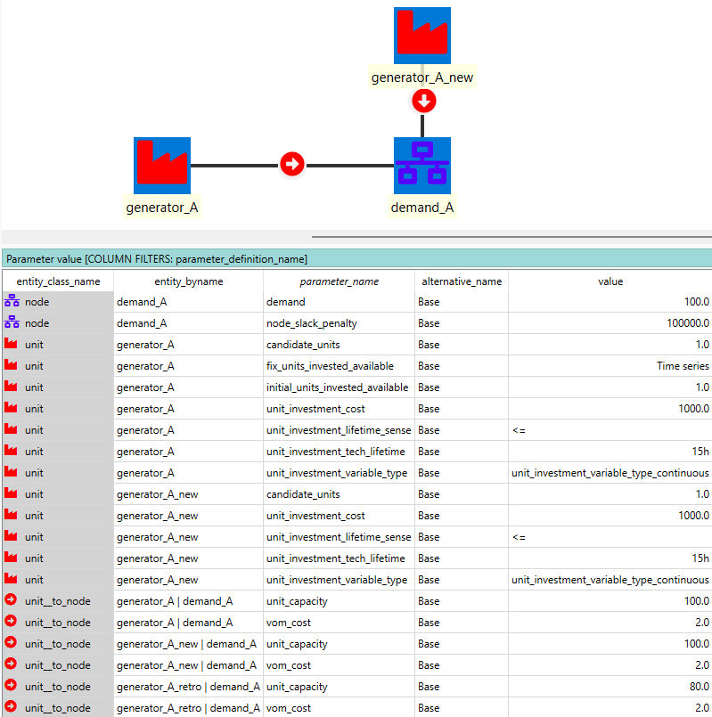
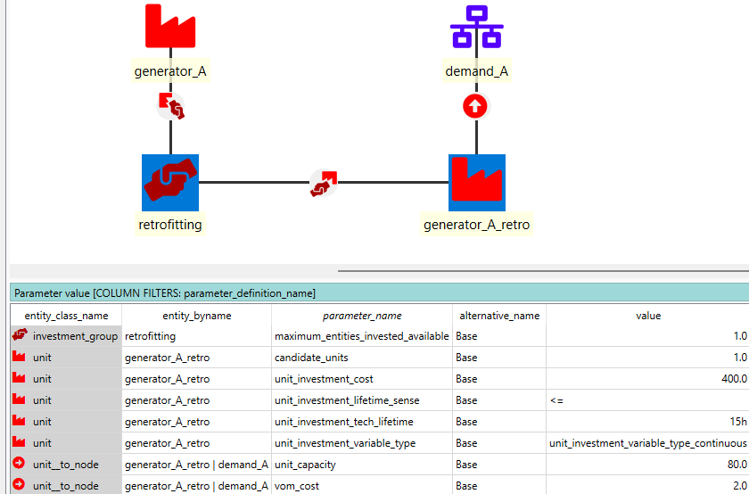
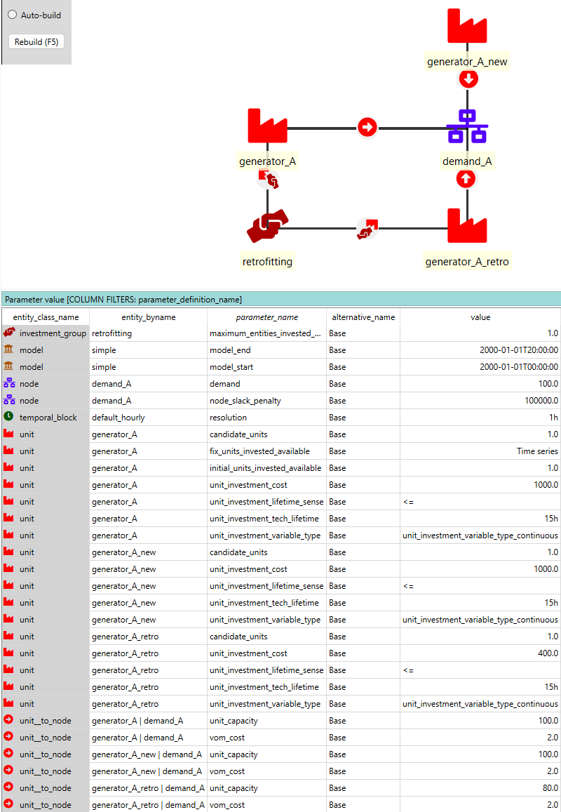
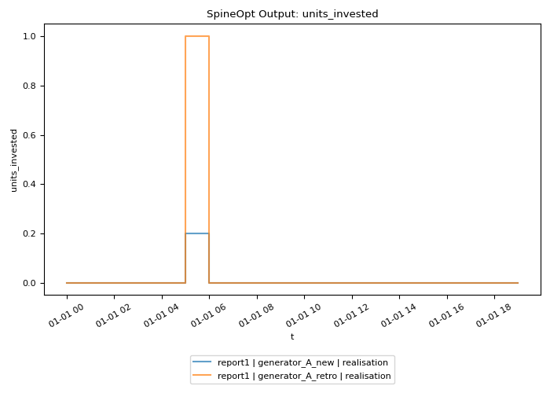
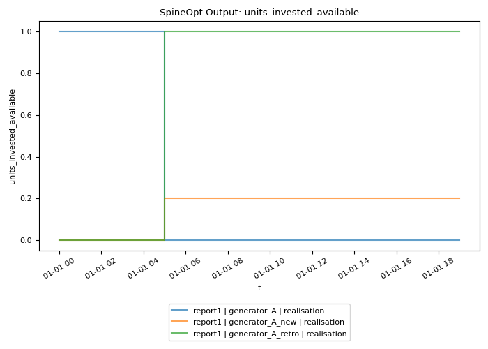
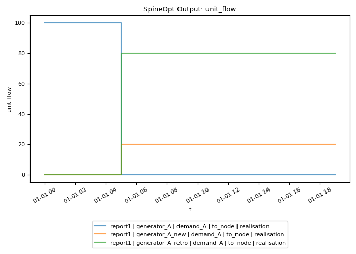

# How to Model Retrofitting

This how-to introduces how we can model retrofitting in SpineOpt. The meaning of retrofitting may vary depending on the context and so does the modelling approach. Here we focus on the very fundamental case where one wants to retrofit an existing `unit` for the continuation of current supply generation. The introduced approach can also model retrofitting an existing `unit` for producing for a different demand. Same retrofitting processes for `connection` and `node` storage can be modelled likewise.

## Model Setup

This section briefs the model instance setup with illustrating the key system specification. The file [retrofitting_example_1.json](./retrofit_material/retrofitting_example_1.json) provides a complete database of this example model instance.

### Basic System Instance Setup

The base system consists of 
- a `node` "demand_A" with a fixed energy `demand` of 100 over the entire modelling horizon
- an existing `unit` "generator_A" to supply "demand_A" with `unit_capacity`="100" and `vom_cost`="2". This unit, however, will retire as of hour 5, specified by the 'Time series' value of parameter `fix_units_invested_available`.
- an investable `unit` "generator_A_new" of the same techno-economic characteristics as "generator_A", with `unit_investment_cost`="1000" and a 15 year `unit_investment_tech_lifetime`. This unit represents the as-usual replacement of "generator_A" when it gets retired.

### Retrofitting Setup

For retrofitting, we introduce a new `unit` "generator_A_retro" as an alternative investment option of "generator_A_new", with the same `vom_cost` and `unit_investment_tech_lifetime`, and different `unit_capacity`="80" and `unit_investment_cost`="400". In this configuration, we would model the case where 80% of "generator_A"'s capacity can be retrofitted in a cheaper investment cost than building a new one.

Particularly, the last and key steps to make "generator_A_retro" a retrofitting option for "generator_A" include:
1. create an `investment_group` entity "retrofitting", and connect it to "generator_A" and "generator_A_retro",
2. define the parameter `maximum_entities_invested_available`="1".

This way, "generator_A_retro" can only be invested in if "generator_A" is retired.

### Model Structure

For simplicity, the example model spans 20 hour with an hourly resolution for both operationa and investment. Investment decisions are modelled as continuous value by defining the paramter `unit_investment_variable_type`="unit_investment_variable_type_continuous".

The complete model configuration is provided below:

## Model Results

As expected, as of hour 5 when "generator_A" retires, the model invests in all capacity=80 of "generator_A_retro" to continue supplying "demand_A", and in capcity=20 new installation "generator_A_new" for the residue demand. The results are illustrated below:

### Investment Related Variables

### Operation Related Variables
