# Capacity Planning Tutorial

This tutorial provides a step-by-step guide to include investment constraints for capacity planning in a simple energy system with Spine Toolbox for SpineOpt.

## Introduction

Welcome to our tutorial, where we will walk you through the process of adding investment constraints in SpineOpt using Spine Toolbox. To get the most out of this tutorial, we suggest first completing the Simple System tutorial, which can be found [here](https://spine-tools.github.io/SpineOpt.jl/latest/tutorial/simple_system/).

### Model assumptions

This tutorial is built on top of the 6-unit system from the [SpineOpt_Backbone_Comparison](https://github.com/spine-tools/SpineOpt_Backbone_Comparison) repository available in the Spine tools github. The main changes to that system are:

- Additional connections are added to the model
- Additional nodes for the connections including a demand parameter
- An additional unit to inject power into one new node and supply the new demand
- Investment parameters added for investment decisions in additional power plant (unit) capacity, storage (node) capacity, and transmission (connection) capacity

This tutorial includes a step-by-step guide to include the parameters to help analyze the results in SpineOpt and the investment optimization concepts. For further information on this topic, please refer to the section on Investment Optimization in the SpineOpt docs which can be found [here](https://spine-tools.github.io/SpineOpt.jl/latest/advanced_concepts/investment_optimization/).

## Guide

### Entering input data

- Begin by downloading the [6-unit system json database](https://github.com/spine-tools/SpineOpt.jl/blob/master/examples/6_unit_system.json)
- Launch Spine Toolbox and select **File** and then **Open Project** or use the keyboard shortcut **Ctrl + O** to open the desired project.
- Select the 'input' Data Store item in the *Design View* and create a new sqlite database.
- Go to *Data Store Properties* and hit **Open editor**. This will open the database in the *Spine DB editor*.
- Go to the hamburger menu (typically at the top right) and select **import**. Navigate to the downloaded json file and import it.

#### Creating objects

##### Nodes

- Always in the Spine DB editor, locate the *Object tree* (typically at the top-left). Expand the [root] element if not expanded.
- Right click on the *node* class, and select *Add objects* from the context menu. The *Add objects* dialog will pop up.
- Enter the names for the new system nodes as seen in the image below, then press *Ok*. This will create two new objects of class *node*, called *C* and *D*.

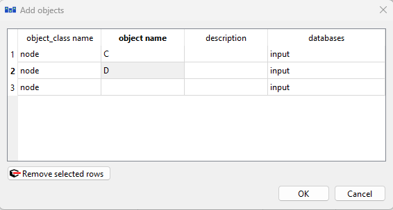

##### Connections

Similarly, add connections. Right click on the connection class, select *Add objects* from the context menu and add the following connections:
- *A_C*
- *D_C*
- *B_D*

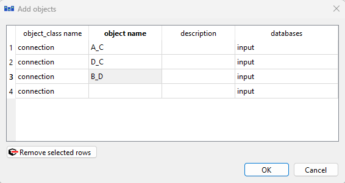

##### Units

Right click on the unit class, select *Add objects* from the context menu and add a unit with name *U_solar*.

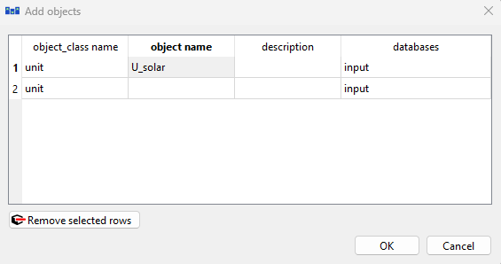

##### Temporal block

Finally, for this investment model, you will need another temporal block that will be considered for the investment period which will occur at a different resolution than the hourly model. Select *Add objects* from the context menu and add the following temporal_block:
- *investment_tb*

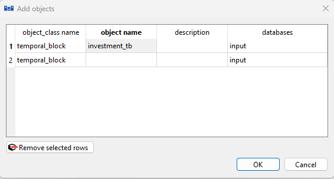

#### Establish relationships

Now that we have created the new objects, we need to establish the relationships between them and the existing model.

##### Connections to/from nodes
The next step is to establish relationships between the newly created connections and nodes. We will look at two ways of doing this. The first involves more manual steps. The second is simpler for a particular connection type.

The *connection_type* is a parameter that can be used to define the connection relationships. If the connection type is normal, then the connection is assumed to be unidirectional. Thus for a two-way relationship a *connection__to_node* and *connection__from_node* relationship needs to be specified for each direction. If the connection type is selected as lossless bidirectional, two of the relationships will automatically be generated as well as the ratio parameter.

###### Connection type: unidirectional

- In the Spine DB editor, locate the *Relationship tree*. Expand the *root* element if not expanded.
- Right click on the *connection\_\_from_node* class, and select *Add relationships* from the context menu. The *Add relationships* dialog will pop up.
- Insert the following relationships in the *connection__from_node* class:

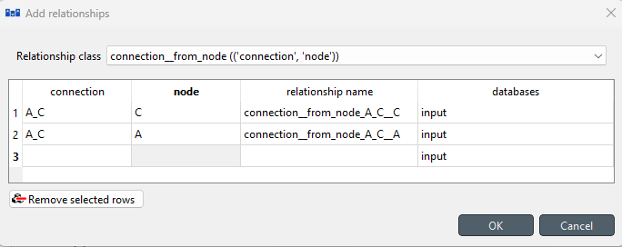

as well as the following the following *connection__to_node* relationships as you see in the figure:

You will also need to add *connection__node__node* relationships between the nodes that connection is linking. This relationship will be used to define a connection “efficiency” parameter called *fix_ratio_out_in_connection_flow* as in the image below.

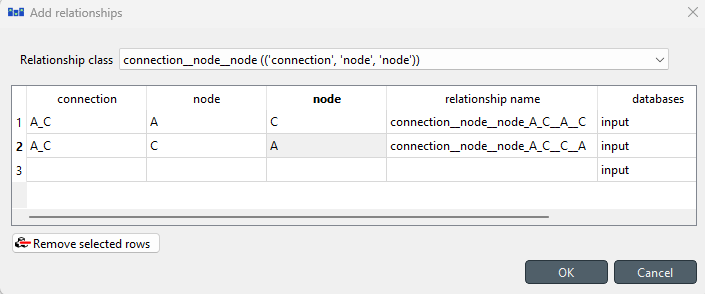

###### Connection type: lossless bidirectional

Insert the following relationships in the *connection__from_node* class:

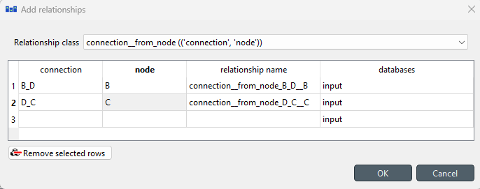

as well as the following the following *connection__to_node* relationships as you see in the figure:

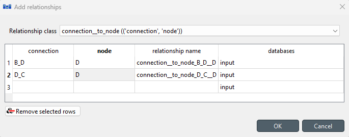

That is all that is needed for now. In the next section we will add an object parameter to the connections that will complete this method.

##### Unit to node
Next add a *unit__to_node* relationship from the newly added *U_solar* unit to the *D* node as below.

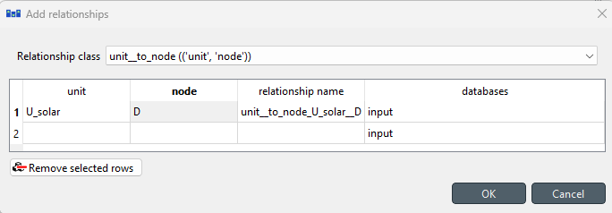

##### Model

For the investment constraints to be added to the model, add the following relationship classes and relationships:
- *model__default_investment_stochastic_structure*
- *model__default_investment_temporal_block*

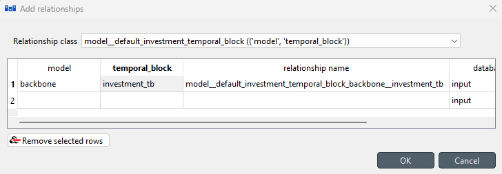
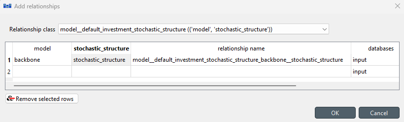

##### Report output
Next, we want to add new reporting options to the output report to gain insight into the model investment decisions. Add the following relationships to the *report__output* class if not already added.
- *connections_invested*
- *connections_invested_available*
- *storages_invested*
- *storages_invested_available*
- *units_invested*
- *units_invested_available*

!!! note
  In SpineOpt, storage is not represented by a unit but by a node. Therefore, they have their own separate investment variables.

#### Specify object parameters values:

Now we will add the object parameter values for all the objects we just created.

##### Connections

- In the *Object tree*, expand the *connection* class and select *B_D*.
- Locate the *Object parameter* table (typically at the top-center).
- Select the following parameter and the value as seen in the image below:
  - *connection_type* parameter with the *Base* alternative and select from the possible values *connection_type_lossless_bidirectional*

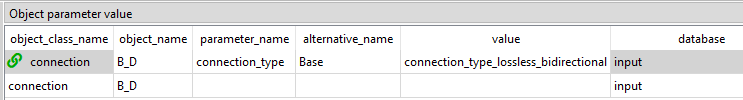

Repeat the above step for the *D_C connection.*

For the *A_C* connection, more parameters will be added for the investment variables. In the *Object parameter* table, select the following parameters as seen in the image below:
- *candidate_connections* with a value of 1
- *initial_connections_invested_available* with a value of 0
- *connection_investment_cost* with a value of 100
- *connection_investment_variable_type* with a value of *variable_type_integer*

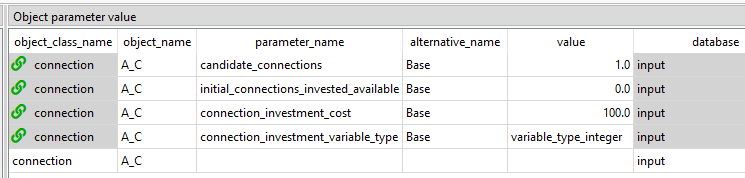

##### Nodes

- In the *Object tree*, expand the *node* class and select *battery*.
- In the *Object parameter* table, select the following parameters and values as specified below:
  - *candidate_storages* with a value of 10000
  - *initial_storages_invested_available* with a value of 0
  - *storage_investment_cost* with a value of 100
  - *storage_investment_variable_type* with a value of *variable_type_integer*
  - *node_state_cap* change to a value of 1
- Remove *initial_node_state*

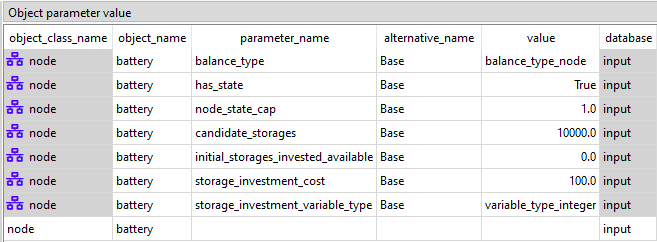

For the *C* node, add the following parameters:

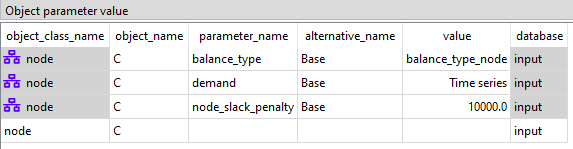

To add the *demand* time series, we will simply copy the time series from the *demand* parameter of the *A* node and paste it in the *C* node.
The *node_slack_penalty* is added so that if there is not enough energy in the system, the demand can still be satisfied by creating node slack thus preventing an infeasibility when solving the model.

##### Units

To make the investment decision more interesting, we will move the nuclear unit to node C. In the *Relationship tree*, right-click on *unit__to_node* and select Edit. Change the node from *A* to *C* and click OK as in the image below.

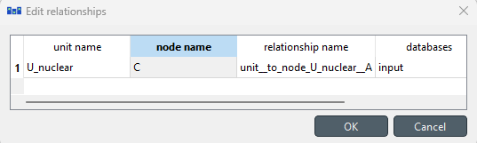

- In the *Object tree*, expand the *unit* class and select *U_solar*.
- In the *Object parameter* table, select the following parameters and values as specified below:
  - *candidate_units* with a value of 10000
  - *initial_units_invested_available* with a value of 0
  - *unit_investment_cost* with a value of 10000
  - *unit_investment_variable_type* with a value of *unit_investment_variable_type_integer*
  - *number_of_units* with a value of 0
  - *online_variable_type* with a value of *unit_online_variable_type_integer*
  - *unit_availability_factor* with the time series provided [here](figs_capacity_planning/solar_availability.xlsx)

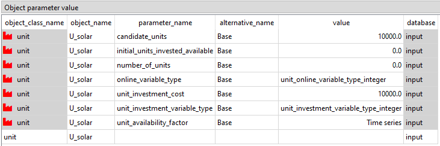

##### Temporal Block

- In the *Object tree*, expand the *temporal_block* class and select *investment_tb*.
- In the *Object parameter* table, select the *resolution* parameter and specify a value of 1 year. Note that this must be specified as a *Duration* type.

#### Specify relationship parameters values:

Now we will add the relationship parameter values for all the relationships we created.

##### Connections

- In *Relationship tree*, expand the *connection__from_node* class and select *B_D | B*.
- In the *Relationship parameter* table (typically at the bottom-center), select the *connection_capacity* parameter and the *Base* alternative, and enter the value *500* as seen in the image below. This will set the limit of the connection flow for connection *B_D*.
- Now expand the *connection__to_node* class for the same and select *B_D | D*.
- Enter a value of *500* for the *connection_capacity*

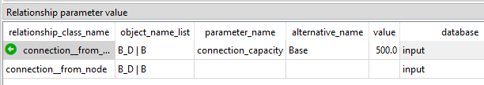
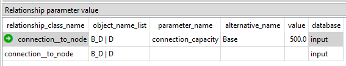

- Repeat the above steps for the *D_C* and *A_C* connection relationships using a value of 500 for the *connection_capacity*.

For the *A_C* connection, because the connection type was not specified and defaults to *connection_type_normal*, we need to specify a *connection__node__node* relationship along with a *fix_ratio_out_in_connection_flow* parameter. Adding this parameter will allow energy to flow through the connection. If this parameter is not specified, the connection will be unrestrained and able to produce free energy.

- In Relationship tree, expand the *connection__node__node* class and select *A_C | A | C*.
- In the *Relationship parameter* table, select the *fix_ratio_out_in_connection_flow* parameter and the *Base* alternative, and enter the value *1* as seen in the image below. 
- Do the same for the *A_C | C | A* relationship.

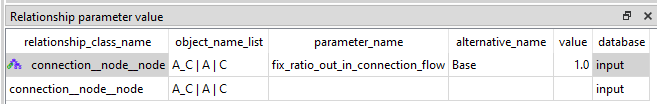

##### Units

- In *Relationship tree*, expand the *unit__to_node* class and select *U_solar | D*.
- In the *Relationship parameter* table, select the *unit_capacity* parameter and the *Base* alternative, and enter the value *1* as seen in the image below.

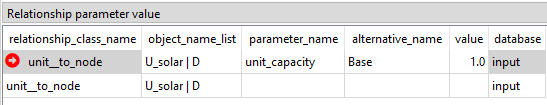

Note, we are using a unit capacity of 1 because the candidate investments can be an integer value multiple of this unit capacity.

When you're ready, save/commit all changes to the database.

The system topology should now look like this:

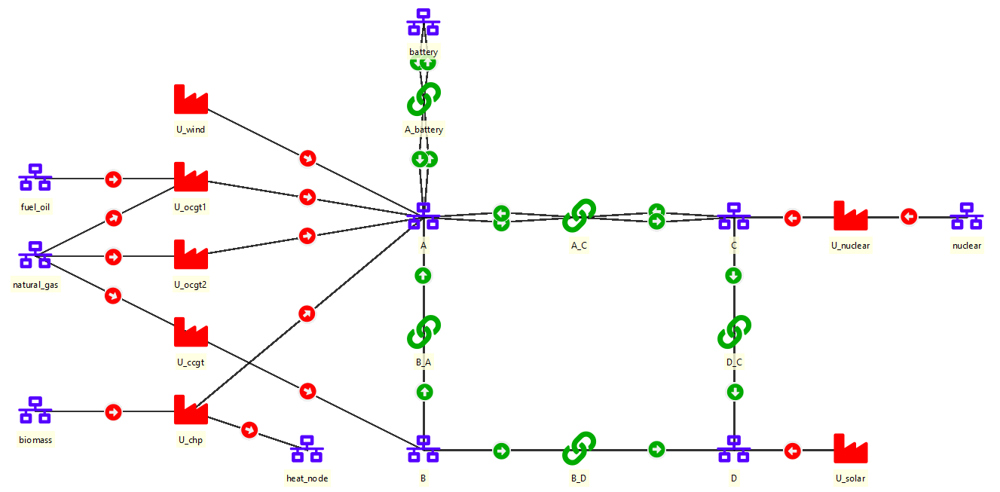

### Executing the Workflow

- Go back to Spine Toolbox's main window and hit the **Execute project** button from the tool bar. You should see 'Executing All Directed Acyclic Graphs' printed in the *Event log* (at the bottom left by default).

- Select the 'Run SpineOpt' Tool. You should see the output from SpineOpt in the *Julia Console* after clicking the *object activity control*.

### Examining the Results

- Select the output data store and open the Spine DB editor. You can already inspect the fields in the displayed tables or use a pivot table.

- In the *Alternative tree*, select the latest run.

- By clicking on *parameter_name* in the *Relationship parameter value* table , it is possible to filter the parameters. Select only *connections_invested*, *storages_invested*, and *units_invested*.

- By examining the time series for each of these parameters, you can see the capacities that were invested in. For example, with a 1 week model duration from 2000-03-01T00:00:00 to 2000-03-08T00:00:00, the model invests in 1 connection (of 500 capacity), 2654 units of storage capacity, and 2778 units of solar capacity. The below image displays the results for storages_invested as an example. Keep in mind that units of measurement are not specified in SpineOpt, so all of these capacities can be interpreted by the user. For instance, in this tutorial they could be referring to MW for unit and connection capacity and MWh for storage capacity.

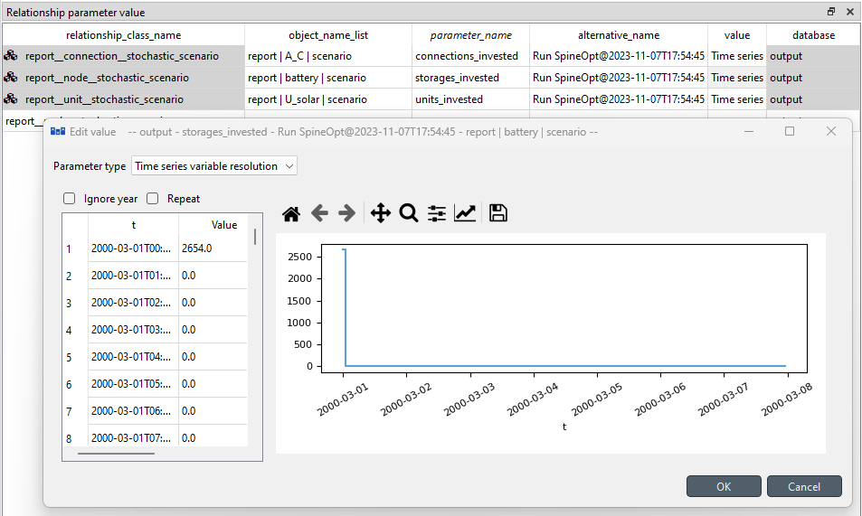

- You can also select more parameters and view the behaviour of the system such as the connection and unit flows, or the node state to see the usage of the battery.
