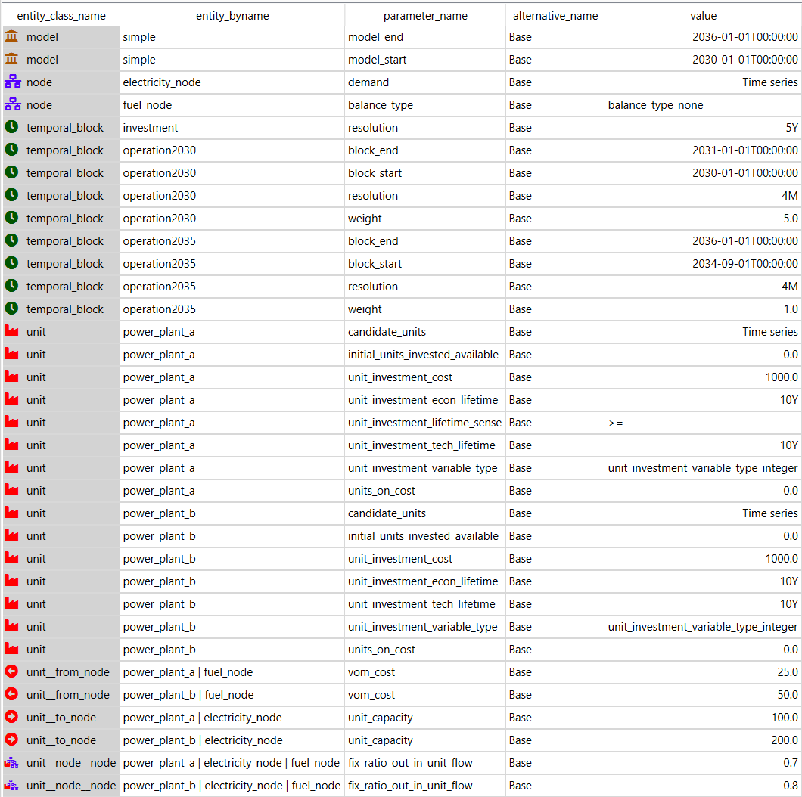

# Capacity Planning Tutorial

This tutorial provides a step-by-step guide to include investment constraints for capacity planning in a simple energy system with Spine Toolbox for SpineOpt. There is more information to be found in the documentation on [investment optimization](https://spine-tools.github.io/SpineOpt.jl/latest/advanced_concepts/investment_optimization/). To get the most out of this tutorial, we suggest first completing the [Simple System tutorial](https://spine-tools.github.io/SpineOpt.jl/latest/tutorial/simple_system/).

## Overview

In this tutorial we will:
+ start from the simple system tutorial,
+ change the temporal structure from days to months,
+ add a temporal block for investments,
+ and add investment related parameters for the units.

We end the tutorial with a guide on multi-year investments.

## Spine Toolbox

Create a new workflow in Spine Toolbox, as you did for the simple system tutorial. In the input database, we import the simple system tutorial (File > import).

## Temporal structure

For the investment optimization, let us consider a more appropriate time horizon, e.g. 2030-2035. We set the `model_start` and `model_end` parameters accordingly to 2030-01-01 and 2036-01-01.

We'll consider a seasonal operation (to reduce the number of entries later on) so we'll set the resolution of the exiting temporal block to `4M`. For clarity we also change the name from `flat` to `operation`.

For the investment period we'll have to add another temporal block called `investment`. We connect it to the model entity with the `model__temporal_block` and `model__default_investment_temporal_block`. The resolution is to be set to `5Y`.

!!! info
	Instead of a default connection to the model entity, we can also make the investment temporal block specific to a part of the energy system, e.g. with the [unit\_\_investment\_temporal\_block](@ref) entity.

In principle we also need to define the default investment stochastic structure. To that end, we can simply connect the existing stochastic structure to the model entity using the `model__default_investment_stochastic_structure` entity.

## Unit investment parameters

With the infrastructure for investments in place, we can now ready units for the investment optimization. For both power plants:
- Set the [number\_of\_units](@ref) parameter to zero so that the unit is unavailable unless invested in.
- Set the [initial\_units\_invested\_available](@ref) to zero as well for a similar reason.
- Set the [candidate\_units](@ref) parameter for the unit to 1 to specify that a maximum of 1 new unit of this type may be invested in by the model.
- Set the unit's investment cost by setting the [unit\_investment\_cost](@ref) parameter to 1000.0. It is important to mention that, normally, you should use the discounted cost. In this example, the costs in 2030 and in 2035 should be discounted to the discount year, i.e., you would define a time-varying cost to reflect the economic representation.
- Specify the [unit\_investment\_tech\_lifetime](@ref) of the unit to, say, 10 years (duration `10Y`) to specify that this is the minimum amount of time this new unit must be in existence after being invested in.
- Specify the [unit\_investment\_econ\_lifetime](@ref) to automatically adjust the investment costs. Let's set it equal to the technical lifetime here.
- Specify the [unit\_investment\_variable\_type](@ref) to `unit_investment_variable_type_integer` to specify that this is a discrete [unit](@ref) investment decision. By default this is set to continuous and we would see an investment of 0.25 units for power plant b in the solution. That also shows that unit size is set by the `unit_capacity` parameter of the `unit__to_node` entity (for power plant b the unit capacity is 200 and multiplied with the investment of 0.25 units we obtain 50 which equals the flow from power plant b).
- Specify the [units\_on\_cost](@ref) to apply a cost to units that are on. Sometimes this is necessary to ensure that the [units\_on](@ref) variables are created which are needed for the proper functioning of the constraints. Even a value of 0.0 is sufficient to trigger these variables. And that is also what we do here.

!!! info
	Investments in storage and connections are very similar. Note that storage is implemented through nodes.

## Examine output

To be able to see the investments in the results, we'll have to add some more output entities to the report entity, i.e. `units_invested` and `units_on`. Commit the changes to the input data base and run the SpineOpt tool. In the output you should now also find the investments. The value should be equal to 1.0 unit.

## Multi-year investments

Multi-year investments refer to making investment decisions at different points in time, such that a pathway of investments can be modeled. This is particularly useful when long-term scenarios are modeled, but modeling each year is not practical. Or in a business case, investment decisions are supposed to be made in different years which has an impact on the cash flow.

In this tutorial, we consider two investment points, at the start of the modeling horizon (2030), and 5 years later (2035). Operation is assumed to be every 4 months, but only in 2030 and 2035. In other words, we only model 2030 and 2035 as milestone years for the pathway 2030 - 2035.

To make this work, some adjustments are needed to:
+ the temporal structure,
+ the demand,
+ and the units.

For the temporal structure, we need a separate operation temporal block for 2030 and 2035 (each with a resolution of `4M`). To obtain a discontinuous gap between the years in the model we set the `block_start` and `block_end` to the start and end of the respective years. Note that for the temporal block of 2035 we already start in the last season of the previous year. That is to be able to set the boundary conditions for that block.

Note that we use the temporal block `operation2030` to represent the operations during 2030 - 2034, so a `weight` of 5 is assigned to the block such that the operational costs cover the entire period. The `weight` of the temporal block `operation2035` is set to 1, as it only covers the last year 2035 of the model horizon.

You can also choose to not use `weight`, but then you need to make sure your input operational costs cover the operations during 2030 - 2034.

!!! warning 
	It is important to delete the temporal blocks that are not used, and only leave the used ones. Otherwise, the temporal structure may be wrong.

!!! info
	Discontinuous (or non-consecutive) time slices in SpineOpt need to be initialized in order for SpineOpt to correctly generate constraints. For the first time slice that is done through the initialization parameters as has been done before in the tutorials. For the other time slices, an additional preceding time slice is needed. The boundary conditions for, e.g., initial storage level or online status of units can be set in that preceding time slice.

	Note that we do not yet support linking the boundary conditions with the previous operation temporal block. This additional definition means that we will also have results for it, which is redundant and should be ignored when post-processing.

The demand data is seasonal (4M). We assume that the demand increases over the years. So, let's take a demand of 100 for all seasons in 2030 and a demand of 400 for all seasons in 2035. In the input database that means that we'll have to change the constant value of the demand to a time series with variable resolution. We can then enter the values for each season. For the initial conditions of the second time slice, we'll add a 0 at 2034-09-01.

We will allow investments for `power_plant_a` in both 2030 and 2035, and for `power_plant_b` only in 2035. This is realised through the definition of [candidate\_units](@ref) as a time series with variable resolution.

- power_plant_a: [2030-01-01: 1, 2035-01-01: 2]. Note this means in 2030, 1 unit can be invested, and in 2035, another 1 **(instead of 2)** can invested. In other words, this parameter includes the previously available units.
- power_plant_b: [2030-01-01: 0, 2035-01-01: 1].

We can check the results for `power_plant_a` first. The below pictures show that in 2030, there is 1 investment, and in 2035, there is another investment. In 2035, there are 2 units on.

Note we notice a drop between the two periods for operation variables, `units_on` in this case, because it is a redundant result.

We also get 1 investment for `power_plant_b` in 2035.

## Debugging

For debugging purposes, consider an overview of all the parameters in this tutorial below.

