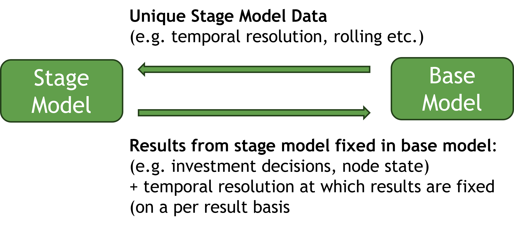
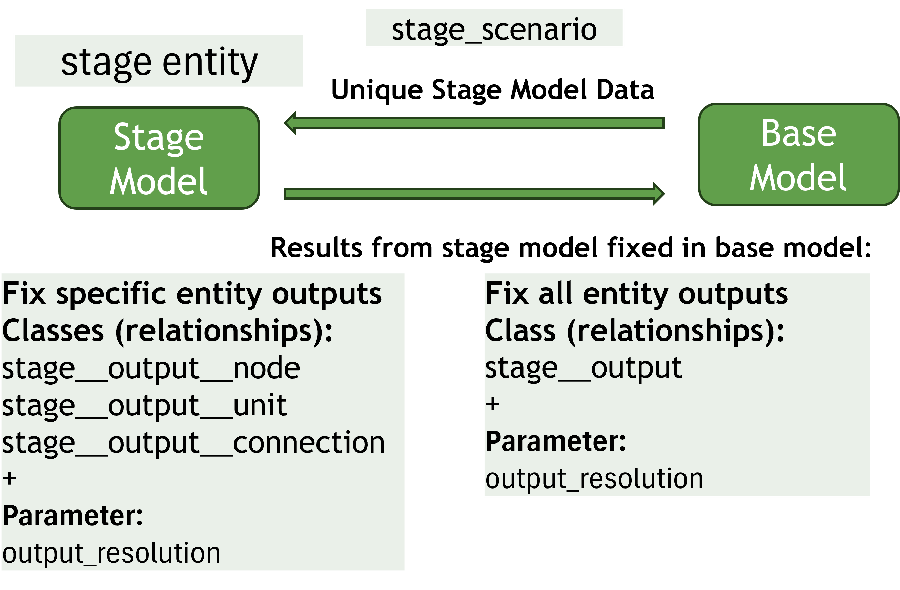
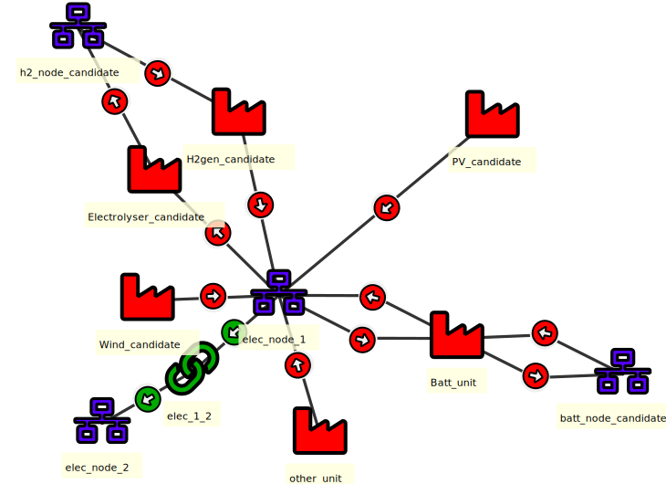
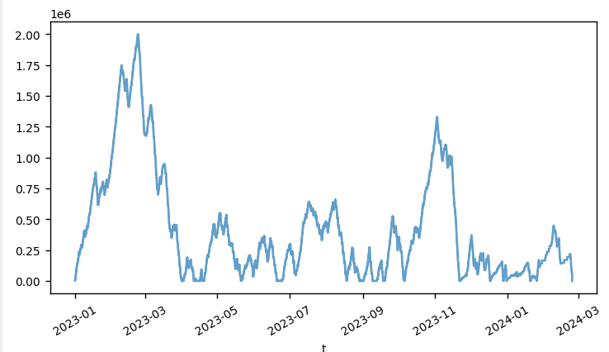
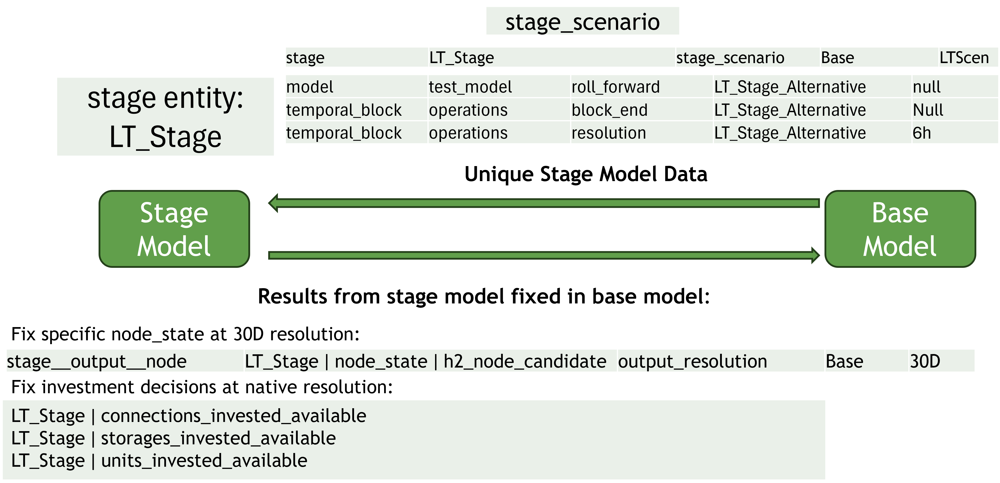
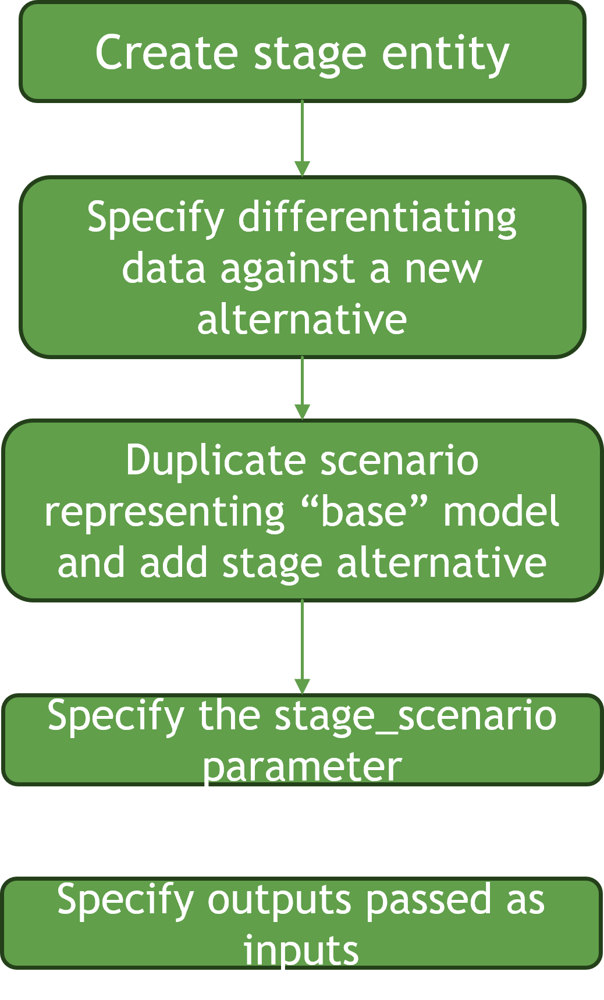

# Multi-Stage Optimisation Tutorial
In this tutorial we will explain how to create a multi-stage optimisation within a SpineOpt model. The functionality allows multiple models to be defined with outputs from one model passing as inputs to another model. This can be very useful to leverage the flexible temporal structure of SpineOpt to create similar linked models with different structures. For example, using this functionality, one can easily create a long term model which passes investments and long term storage trajectories to a short term operational model.

## The Basic Idea
The basic idea is we start with a base SpineOpt model, for example, an operational model. From this, we can specify a `stage model` (for example, a long-term model). We define the `stage model` by specifying the unique data which makes it different from the `base model`. We then link the models by specifying which outputs from the `stage model` pass as inputs to the `base model`.

## Creating a Stage Model
A `stage model` is created very simply by creating an entity of class `stage`. 

## Specifying the Stage Model Data
A `stage model` is defined by the data which is unique to it. The is achieved by creating a scenario (`stage scenario`) which represents the stage model. Usually the `base model` and `stage model` will differ only in some limited respects, for example, the temporal structure. In practice, the best way to create the `stage scenario` is to duplicate the scenario which represents the `base model` and creating a `stage alternative` and then adding that altnerative to the `stage scenario` meaning the `base model` and `stage model` will differ only according to the data specified under the `stage_altnernative`

## Specifying which outputs pass from the stage model as inputs to the base model
To specify which outputs pass as inputs to the base model, we use entities of class: `stage__output`. This links our `stage` entity with any number of `output` entites. For example, if our stage entity is named `LT_Stage` and we wish all unit investment decisions to pass from our `stage model` as inputs to our base model, we would create a `stage__output` entity linking `LT_Stage` and `units_invested_available`. If we wish to fix inputs in the base model only at certain intervals, we can use the `output_resolution` parameter.

Using `stage__output`, outputs for all entities pass from the `stage model` to the `base model`. If we wish outputs for specific entities only to be passed, then we use 
 - `stage__output__node`
 - `stage__output__unit`
 - `stage__output__connection`
 depending on whether the output is associated with a `node`, a `unit` or a `connection`.  

## Test System
The simple test system is illustrated below. 

The model must invest in wind, solar, battery and storage in order to satisfy demand. The base model is configured as a rolling operational model with the following temporal structure:

Temporal Resolution: 
 - Days 0 - 30 (operations `temporal_block`) 1h 
 - Days 31 - 60 (look_ahead `temporal_block`) 6h
 - Rolling duration: 30D

Looking at the `node_state` result for the h2_node_candidate `node` we immediately see that it is not well optimised. Because the model is rolling and sees only 60 days at a time, the store is always emptied at the end of the rolling period because no value is seen beyond 60 days.

We can solve this problem using the stage functionality to create a long term model that sees the full year all at once and passes the node state as an input to the base rolling model.

### Step 1: Create `stage` entity
Using Spine Toolbox DB Editor, we right click on the entity class and select: "add entities". We will call our new stage entity: `LT_Stage`
 - Commit changes

### Step 2: Create `stage` alternative
Using DB Editor, we click into the alternatives pane and create a new alternative called `LT_Stage_Alternative`. 

### Step 3a: Create `stage` scenario
  - Using DB Editor, we click into the scenarios pane and create a new scenario called "LT_Stage_Scenario"
  - Switch to the scenario pivot view by clicking on scenario in the tool ribbon
  - Duplicate the base scenario by right clicking on "base" and selecting "duplicate scenario" from the context menu
  - Add the base alternative to LT_Stage_Scenario by checking the box. It should indicate "1" indicating that base data gets written first
  - Add the LT_Stage_Alternative alternative to LT_Stage_Scenario by checking the box. It should indicate "2" indicating that the LT_Stage_Alternative gets written second, overwriting base data
   - Commit changes

  Your scenario/alternative grid should look like this:

### Step 3b: Associate scenario LT_Stage_Scenario with the `stage model` 
We need to tell SpineOpt that the LT_Stage_Scenario contains the unique data for the stage entity: `LT_Stage`
 - Select the LT_Stage `stage` entity
 - Switch to the parameter value_pane
 - class and entity_byname should be prefilled
 - for parameter name, select `stage_scenario`
 - enter the text: `LT_Stage_Scenario` (this is the textual name of the LT_Stage_Scenario scenario we created above)

### Step 4: Create `LT_Stage` data
So what is different about our long term model compared to our operations `base model`?
 - The model doesn't roll, it sees the full year all at once.
 - Since it doesn't roll and we see the full year, we don't need the `look_ahead` temporal_block
 - Instead of 1h resolution, we want 6h resolution (otherwise our long term model will take a very long time to solve)
 - Our operations `temporal_block` no longer ends after 30 days.

 To implement these changes, we use the LT_Stage_Alternatives to create parameters that will override the corresponding base model data, as follows:

- Turn rolling off for the LT_Stage_Alternative:
  - Select the `test_model` entity in the model class
  - Switch to parameter value view
  - Class and entity_byname should be prefilled. Select `roll_forward` in the parameter name field.
  - In the alternative field, select `LT_Stage_Alternative`
  - In the value field, right click the cell and select `edit`. 
  - Select plain value
  - Select `null`
  - Commit changes
- Remove the look_ahead temporal block from the LT_Stage_Alternative by:
  - switch back to table view by clicking `table` in the ribbon
  - switch to the entity_alternative tab
  - select the `look_ahead` temporal block entity
  - in the bottom row, `class` and `entity_byname` should be prefilled. In the alternative field, select `LT_Stage_Alternative`
  - In the `active` field, select `false`
  - Commit changes
- Change the temporal resolution of the operations `temporal_block` to 6h
  - Select the operations entity in the `temporal_block` class
  - Class and entity_byname should be prefilled. 
  - Select `resolution` in the parameter name field.
  - Right click value field and select edit
  - Select `duration value`
  - enter "6h"
  - Commit changes
- remove `block_end` of the operations `temporal_block`
  - Select the operations entity in the `temporal_block` class
  - Class and entity_byname should be prefilled. 
  - Select `block_end` in the parameter name field.
  - Right click value field and select edit
  - Select "plain value"
  - select null
  - Commit changes

  

### Step 5: Specify outputs from the LT_Stage model that pass as inputs to our Base model
We want to make sure that the following Long Term model outputs pass as inputs to the base model:
 - All unit investment decisions
 - All connetion investment decisions
 - All storage investment decisions
 - `node_state` for the seasonal h2_node_candidate node
 
To pass outputs for all entities for a certain output, we need to create 2-Dimensional entities of class `stage__output`
 - For unit investment decisionss
   - Right click on `stage__output` class
   - Select: add entities
   - For `stage` select `LT_Stage`
   - For `output` select `units_invested_available`
 - For connection investment decisionss
   - Right click on `stage__output` class
   - Select: add entities
   - For `stage` select `LT_Stage`
   - For `output` select `connections_invested_available`
 - For storage investment decisionss
   - Right click on `stage__output` class
   - Select: add entities
   - For `stage` select `LT_Stage`
   - For `output` select `storages_invested_available`
 - Commit changes

To pass node state for the h2_node_candidate, we need to create a 3-Dimensional entity of class `stage__output__node`
- Right click on `stage__output__node` class
- Select: add entities
- For `stage` select `LT_Stage`
- For `output` select `node_state`
- For `node` select `h2_node_candidate`
- Commit changes

For node_state, we don't want to overconstrain the operations problem, so we only want the node_state in the operations model to be fixed at intervals, thus allowing some flexibility in the operations model while also following the seasonal trajectory from the long term model. To do this, we use the `output_resolution` parameter for the `stage__output__node` we just created above
- Select the `stage__output__node` we just created above in the tree
- The class and entity_by_name fields should be prefilled
- For parameter name, select `output_resolution`
- Right-click the value field and select edit
- Select duration value
- Enter "30D" 
- Commit changes

## Run Model
Now you have successfully created a Long Term `Stage Model` that feeds a selected node_state and all investment decisions to the `Base Model`

Run the model, making sure to run the "Base" scenario. Remember the LT_Stage_Scenario's purpose is only to specify the unique data for the `stage model`. It's not a scenario that you actually run (unless you would like to see the outputs of the long term model only.
