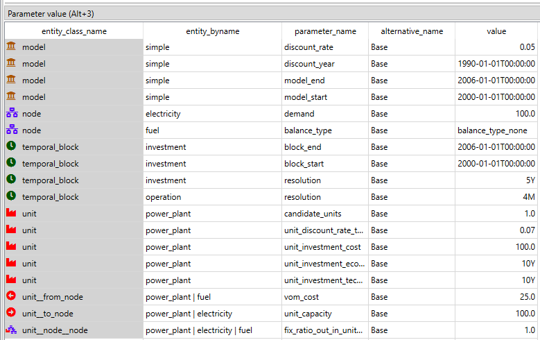
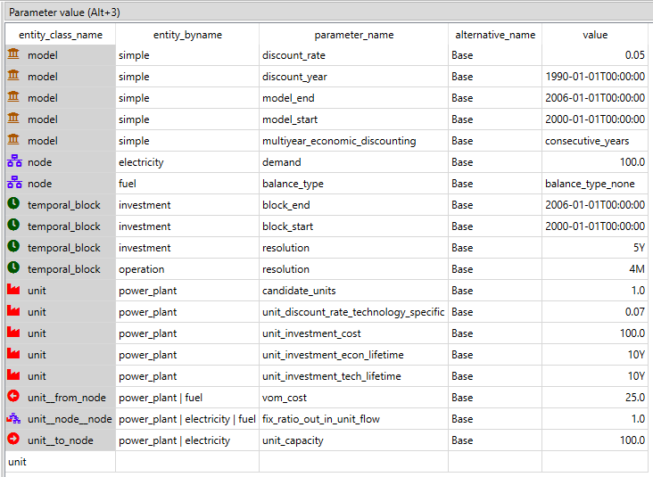
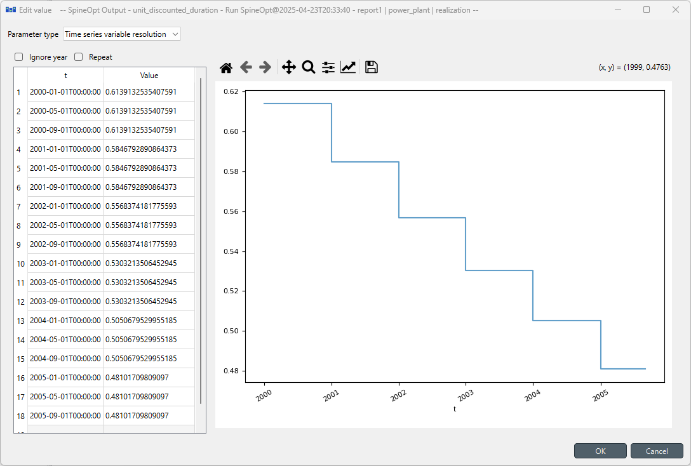
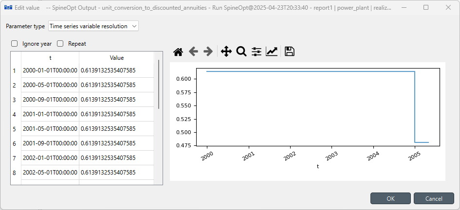
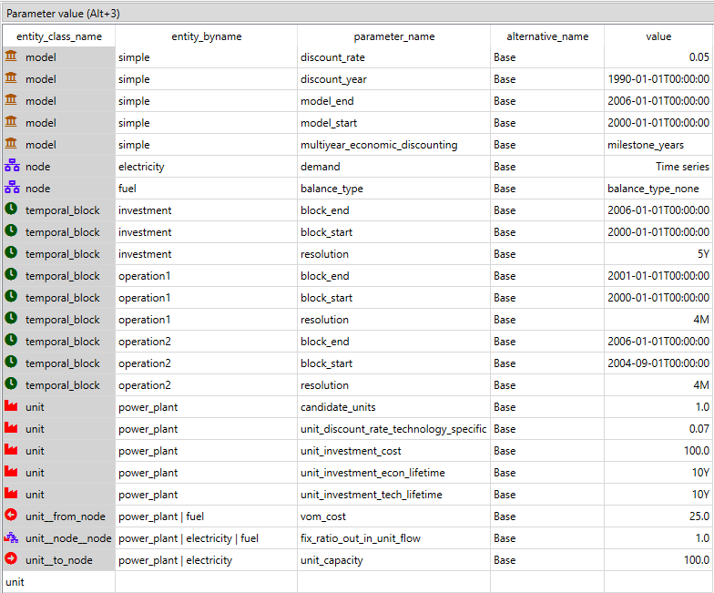
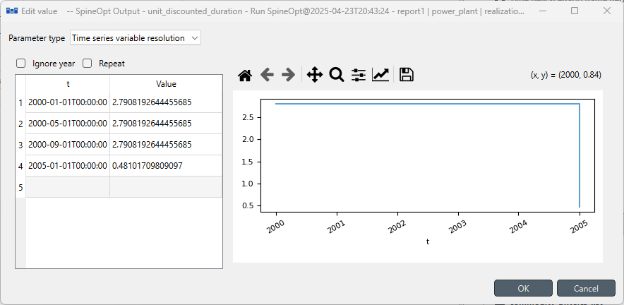
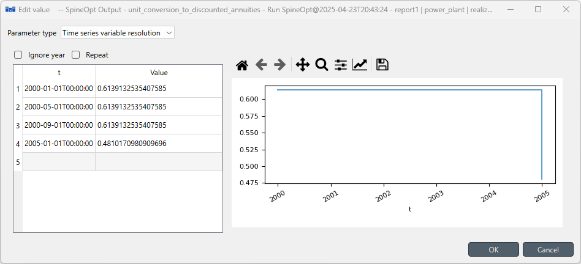

# Multi-year Investments Using Pre-defined Internal Parameters Tutorial

The basics of how to set up a capacity planning model are covered in [Capacity planning Tutorial](https://spine-tools.github.io/SpineOpt.jl/latest/tutorial/capacity_planning/) and multi-year investments in [Multi-year investments](https://spine-tools.github.io/SpineOpt.jl/latest/tutorial/capacity_planning/#Multi-year-investments). With those information, You should be able to do multi-year investments already with your own parameters. However, the correct representation for costs across years can be tricky. To make it more user-friendly, SpineOpt has incorporated some pre-defined economic parameters internally, and the goal of this tutorial is to walk you through the set-up for using these parameters.

!!! info
    The details of the formulation and economic parameters are given in the concept references.

## Overview
In this tutorial, we will
- simplify the simple system tutorial by only using one `power_plant`,
- show the necessary parameters to activate and use pre-defined internal parameters,
- show you how to use these economic parameters,
- show you how to use milestone years. 

## Set-up
To avoid repetition, we only consider one unit instead of the two units from the simple system tutorial. The easiest way to do this is to import the [simple system](https://github.com/spine-tools/SpineOpt.jl/blob/master/examples/simple_system.json) (file > import) and to remove one of the two power plants. To remove a power plant you can go to the graph view. Use ctrl+click on each of the relevant entities connect to power_plant_b (except for the nodes as we still need those for power_plant_a). Then right click and select 'remove'. There will be a confirmation box with an overview of all the entities that you will be removing.

Since we are working with investments, we are going to make a distinction between investments and operation in the time blocks. We retain the original time block but adjust the resolution to 4 months ('4M'). Additionally we add an investment time block with a resolution of 5 years ('5Y') between 2000 and 2006. We have to adjust the time horizon of the model entity accordingly.

Once we have our setup, we can take a look at the economic representation in SpineOpt. Below is a list of parameters you would need:
- [multiyear\_economic\_discounting](@ref): activation value in a choice between `consecutive_years` and `milestone_years`, with the default value being `null` (`None` in a SpineDB and `nothing` in Julia). When a valid value is selected, the model will use its internally-calculated parameters for discounting investment and operation costs. Specifically, choosing `consecutive_years` requires the model to use continous operational temporal blocks, and thus the operation cost will be discounted every year. In constrast, choosing `milestone_years` means the model will discount the operation cost as per the investment temporal block.  
- [discount\_rate](@ref): the rate you would like to discount your costs with.
- [discount\_year](@ref): the year you would like to discount your costs to.
- [unit\_investment\_tech\_lifetime](@ref): using units as an example, this is the technical lifetime of the unit.
- [unit\_investment\_econ\_lifetime](@ref): using units as an example, this is the economic lifetime of the unit which is used to calculate the economic parameters.
- [optional] [unit\_discount\_rate\_technology\_specific](@ref): using units as an example, this is used if you would like to have a specific discount rate different from [discount\_rate](@ref).
- [optional] [unit\_lead\_time](@ref): if not specified, the default lead time is 0. 
- [unit\_investment\_cost](@ref): using unit as an example, this is the investment cost for the investment year. When [multiyear\_economic\_discounting](@ref) is not used (i.e. with the default value `null`), then this cost that you put will not be discounted at all. However, when you choose a valid value of [multiyear\_economic\_discounting](@ref), SpineOpt will discount this cost to the [discount\_year](@ref) using [discount\_rate](@ref).

To be able to see the values of the economic parameters after a run, you have to add them to the report. 

## Not using economic discounting
We start with the case where [multiyear\_economic\_discounting](@ref) is not used with the default value `null`, which means SpineOpt will not create and use its internally-calculated parameters for discounting investment and operation costs. A [unit\_investment\_cost](@ref) of 100 and a [vom\_cost](@ref) of 25 are not discouted at all. See the set-up below.

## Using economic parameters with consecutive operation years
Now we set [multiyear\_economic\_discounting](@ref) to `consecutive_years`. This set-up indicates that the model will use the internally-calculated parameters and continous operational temporal blocks. Now the [unit\_investment\_cost](@ref) and the [vom\_cost](@ref) are discounted to 1990 using a [discount\_rate](@ref) of 0.05. See the set-up below.

The values for the output parameter `unit_discounted_duration` are shown below. It is used to discount operation costs so it has the resolution of the operational temporal block. However, since we only discount per year, this parameter value is constant within a year.

The rest is for discounting investment costs with the resolution of the investment temporal block.

## Using economic parameters with milestone investment years
Now we set [use\_milestone\_years](@ref) to `milestone_years`. This indicates that we want operational temporal block to be discontinous and use the same milestone years as the investment temporal block. In this case, we need to change the definition of temporal blocks, see below picture:

where the demand `TimeSeries` is defined as follows:

!!! info
    If you get confused why the temporal blocks are defined this way, I recommend going back to [Multi-year investments](https://spine-tools.github.io/SpineOpt.jl/latest/tutorial/capacity_planning/#Multi-year-investments) for details.

The values for the output parameter `unit_discounted_duration` are shown below. Note now in 2000, the value becomes 2.79. This parameter value acts as a weight taking into account the discount per year and the resolution of the milestone years. In order words, now the operation costs for the in-between years have also been included.

The rest is for discounting investment costs with the resolution of the investment temporal block.

