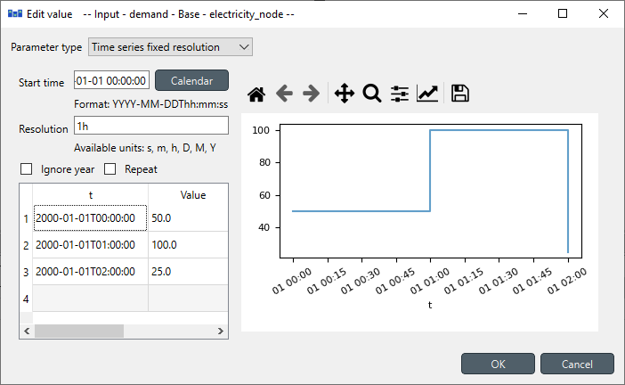
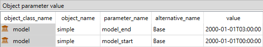
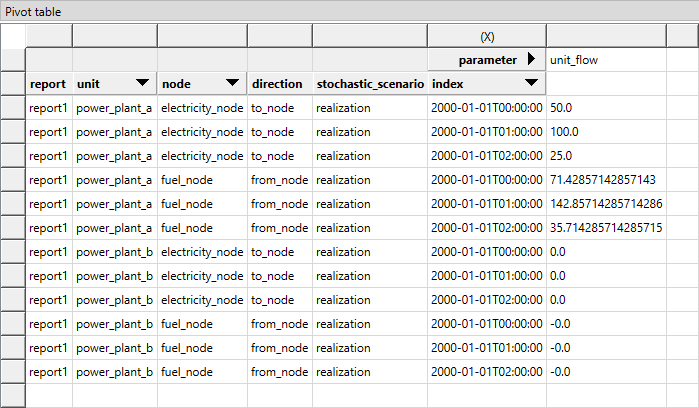

# Ramping definition tutorial

This tutorial provides a step-by-step guide to include ramping constraints in a simple energy system with Spine Toolbox for SpineOpt.

## Introduction

Welcome to our tutorial, where we will walk you through the process of adding ramping constraints in SpineOpt using Spine Toolbox. To get the most out of this tutorial, we suggest first completing the Simple System tutorial, which can be found [here](https://spine-tools.github.io/SpineOpt.jl/latest/tutorial/simple_system/).

The ramping constraint limit refers to the maximum rate at which a power unit can increase or decrease its output flow over time. These limits are typically put in place to prevent sudden and destabilizing shifts in power units. However, they may also represent any other physical limitations that a unit may have that is related to changes over time in its output flow.

### Model assumptions

This tutorial is built on top of the Simple System. The main changes to that system are:

- The demand at *electricity\_node* is a 2-hour time series instead of a unique value
- The *power\_plant\_a* has ramp limit of 10%

This tutorial includes a step-by-step guide to include the parameters to help analyze the results in SpineOpt and the ramping constraints concepts.

## Step 1 - Update the demand

### Opening the Simple System project

- Launch the Spine Toolbox and select **File** and then **Open Project** or use the keyboard shortcut **Alt + O** to open the desired project.
- Locate the folder that you saved in the Simple System tutorial and click *Ok*. This will prompt the Simple System workflow to appear in the *Design View* section for you to start working on.
- Select the 'input' Data Store item in the *Design View*.
- Go to *Data Store Properties* and hit **Open editor**. This will open the database in the *Spine DB editor*.

In this tutorial, you will learn how to add ramping constraints to the Simple System using the *Spine DB editor*, but first let's start by updating the electricity demand from a single value to a 2-hour time series.

### Editing demand value

- Always in the Spine DB editor, locate the *Object tree* (typically at the top-left). Expand the [root] element if not expanded.
- Expand the [node] class, and select the *electricity\_node* from the expanded tree.
- Locate the *Object parameter* table (typically at the top-center).
- In the *Object parameter* table, identify the *demand* parameter which should have a 150 value from the Simple System first run.
- Right click on the value cell and then select *edit* from the context menu. The *Edit value* dialog will pop up.
- Change the *Parameter type* to *Time series fixed resolution*, *Resolution* to *1h*, and the demand values to the time series as in the image below.
- Finish by pressing *OK* in the *Edit value* menu. In the *Object parameter* table you will see that the value of the *demand* has changed to *Time series*.

Notice that there is only demand values for `2000-01-01T00:00:00` and `2000-01-01T01:00:00`. Therefore, we need to update the start and end of the model. But first, let's change the temporal block.

### Editing the temporal block

You might or might not notice that the Simple System has, by default, a temporal block resolution of *1D* (i.e., one day); wait, what! Yes, by default, it has *1D* in its template. So, we want to change that to *1h* to make easy to follow the results.

- Locate again the *Object tree* (typically at the top-left). Expand the [root] element if not expanded.
- Expand the [model] class, and select the *simple* from the expanded tree.
- Locate the *Object parameter* table (typically at the top-center).
- In the *Object parameter* table, identify the *resolution* parameter which should have a *1D* value from the Simple System first run.
- Right click on the value cell and then select *edit* from the context menu. The *Edit value* dialog will pop up.
- Change the *Duration* from *1D* to *1h* as shown in the image below.

### Editing the model start and end

Since the default resolution of the Simple System was *1D*, the start and end date of the model needs also to be changed.

- Locate again the *Object tree* (typically at the top-left). Expand the [root] element if not expanded.
- Expand the [temporal_block] class, and select the *flat* from the expanded tree.
- Locate the *Object parameter* table (typically at the top-center).
- In the *Object parameter* table, select the *model\_start* parameter, the *Base* alternative, and then right click on the value and select the *Edit* option in the context menu, as shown in the image below.

- Repeat the procedure for the *model\_end* parameter, but now the value is `2000-01-01T02:00:00`. Notice that since the demand goes until `2000-01-01T01:00:00` the model must finish in the second hour to properly account for the first hour. The final values should look like that the image below.

When you're ready, save/commit all changes to the database.

### Executing the workflow

- Go back to Spine Toolbox's main window, and hit the **Execute project** button  from the tool bar. You should see 'Executing All Directed Acyclic Graphs' printed in the *Event log* (at the bottom left by default).

- Select the 'Run SpineOpt' Tool. You should see the output from SpineOpt in the *Julia Console* after clicking the *object activity control*.

### Examining the results

- Select the output data store and open the Spine DB editor. You can already inspect the fields in the displayed tables or use a pivot table.

- For the pivot table, press **Alt + F** for the shortcut to the hamburger menu, and select **Pivot -> Index**.

- Select *report\_\_unit\_\_node\_\_direction\_\_stochastic\_scenario* under **Relationship tree**, and the first cell under **alternative** in the *Frozen table*.

- Under alternative in the Frozen table, you can choose results from different runs. Pick the run you want to view. If the workflow has been run several times, the most recent run will usually be found at the bottom.

- The *Pivot table* will be populated with results from the SpineOpt run. It will look something like the image below.

The image above shows the electricity flow results for both power plants. As expected, the *power\_plant\_a* (i.e., the cheapest unit) always covers the demand in both hours, and then the *power\_plant\_b* (i.e., the more expensive unit) has zero production. This is the most economical dispatch since the problem has no extra constraints (so far!).

## Step 2 - Include the ramping limit

Let's consider the input data where the *power\_plant\_a* has a ramping limit of *10%*, meaning that the change between two time steps can't be greater than *10MW* (since the plant 'a' has a unit capacity of *100MW*).

### Adding the ramping limit

- In *Relationship tree*, expand the *unit\_\_to_node* class and select *power\_plant\_a | electricity\_node*.

- In the *Relationship parameter* table, select the *ramp\_up\_limit* parameter and the *Base* alternative, and enter the value *0.1* as seen in the image below. This will set the ramping limit for *power\_plant\_a*.

When you're ready, save/commit all changes to the database.

### Executing the workflow with ramp up limit

- Go back to Spine Toolbox's main window, and hit the **Execute project** button  from the tool bar. You should see 'Executing All Directed Acyclic Graphs' printed in the *Event log* (at the bottom left by default).

- Select the 'Run SpineOpt' Tool. You should see the output from SpineOpt in the *Julia Console* after clicking the *object activity control*.

### Examining the results with ramp up limit

- Select the output data store and open the Spine DB editor. You can already inspect the fields in the displayed tables or use a pivot table.

- For the pivot table, press **Alt + F** for the shortcut to the hamburger menu, and select **Pivot -> Index**.

- Select *report\_\_unit\_\_node\_\_direction\_\_stochastic\_scenario* under **Relationship tree**, and the first cell under **alternative** in the *Frozen table*.

- Under alternative in the Frozen table, you can choose results from different runs. Pick the run you want to view. If the workflow has been run several times, the most recent run will usually be found at the bottom.

- The *Pivot table* will be populated with results from the SpineOpt run. It will look something like the image below.

The image above shows the electricity flow results for both power plants. As expected, the *power\_plant\_a* (i.e., the cheapest unit) output is limited to it ramp up limit, therefore it can't go from *50MW* to *100MW* and therefore, the *power\_plant\_b* (i.e., the more expensive unit) must produce *40MW* to cover the demand that plant 'a' can't. As shown here, the ramping limits might lead to a higher costs in power systems.
