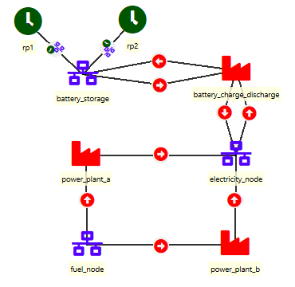
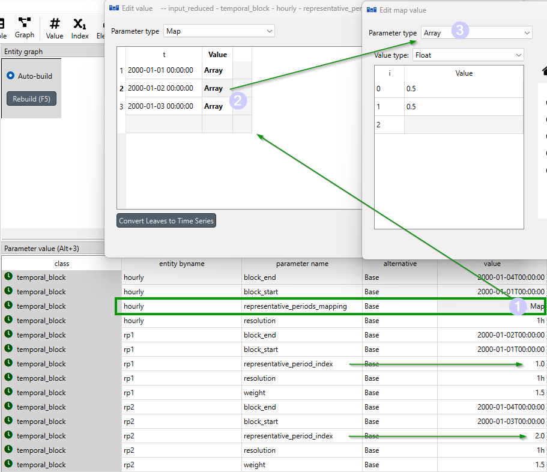
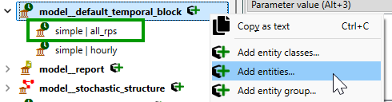
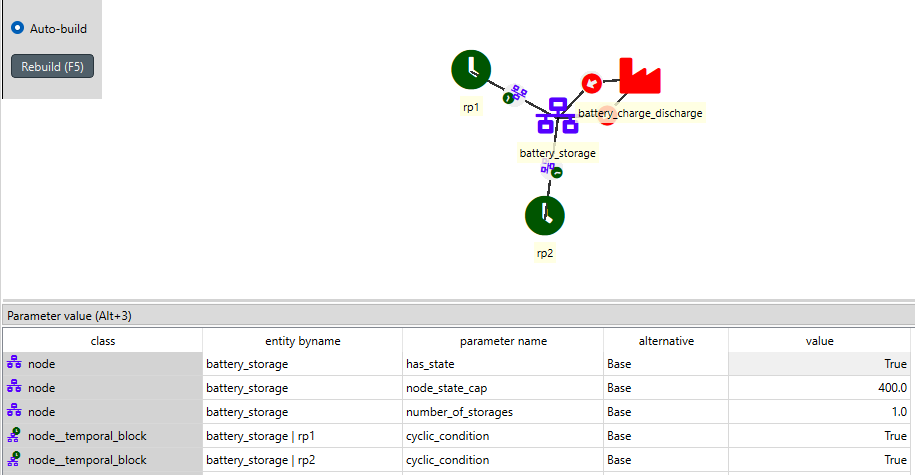
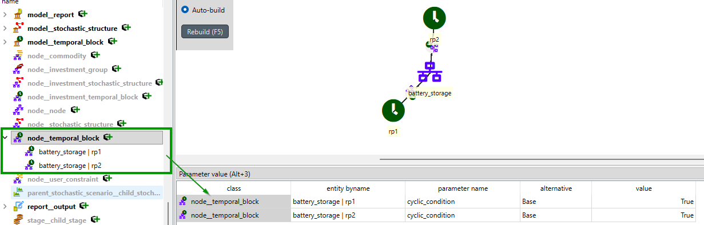
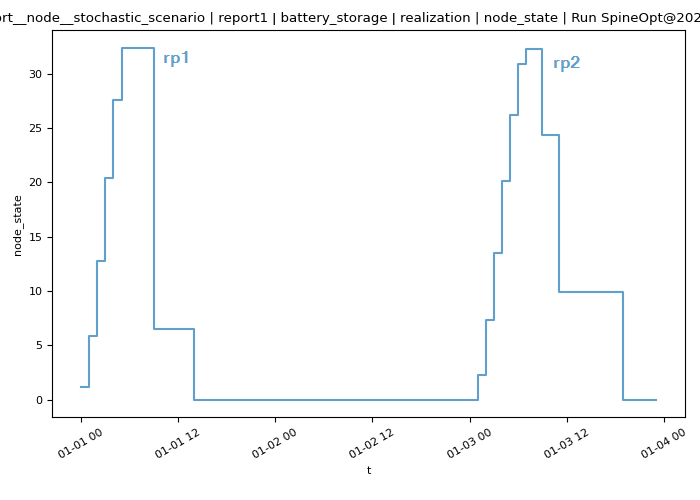

# Representative periods tutorial

This tutorial provides a step-by-step guide to show how to include representative periods in a simple energy system with Spine Toolbox for SpineOpt.

## Introduction

Welcome to our tutorial, where we will walk you through the process of adding representative periods in SpineOpt using Spine Toolbox. To get the most out of this tutorial, we suggest first completing the Simple System tutorial, which can be found [here](https://spine-tools.github.io/SpineOpt.jl/latest/tutorial/simple_system/).

### Model assumptions

First, let's start by importing the file [representative_periods.json](https://github.com/spine-tools/SpineOpt.jl/blob/master/examples/representative_periods.json) into SpineToolbox and create a workflow to run the model as in the Simple System tutorial. The file has already set up the representative periods for a simple case with seasonal and short-term storage nodes, so you can directly run the workflow to see how it works. However, we recommend going through the steps in this tutorial to understand how to set up representative periods in SpineOpt and analyze the results.

Good! So, let's now have a look to the system we are working with. The image below shows the system structure, which is an extension of the Simple System with two storage nodes: *fuel\_node* and *battery\_storage*.

The main changes to the Simple System are:

- The demand at *electricity\_node* is a time series of three days of 24-hour values instead of a unique value
- The *fuel\_node* is a seasonal storage node with no inflows, but with a initial value of 12000 units at the beginning of the first day, and it can supply both *power\_plant\_a* and *power\_plant\_b*.
- The *battery\_storage* is a short-term storage node that can be charged from *power\_plant\_a* and discharged to the demand node.
- The temporal structure includes two representative periods (called *rp1* and *rp2*), which are mapped to the original temporal blocks such that day 1 is mapped 1:1 to *rp1*, day 2 is mapped half to *rp1* and half to *rp2*, and day 3 is mapped 1:1 to *rp2*.

All right! with this information in hand, let's explore the data and see how all this information is setup in SpineOpt.

## Temporal Structure

The temporal structure of the model is shown in the image below. We can see that there are three temporal blocks:

- *hourly*: the original temporal block for the whole time horizon, i.e., 72 hours (or three days).
- *rp1* (representative period 1): 24-hour block representing that starts and ends at the beginning and end of day 1.
- *rp2* (representative period 2): 24-hour block representing that starts and ends at the beginning and end of day 3.

!!! tip "Representative definitions"
    The representative periods are not necessarily consecutive, they can be any block of time that represents the original temporal block. For instance, *rp1* takes the information from the time series in day 1, while *rp2* takes information from the time series in day 3. Check the `block_start` and `block_end` parameters for each rp temporal block to see this in the input data.

The key parameter that defines the mapping of the original temporal block to the representative periods is [representative\_period\_mapping](@ref). The values in this parameter map each original temporal block to the representative periods through and array that has the weights in each case. For instance, the following figure shows that the second day maps half to *rp1* and half to *rp2*:

Please note that the [representative\_period\_index](@ref) defines the order of the representative periods, which is relevant for the array definition of the weights in the [representative\_period\_mapping](@ref) parameter.

!!! tip "Remember!"
    Bare in mind in the previuos figure that Python is 0-index based, so the first element of the array corresponds to *rp1* and the second element to *rp2*.

Another important parameter in the representative periods setup is the [weight](@ref) parameter, which defines the weight of each representative period in the objective function. In this case, since we have three days and two representative periods, the weights are 1.5 for both *rp1* and *rp2*. Why? Because *rp1* represents day 1 and half of day 2, so it represents 1.5 days. The same applies to *rp2*, which represents day 3 and half of day 2 😉

For more details on how to set up representative periods in SpineOpt, please check the how-to section [How to set up representative days for investment problems](@ref Usage_rep_period_seasonal_Storage), which includes some tools to help you to find the representative periods for large-scale models.

## All representative periods

In addition to the individual representative periods, you need a group that includes all the representative periods, see the image below:

!!! tip "How do I create an entity group?"
    You can create an entity group by clicking on the *temporal\_block* structure and then select the option "Add entity group...".

And last, but not least, you need to create a new entity in the *model\_default\_temporal\_block* entity class that includes all the group of representative periods.

These configurations are needed for SpineOpt to properly interpret the representative periods and create the corresponding variables and constraints in the model.

## Nodes

### Electricity node

The *electricity\_node* is a demand node with a time series of three days of 24-hour values instead of a unique value as in the Simple System. Note that the demand time series is defined for the whole time horizon (i.e., 72 hours), but the operational variables in the model will only be created for the representative periods. That is what allows to reduce the computational burden of the model while still capturing the key characteristics of the system through the representative periods.

### Battery storage node

The configuration of the *battery\_storage* includes the [has\_state](@ref) parameter set to `true` to allow the battery to have a state variable, the [node\_state\_cap](@ref), and the [number\_of\_storages](@ref) as the basic information.

 In addition, we can define a cyclic condition for the battery storage by defining *node\_\_temporal\_block* entities, like in the figure below. This cyclic condition means that the state of charge at the end of the last representative period will be equal to the state of charge at the beginning of the first representative period, which is a common assumption for short-term storage in representative periods models.

### Fuel node

The configuration of the *fuel\_node* is similar to the *battery_storage* node. In addition, we can define an initial value for the fuel node at the beginning of the model's time horizon using the [initial\_node\_state](@ref) parameter.

The parameter *is\_longterm\_storage* is set to `true` for the fuel node, which means that the state of the fuel node can be carried over the whole time horizon, allowing to properly account for seasonal storage in the model. This is a key feature of SpineOpt that allows to capture the dynamics of seasonal storage in representative periods models.

## Units and other entity classes

The definition of units and other entity classes is similar to the Simple System, you can check out the [Simple System tutorial](@ref Simple_System) to learn more.

## Results

As usual, you can analyze the results in SpineToolbox. The following figures show the state of charge of the battery storage and the fuel node.

Let's check first the battery storage node. We can see that the state of charge of the battery storage changes within the representative periods, but there is no node state variable for the non-representative periods, since it is not a long-term storage. In addition, we can see that the state of charge at the end of the each representative period is equal to the state of charge at the beginning of the same representative period, which confirms that the cyclic condition is properly defined in the model.

In contrast, the fuel node has a state variable for all the periods, since it is a long-term storage. We can see that the node state of the fuel node changes across the representative periods, which allows to capture the seasonal dynamics of the fuel node in the model. In order to stimate the node state of the fuel node in the non-representative periods, SpineOpt uses the changes (or deltas) in the node state of the corresponding representative periods according to the mapping defined in the [representative\_period\_mapping](@ref) parameter. For instance, for the second day, which is mapped half to *rp1* and half to *rp2*, the node state of the fuel node is estimated as a weighted average of the change in the node state in *rp1* and *rp2*. This formulation is known as the [delta formulation](https://www.sciencedirect.com/science/article/pii/S0306261918306950) for representative periods, and it is a common approach to estimate the state of long-term storage in non-representative periods based on the changes in the representative periods.

!!! info "You have completed this tutorial, congratulations!"
    You have mastered the basic concepts of representative periods and modelling seasonal and non-seasonal storage using SpineToolbox and SpineOpt. Keep up the good work!
