# [Reserve definition tutorial](@id reserves-tutorial)

This tutorial provides a step-by-step guide to include reserve requirements in a simple energy system with Spine Toolbox for SpineOpt.

## Introduction

Welcome to our tutorial, where we will walk you through the process of adding a new reserve node in SpineOpt using Spine Toolbox. To get the most out of this tutorial, we suggest first completing the Simple System tutorial, which can be found [here](https://spine-tools.github.io/SpineOpt.jl/latest/tutorial/simple_system/).

Reserves refer to the capacity or energy that is kept as a backup to ensure the power system's reliability. This reserve capacity can be brought online automatically or manually in the event of unforeseen system disruptions such as generation failure, transmission line failure, or a sudden increase in demand. Operating reserves are essential to ensure that there is always enough generation capacity available to meet demand, even in the face of unforeseen system disruptions.

### Model assumptions

- The reserve node has a requirement of 20MW for upwards reserve
- Power plants 'a' and 'b' can both provide reserve to this node

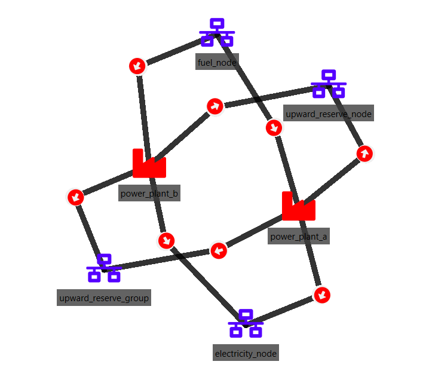

## Guide

### Entering input data

- Launch the Spine Toolbox and select **File** and then **Open Project** or use the keyboard shortcut **Ctrl + O** to open the desired project.
- Locate the folder that you saved in the Simple System tutorial and click *Ok*. This will prompt the Simple System workflow to appear in the *Design View* section for you to start working on.
- Select the 'input' Data Store item in the *Design View*.
- Go to *Data Store Properties* and hit **Open editor**. This will open the database in the *Spine DB editor*.

In this tutorial, you will learn how to add a new reserve node to the Simple System.

#### Creating objects

- Always in the Spine DB editor, locate the *Object tree* (typically at the top-left). Expand the [root] element if not expanded.
- Right click on the [node] class, and select *Add objects* from the context menu. The *Add objects* dialog will pop up.
- Enter the names for the new reserve node as seen in the image below, then press *Ok*. This will create a new object of class *node*, called *upward\_reserve\_node*.

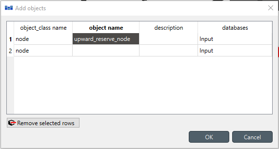

- Right click on the *node* class, and select *Add object group* from the context menu. The *Add object group* dialog will pop up. In the *Group name* field write *upward\_reserve\_group* to refer to this group. Then, add as a members of the group the nodes *electricity\_node* and *upward\_reserve\_node*, as shown in the image below; then press *Ok*.

!!! note
    In SpineOpt, groups of nodes allow the user to create constraints that involve variables from its members. Later in this tutorial, the group named *upward\_reserve\_group* will help to link the flow variables for electricity production and reserve procurement.

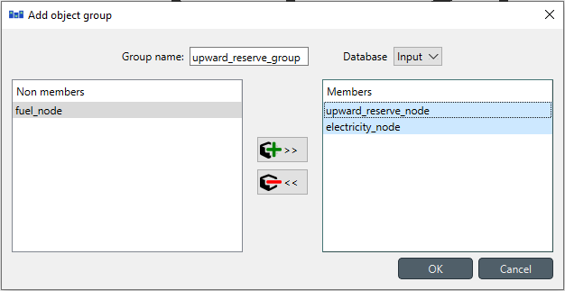

#### Establishing relationships

- Always in the Spine DB editor, locate the *Relationship tree* (typically at the bottom-left). Expand the *root* element if not expanded.
- Right click on the *unit\_\_to_node* class, and select *Add relationships* from the context menu. The *Add relationships* dialog will pop up.
- Select the names of the two units and their **receiving** nodes, as seen in the image below; then press *Ok*. This will establish that both *power\_plant\_a* and *power\_plant\_b* release energy into both the *upward\_reserve\_node* and the *upward\_reserve\_group*.

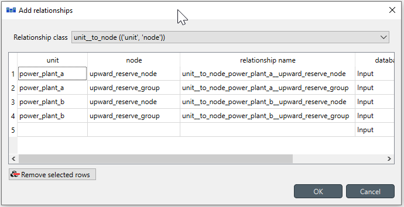

- Right click on the *report\_\_output* class, and select *Add relationships* from the context menu. The *Add relationships* dialog will pop up.

- Enter *report1* under *report*, and *variable\_om\_costs* under *output*. Repeat the same procedure in the second line to add the *res\_proc\_costs* under *output* as seen in the image below; then press *Ok*. This will write the total *vom\_cost* and *procurement reserve cost* values in the objective function to the output database as a part of *report1*.

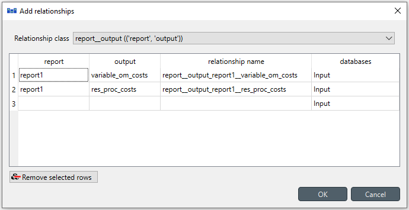

#### Specifying object parameter values

- Back to *Object tree*, expand the *node* class and select *upward\_reserve\_node*.
- Locate the *Object parameter* table (typically at the top-center).
- In the *Object parameter* table (typically at the top-center), select the following parameter as seen in the image below:
  - *demand* parameter and the *Base* alternative, and enter the value *20*. This will establish that there's a demand of '20' at the reverse node.
  - *is\_reserve\_node* parameter and the *Base* alternative, and enter the value *True*. This will establish that it is a reverse node.
  - *upward\_reserve* parameter and the *Base* alternative, then right-click on the value cell and then, in the context menu, select 'Edit...' and select the option *True*. This will establish the direction of the reserve is upwards.
  - *nodal\_balance\_sense* parameter and the *Base* alternative, and enter the value $\geq$. This will establish that the total reserve procurement must be greater or equal than the reserve demand.

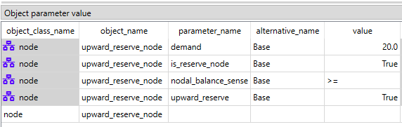

- Select *upward\_reserve\_group* in the *Object tree*.

- In the *Object parameter* table, select the *balance\_type* parameter and the *Base* alternative, and enter the value *balance\_type\_none* as seen in the image below. This will establish that there is no need to create an extra balance between the members of the group.

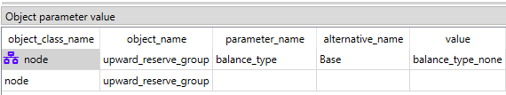

#### Specifying relationship parameter values

- In *Relationship tree*, expand the *unit\_\_to\_node* class and select *power\_plant\_a | upward\_reserve\_node*.

- In the *Relationship parameter* table (typically at the bottom-center), select the *unit\_capacity* parameter and the *Base* alternative, and enter the value *100* as seen in the image below. This will set the capacity to provide reserve for *power\_plant\_a*.

!!! note
    The value is equal to the unit capacity defined for the electricity node. However, the value can be lower if the unit cannot provide reserves with its total capacity.

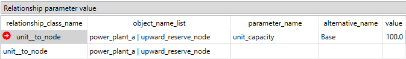

- In *Relationship tree*, expand the *unit\_\_to\_node* class and select *power\_plant\_b | upward\_reserve\_node*.

- In the *Relationship parameter* table (typically at the bottom-center), select the *unit\_capacity* parameter and the *Base* alternative, and enter the value *200* as seen in the image below. This will set the capacity to provide reserve for *power\_plant\_b*.

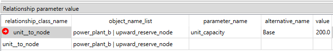

- In *Relationship tree*, expand the *unit\_\_to\_node* class and select *power\_plant\_a | upward\_reserve\_group*.

- In the *Relationship parameter* table (typically at the bottom-center), select the following parameter as seen in the image below:
  - *unit\_capacity* parameter and the *Base* alternative, and enter the value *100*. This will set the total capacity for *power\_plant\_a* in the group.

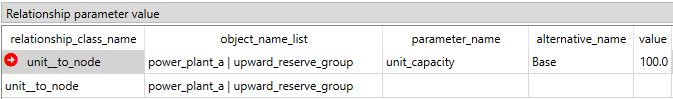

- In *Relationship tree*, expand the *unit\_\_to\_node* class and select *power\_plant\_b | upward\_reserve\_group*.

- In the *Relationship parameter* table (typically at the bottom-center), select the following parameter as seen in the image below:
  - *unit\_capacity* parameter and the *Base* alternative, and enter the value *200*. This will set the total capacity for *power\_plant\_b* in the group.

When you're ready, save/commit all changes to the database.

### Executing the workflow

- Go back to Spine Toolbox's main window, and hit the **Execute project** button  from the tool bar. You should see 'Executing All Directed Acyclic Graphs' printed in the *Event log* (at the bottom left by default).

- Select the 'Run SpineOpt' Tool. You should see the output from SpineOpt in the *Julia Console* after clicking the *object activity control*.

### Examining the results

- Select the output data store and open the Spine DB editor. You can already inspect the fields in the displayed tables or use a pivot table.

- For the pivot table, press **Alt + F** for the shortcut to the hamburger menu, and select **Pivot -> Index**.

- Select *report\_\_unit\_\_node\_\_direction\_\_stochastic\_scenario* under **Relationship tree**, and the first cell under **alternative** in the *Frozen table*.

- Under alternative in the Frozen table, you can choose results from different runs. Pick the run you want to view. If the workflow has been run several times, the most recent run will usually be found at the bottom.

- The *Pivot table* will be populated with results from the SpineOpt run. It will look something like the image below.

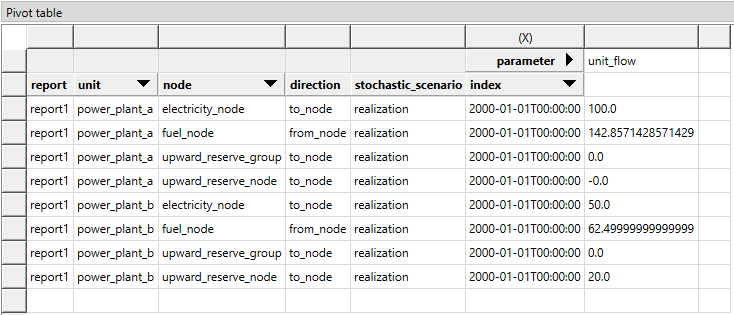

As anticipated, the *power\_plant\_b* is supplying the necessary reserve due to its surplus capacity, while *power\_plant\_a* is operating at full capacity. Additionally, in this model, we have not allocated a cost for reserve procurement. One way to double-check it is by selecting *report\_\_model* under **Relationship tree** and look at the costs the *Pivot table*, see image below.

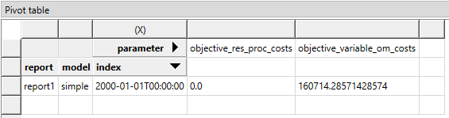

So, is it possible to assign costs to this reserve procurement in SpineOpt? Yes, it is indeed possible.

#### Specifying a reserve procurement cost value

- In *Relationship tree*, expand the *unit\_\_to\_node* class and select *power\_plant\_a | upward\_reserve\_node*.

- In the *Relationship parameter* table (typically at the bottom-center), select the *reserve\_procurement\_cost* parameter and the *Base* alternative, and enter the value *5* as seen in the image below. This will set the cost of providing reserve for *power\_plant\_a*.

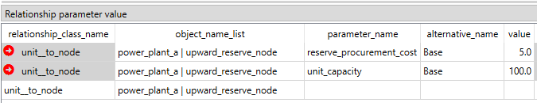

- In *Relationship tree*, expand the *unit\_\_to\_node* class and select *power\_plant\_b | upward\_reserve\_node*.

- In the *Relationship parameter* table (typically at the bottom-center), select the *reserve\_procurement\_cost* parameter and the *Base* alternative, and enter the value *35* as seen in the image below. This will set the cost of providing reserve for *power\_plant\_b*.

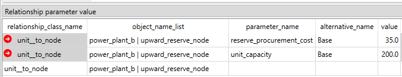

**Don't forget to commit the new changes to the database!**

#### Executing the worflow and examining the results again

- Go back to Spine Toolbox's main window, and hit again the **Execute project** button as before.

- Select the output data store and open the Spine DB editor. You can inspect results as before, which should look like the image below.

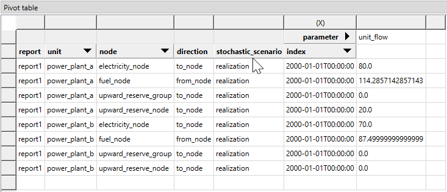

Since the cost of reserve procurement is way cheaper in *power\_plant\_a* than in *power\_plant\_b*, then the optimal solution is to reduce the production of electricity in *power\_plant\_a* to provide reserve with this unit rather than *power\_plant\_b* as before. By looking at the total costs, we can see that the reserve procurement costs are no longer zero.

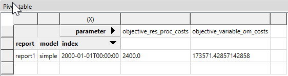
