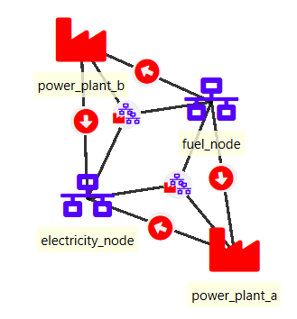
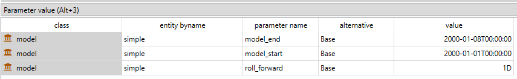
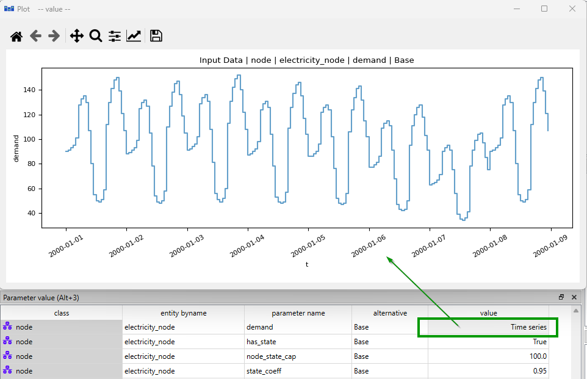
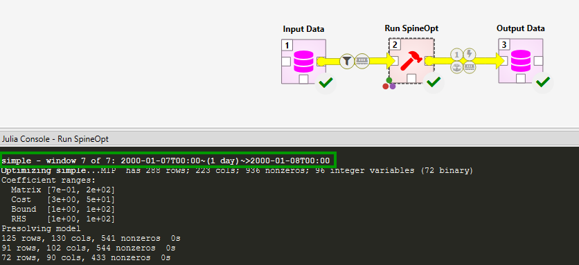
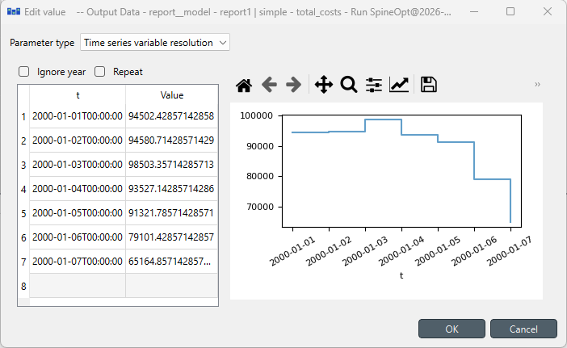
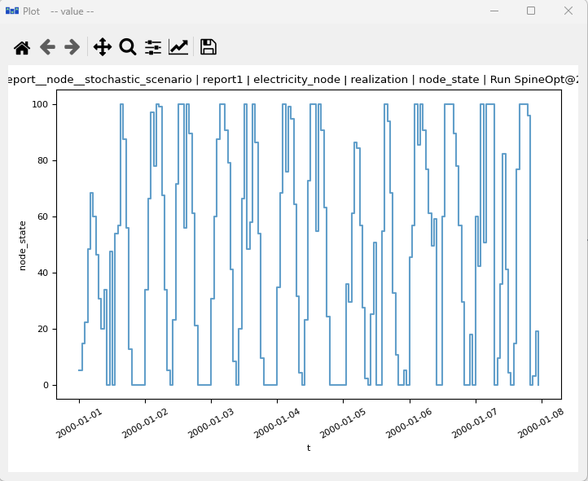
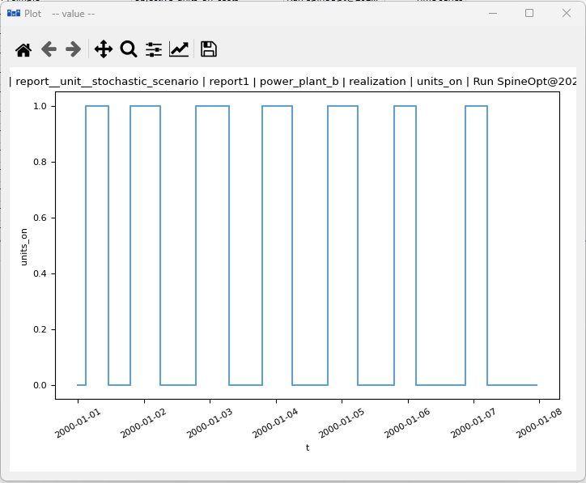

# Rolling horizon tutorial

This tutorial provides a step-by-step guide to show the main parameter seeting up to use the rolling horizon feature in SpineOpt.

## Introduction

Welcome to our tutorial the tutorial for rolling horizon in SpineOpt. To get the most out of this tutorial, we suggest first completing the Unit Commitment tutorial, which can be found [here](https://spine-tools.github.io/SpineOpt.jl/latest/tutorial/unit_commitment/).

But first, **What is rolling horizon?**

The rolling horizon technique manages large problems by prioritizing efficiency over accuracy. Instead of solving the entire time horizon, it tackles smaller problems within "rolling windows" that represent shorter time periods that share results from one window to the next. This approach allows for quicker solutions, but may lead to sub-optimal results (from the entire time horizon perspective), particularly affecting inter-temporal constraints (e.g., storage levels, unit-commitment, ramping) due since avoids the perfect foresight. More information about the rolling horizon technique can be found in [here](https://jump.dev/JuMP.jl/stable/tutorials/algorithms/rolling_horizon/).

### Model assumptions

First, let's start by importing the file [rolling_horizon.json](https://github.com/spine-tools/SpineOpt.jl/blob/master/examples/rolling_horizon.json) into SpineToolbox and create a workflow to run the model as in the Unit Commitment tutorial. The file has already set up the rolling horizon, so you can directly run the workflow to see how it works. However, we recommend going through the steps in this tutorial to understand how to set up the rolling horizon in SpineOpt and analyze the results.

Good! So, let's now have a look to the system we are working with. The image below shows the system structure, which is an extension of the Unit Commitment case study with two storage nodes: *fuel\_node* and *battery\_storage*.

The main changes to the Unit Commitment case study are:

- The demand at *electricity\_node* is a time series of a week (168 hours) instead of a single day
- The *electricity\_node* has storage state with capacity 100 MWh and efficiency of 0.95.

!!! tip "Remember!"
    This example is an extension of the Unit Commitment tutorial, so the inter-temporal constraints included are: unit-commitment, minimum operating point, minimum down time, and minimum up time.

All right! with this information in hand, let's explore the data and see how all this information is setup in SpineOpt.

## Model setup

In the figure below, you can see the model parameters. Notice that in addition, to the `model_start` and `model_end` parameters, there is a new parameter [roll_forward](@ref) that defines how much the model moves ahead in time between solves in a rolling optimization. In this case, we can see that the model moves forward by 24 hours (1 day) in each step, which means that the optimization will be performed in 7 steps to cover the whole week.

## Temporal block setup

The `temporal_block` parameters `block_start` and `block_end` are set to 0h and 1D respectively, which means that the optimization will be performed in rolling windows of 24 hours,  the results at the end of each window are used to initialize the next window.

!!! tip "Pro tip!"
    The `temporal_block` parameters `block_start` and `block_end` can be larger range than the `roll_forward` parameter. For example, if `block_start` is set to 0h and `block_end` is set to 48h (i.e., look ahead), the optimization will be performed in rolling windows of 48 hours, but only the results for the first 24 hours will be kept at each step. But! be careful, it means that there is enough input data at the end of the last window to perform the optimization in the last one. You can extend the time series data accordingly and optimize for 8 days in this example.

Please have a look to the sections [Rolling window optimization with single block](@ref rolling_horizon_single_block) and [Rolling horizon with multiple blocks](@ref rolling_horizon_multiple_blocks) in the documentation for more information about how to use the rolling horizon feature with different temporal block setups.

## Electricity demand time series

Let's check the electricity demand time series for the *electricity\_node* in the figure below. The demand is a time series of a week (168 hours) with a daily pattern along the whole week. The demand data is stored in the file [uc\_electricity\_node\_demand\_week.csv](figs_rolling_horizon/uc_electricity_node_demand_week.csv).

In addition, you can see that the parameters `has_state` and `state_coeff` for the storage representation in the *electricity\_node*.

## Results analysis

We are ready to run the model and analyze the results! After running the model, you can check the optimization windows in the console (e.g., see the 7th window in the figure below).

The figure below shows the objective function values for each optimization window, which can be used to analyze the performance of the rolling horizon approach.

Let's now check the results for the storage state and the units on status. The figure below shows the node state and the units on status for the thermal generators.

!!! tip "Did you notice?"
    SpineOpt provides the results for the whole time horizon, which means that you can analyze the results for the entire week, even though the optimization was performed in rolling windows. This allows you to compare the results of the rolling horizon approach with a perfect foresight approach (i.e., optimizing for the whole week at once) and analyze the impact of the rolling horizon on the results.

!!! info "You have completed this tutorial, congratulations!"
    You know how to use the Rolling Horizon feature in SpineToolbox and SpineOpt. Keep up the rolling!
