# Simple System tutorial

Welcome to Spine Toolbox's Simple System tutorial.

This tutorial provides a step-by-step guide to setup a simple energy
system with Spine Toolbox for SpineOpt.
Spine Toolbox is used to create a workflow with databases and tools and 
SpineOpt is the tool that simulates/optimizes the energy system.

!!! info
    If you haven't yet installed the tools or you are not sure whether you have the latest version,
    please follow the installation/upgrade guides: 
    - For Spine Toolbox: [Spine Toolbox installation guide](https://github.com/spine-tools/Spine-Toolbox#installation)
    - For SpineOpt: [SpineOpt installation guide](@ref installation)

## About the simple system

In the simple system:

-   Two power plants take fuel from a source node and release
    electricity to another node in order to supply a demand.
-   Power plant 'a' has a capacity of 100 MW, a variable operating cost
    of 25 euro/fuel unit, and generates 0.7 MWh of electricity per unit
    of fuel.
-   Power plant 'b' has a capacity of 200 MW, a variable operating cost
    of 50 euro/fuel unit, and generates 0.8 MWh of electricity per unit
    of fuel.
-   The demand at the electricity node is 150 MW.
-   The fuel node is able to provide infinite energy.

## Spine Toolbox workflow

The workflow for this tutorial is quite simple: A SpineOpt tool that 
reads data from an input database, executes the simulation/optimization 
and writes the results to an output database.

To create the workflow, it is almost as simple as dragging these items
(i.e. Data Store and Run SpineOpt) to the *Design View* and
connecting them by dragging arrows between the blocks 
but there are some things that need to be configured:
-   The databases need to be initialised. Once you select a database
    you see the properties panel. Select the dialect of the database.
    Here we choose sqlite. Then press the button 'new spine db' to 
    create and save the database on your computer 
    (Spine Toolbox will suggest a good folder).

-   Connecting tools with (yellow) arrows in the Toolbox does not mean that 
    the tools will use these items.
    The arrows in the Toolbox view make items (databases) available.
    To let SpineOpt know we want to use these items, we need to go to the 
    properties panel of Run SpineOpt and drag the available items to the 
    tool arguments. The order of the items is first the input, then the output.
    See below for how the property window should look.

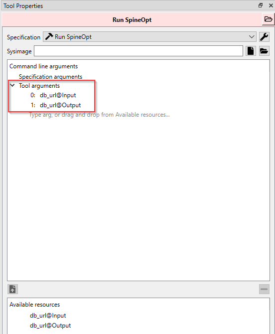

-   (optional) The Spine data stores are quite generic. In order for SpineOpt to be able 
    to read the input database, we need to change its format from the Spine format 
    to the SpineOpt format. Luckily we can use templates for this. One of those 
    templates is made available as an item in Spine Toolbox: Load template. 
    The other option is to load templates into the database using the db editor. 
    The templates can also be used to pre-populate the database with some basic 
    components. Here we briefly explain the use of the Load template 
    block and later we show how to import a template and basic components with the 
    spine db editor. To use the Load template block, drag it to the view and connect 
    it to the input database. Just like the Run SpineOpt block we need to drag the 
    available input database to the tool argument.

The result should look similar to this (+/- the Load template block):

That is it for the workflow. Now we can enter the data for the setup of the simple system 
into the input database, run the workflow and view the results in the output database.

## Entering input data

To enter the necessary data for the simple system, we'll use the *Spine DB editor*.
The *Spine DB editor* is a dedicated interface within Spine Toolbox
for visualizing and managing Spine databases. The default view shows 
tables (see below) but for viewing energy system configurations
it is nice to see a graph. Press the graph button in the toolbar.
The entity graph only shows what you select in the entity tree
and what your selected entities are connected to.

To open the editor:
-   Double click the input Data Store item 
    (or select the 'input' Data Store item in the *Design View*, 
    go to *Data Store Properties* and hit **Open editor**).

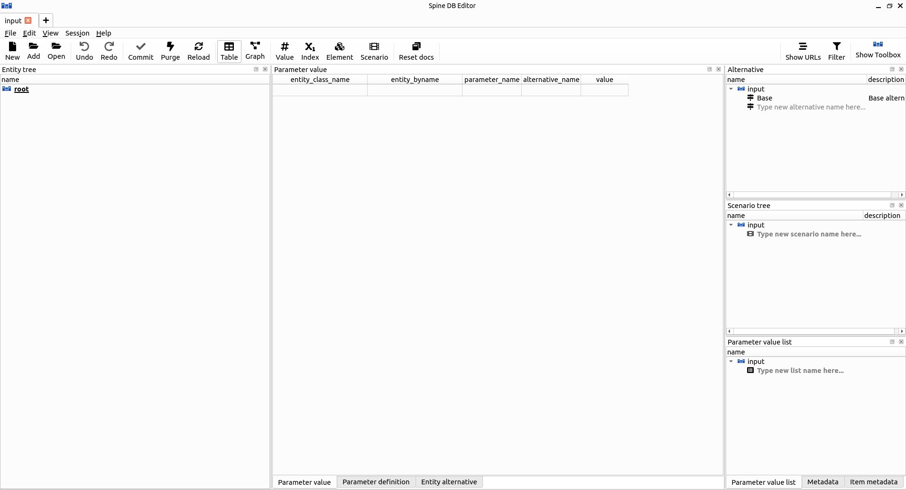

In the following we enter the input data for the simple system.

### Importing the SpineOpt database template

A SpineOpt database is a spine database but a spine database is not necessarily a SpineOpt database. Therefore we first need to format the database to a SpineOpt database with the SpineOpt template. The SpineOpt template contains the fundamental entity classes and parameter definitions that SpineOpt recognizes and expects. One option to load the template is to use the 'Load template' tool as mentioned before. Another option is to import the template with the Spine DB editor. To that end:

-   Download [the SpineOpt database
    template](https://raw.githubusercontent.com/spine-tools/SpineOpt.jl/master/templates/spineopt_template.json) (right click on the link, then select *Save link as...*)

-   To import the template to the database,
    click on **File -> Import...**, and then select the template file you previously
    downloaded (*spineopt\_template.json*). The contents of that file will be 
    imported into the current database, and you should then see classes like 
    'commodity', 'connection' and 'model' in the entity tree.

-   To save our changes, press the **Commit** button in the toolbar.
    Enter a commit message, e.g. 'Import SpineOpt template', in the popup dialog
    and click **Commit**.

### Model settings

A typical SpineOpt database has two parts: the model settings and the physical system.

The model settings that we need for this tutorial are also available as a template that we can import. The SpineOpt basic model template contains some predefined entities for a common deterministic model with a 'flat' temporal structure.

-   Download [the basic SpineOpt
    model](https://raw.githubusercontent.com/spine-tools/SpineOpt.jl/master/templates/models/basic_model_template.json)
    (right click on the link, then select *Save link as...*)

-   Import the template to the database through **File -> Import...**,
    and then select the template file you previously downloaded (*basic\_model\_template.json*).

-   Commit (save) the changes through the **Commit** button in the toolbar.

One of the predefined entities is the report.
The report determines which variables of the SpineOpt model show up in the results later on.
Currently, there is no output connected to the report. We'll have to do that manually:

-   Locate the *Entity tree* in the Spine DB editor (typically
    at the top-left).

-   Press the '+' next to the *report\_\_output* class.
    The *Add entities* dialog will pop up.

-   We'll have to fill in the field for the report and the output.
    Double click the field to see the options.
    For the 'report' field we need 'report1'
    and for the 'output' field we only need 'unit\_flow', as seen in the image below.
    This will tell SpineOpt to write the value of the
    *unit\_flow* optimization variable to the output
    database, as part of *report1*.

-   Press *Ok*.

-   Commit (save) the changes through the **Commit** button in the toolbar.

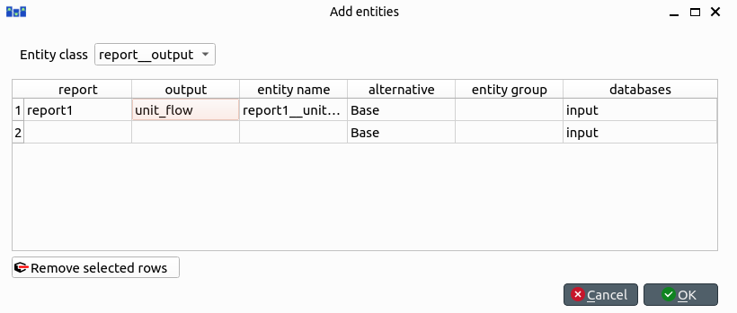

The resulting model structure can then be seen in the picture below (by selecting the model, the stochastic structure and the report in the entity tree). The *realization* entity is a scenario, which is required in SpineOpt even for a deterministic model (details will be explained in the later [Stochastic structure](https://spine-tools.github.io/SpineOpt.jl/latest/tutorial/stochastic_system/) tutorial).

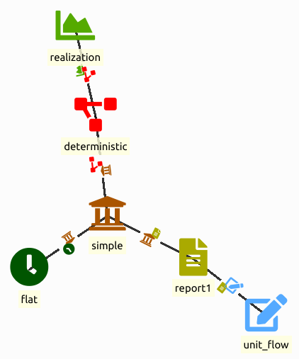

### Creating nodes and units

As for the physical system, we start with creating nodes and units.
As shown before, the simple system contains 2 nodes and 2 units.

!!! info
    In SpineOpt, nodes are points where an energy balance takes place,
    whereas units are energy conversion devices that can take energy from
    nodes, and release energy to nodes.

To create the nodes:

-   Locate the *Entity tree* in the Spine DB editor (typically
    at the top-left).

-   Right click on the [node] class, and select *Add entities* 
    from the context menu (or press the '+' icon next to it).
    The *Add entities* dialog will pop up.

-   Enter the names for the system nodes as seen in the image below,
    then press *Ok*. This will create two entities of class
    *node*, called *fuel* and *electricity*.

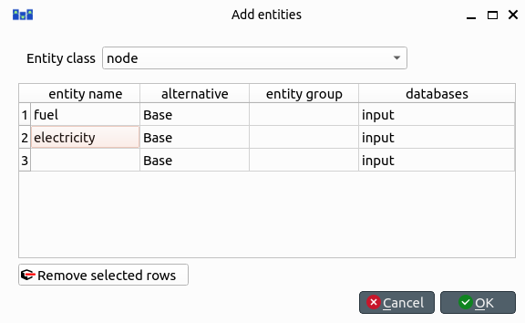

To create the units we do the same thing:

-   Press '+' next to the *unit* class, and add two units called
    *power\_plant\_a* and *power\_plant\_b*.

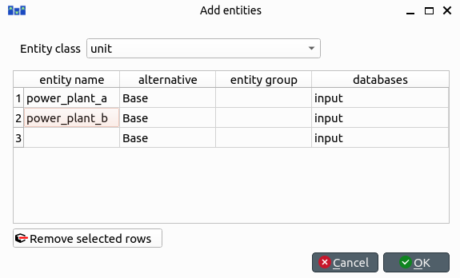

!!! info
    To modify an entity after you enter it, right click on it and select
    **Edit...** from the context menu.

### Creating relationships between the nodes and units

For the simple system we need to link the nodes and the units.
Intuitively, we know that we need to make flows from the
'fuel' node to the units and to the 'electricity' node.
Additionally we'll have to add a 'unit\_\_node\_node' entity
to be able to add data on properties to the relation between
the input and the output of the units.

For the flow from the 'fuel' node to the units:

-   Press '+' next to the *unit\_\_from\_node* class,
    you'll see a 'unit' field and a 'node' field.

-   Double click the unit or node field to see the options.

-   Select each unit once and the 'fuel' node twice,
    resulting in the combinations
    'power\_plant\_a'-'fuel' and 'power\_plant\_b'-'fuel'.

!!! info
    Alternatively right click the entities in the *entity graph* and 
    *connect entities* will show the available entity classes.
    You can then make the desired relations visually.
    Note that this only works when the involved units/nodes/... are visible
    in the entity graph. To make an entity visible, simply click on the entity
    in the entity tree. You can select multiple entities with
    ctrl or shift.

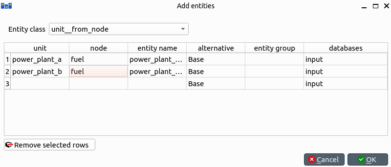

For the flow from the units to the 'electricity' node, we do the same:

-   Press '+' next to the *unit\_\_to\_node* class and choose
    each unit once and the 'electricity' node twice,
    resulting in the combinations
    'power\_plant\_a'-'electricity' and 'power\_plant\_b'-'electricity'

These flows so far only determine what happens between the node and the unit.
However, we also need to determine what happens between the input and output of the unit.
As there can be multiple inputs and outputs, we'll have to define which flows exactly
contribute to the input/output behaviour. To that end we use a *unit\_\_node\_\_node* class.

-   Press '+' next to the *unit\_\_node\_\_node* class and choose the unit, 
    its output node and its input node,
    resulting in the combinations
    'power\_plant\_a'-'electricity'-'fuel' and 'power\_plant\_b'-'electricity'-'fuel'

!!! info
    The *unit\_\_node\_\_node* relationship is necessary to limit the flow 
    (flows are unbound by default) and to define an efficiency.
    The order of the nodes is important for that definition (see later on).
    It may seem unintuitive to define an efficiency through a three-way 
    relationship instead of a property of a unit, but this approach allows you
    to define efficiencies between any flow(s) coming in and out of the unit (e.g. CHP).

The resulting system can be seen in the picture below (by selecting the node in the
entity tree).

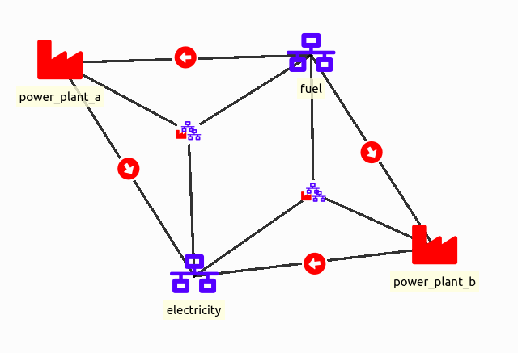

### Adding parameter values

With the system in place, we can now enter the data as described in the beginning of this tutorial,
i.e. the capacities, efficiencies, demand, etc.
To enter the data we'll be using the table view (typically in the center or below the graph view).

!!! info
    The table view has three tabs that can be activated below the table.
    We use the *parameter value* tab to enter values
    and the *parameter definition* tab to get an overview
    of the available parameters and their default values.

Let's start with adding an electricity demand of 150 at the electricity node.

Select the 'electricity' node in the entity tree, in the entity graph, or in the list
after clicking *entity\_byname* in the header row of the parameter value table. Then, in the 
parameter value table:

-   Double click the *parameter\_name* field and select *demand*.

-   Double click the *alternativet\_name* field and select *Base*.

-   Double click the *value* field and enter 150.

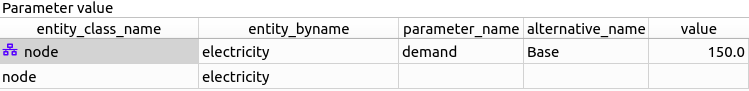

!!! info
    The alternative name is not optional. If you don't select *Base* 
    (or another name) you will not be able to save your data.
    Speaking of which, when is the last time you saved/committed?

!!! info
    A correctly completed row of the parameter value table will show an icon in the
    *entity\_class\_name* column, corresponding to the icon of that entity class in entity tree.
    In contrast, an incomplete row will have no icon and will stay in the parameter value window
    even when a different entity is selected. 
    Pay attention to the icons and entity class names to avoid mixing parameter descriptions.

For the fuel node we want an infinite supply.
Since the default behaviour of a node is to balance all incoming and outgoing flows,
we'll have to take that balance away.

Select the 'fuel' node in the entity tree or in the entity graph. Then, in the parameter
value table, select

-   *entity\_by\_name*: 'fuel' node

-   *parameter\_name*: *balance\_type*

-   *alternative\_name*: *Base*

-   *value*: *balance\_type\_none*

For the power plants we want to specify the variable operation and maintenance (VOM) cost,
the capacity and the efficiency.
Each of these parameters are defined in different parts of the system.
That is, again, because it is possible to define multiple inputs and outputs.
To pinpoint the correct flows, the parameters are therefore related to the flows rather than the unit.
In particular, the VOM cost is related to the input flow
and as such to *unit\_\_from\_node* between the unit and the 'fuel' node.
The capacity is related to the output flow
and as such to *unit\_\_to\_node* between the unit and the 'electricity' node.
The efficiency is related to the relation between the input and the output
and as such to *unit\_\_node\_node* between the unit, the 'electricity' node and the 'fuel' node.

We enter these values again in the parameter value table.

For the VOM cost of the power plants:

-   select the *unit\_\_from\_node* entity class

-   *entity\_by\_name*: 'power\_plant\_a|fuel'

-   *parameter\_name*: *vom\_cost*

-   *alternative\_name*: *Base*

-   *value*: 25.0

-   Do the same for 'power\_plant\_b' with a value of 50.0

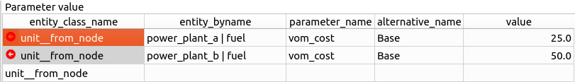

For the capacity of the power plants:

-   select the *unit\_\_to\_node* entity class

-   *entity\_by\_name*: 'power\_plant\_a|electricity'

-   *parameter\_name*: *unit\_capacity*

-   *alternative\_name*: *Base*

-   *value*: 100.0

-   Do the same for 'power\_plant\_b' with a value of 200.0

For the efficiency of the power plants:

-   select the *unit\_\_node\_node* entity class

-   *entity\_by\_name*: 'power\_plant\_a|electricity|fuel'

-   *parameter\_name*: *fix\_ratio\_out\_in\_unit\_flow*

-   *alternative\_name*: *Base*

-   *value*: 0.7

-   Do the same for 'power\_plant\_b' with a value of 0.8

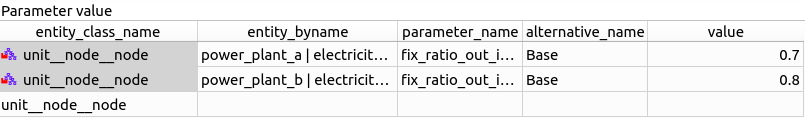

!!! info
    The order of the nodes is important for the *fix\_ratio\_out\_in\_unit\_flow* 
    parameter. If you have swapped the nodes or inverted the efficiency values, 
    the Run SpineOpt tool will run into errors.

When you're ready, save/commit all changes to the database.

Select the root in the entity tree to see an overview of all parameters in the table.

## Executing the workflow

With the input database ready, we are ready to run SpineOpt.

-   Go back to Spine Toolbox's main window, and hit the **Execute
    project** button from the tool bar. 
    You should see 'Executing All Directed Acyclic Graphs' printed in
    the *Event log* (at the bottom left by default).

-   Select the 'Run SpineOpt' Tool. You should see the output from
    SpineOpt in the *Julia Console* (after clicking the *object activity control* in older versions).

## Examining the results

If everything went well, the output should be written to the output database.
Opening the output database in the Spine DB editor, we can inspect its values.
Note that the entity tree looks different as there is no SpineOpt template loaded here.
Regardless, the output is available in the displayed tables.

By default all runs are shown in the tables.
By selecting a specific run in the the *alternatives* (typically on the right),
you can instead view the results of a single run.

Typically there will be *Time Series* in the values.
Double click these to view the values.

For 'power\_plant\_a' you should see a value of 100 and for 'power\_plant\_b' a value of 50.
