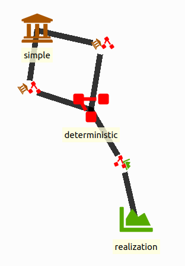
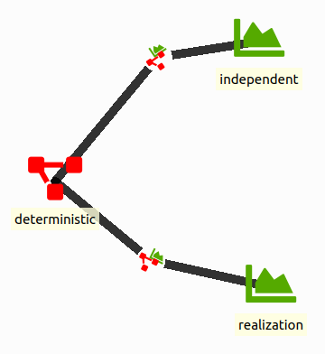
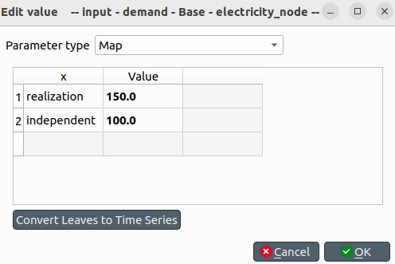
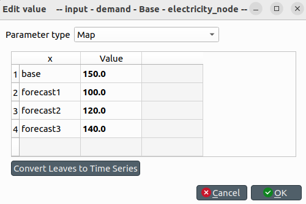
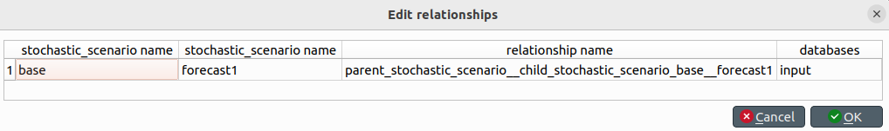
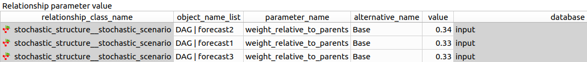
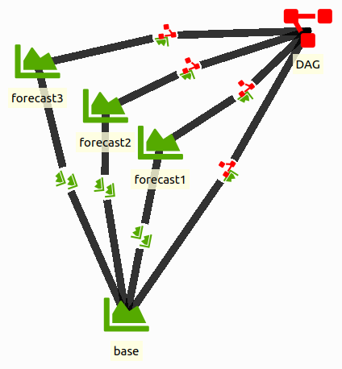
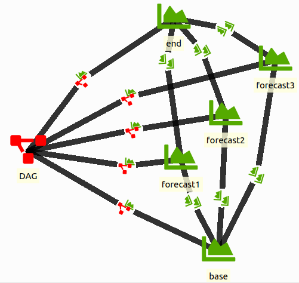

# Stochastic structure tutorial

Welcome to Spine Toolbox's Stochastic System tutorial.

This tutorial provides a step-by-step guide to get started with the stochastic structure.
More information can be found in the [documentation on the stochastic structure](@ref stochastic_framework).
It is recommended to make sure you are able to get the simple system tutorial working first.

In this tutorial we will take a look at independent scenarios and stochastic paths.

!!! info
    In theory it is also possible to have different stochastic structures in different parts of your system. In practice that is very much prone to errors. As much of the functionality of different stochastic structures can be accomplished with a clever DAG, it is recommended to work with a single stochastic structure at all times.

## Setup starting from simple system tutorial

We create a new Spine Toolbox project and start from the simple system tutorial.

For the Spine Toolbox project
- Open Spine Toolbox
- Create a new Spine Toolbox project
- Add two data store items (input and output)
    - set the dialect to sqlite
    - push the new database button
- Add the run SpineOpt tool
    - connect the databases to the SpineOpt tool
    - in the properties pane of the SpineOpt tool,
    move the available resources to the tool arguments

For the simple system tutorial
- Download the simple system database (json file)
from the examples folder in the SpineOpt repository
(you can save the json file in your Spine Toolbox project folder)
- Enter the input database such that you are in the spine db editor
- Go to the hamburger menu (Alt+F) and select import
- Locate the downloaded file to import the simple system
- We save our results when we commit to the database,
so go again to the hamburger menu and select commit.
The update message can be something like this: import simple system tutorial.

!!! note
    The graph view is not always enabled by default. If you want to see the simple system,
    go to the hamburger menu and select graph.

## Independent scenarios
Recall from the simple system tutorial that there actually already is a stochastic structure present.
Let us take a closer look at that structure.

The scenarios are the labels that are available to the user to label their data.
Don't worry, we'll come back to that later.
Here, there is currently one scenario *realization*.

The scenarios are managed by the stochastic structure.
Foremost, the stochastic structure is connected to the model with the
*model\_\_stochastic_structure* relationship.
The stochastic structure is also connected to different parts of the energy system
to manage the stochastic structure in these parts.
With the *model\_\_default_stochastic_structure* relationship we can connect the scenario
to the entire energy system.
Here, there is one stochastic structure *deterministic* which is also the systems default.

It is quite simple to add an independent scenario to this existing stochastic structure.
- Add a *scenario* object and call it 'independent'
- Add a *stochastic\_structure\_\_stochastic\_scenario* relationship between *independent* and *deterministic*
either from the tree view (right click -> new relationship) or from the graph view (right click -> add relationship)

Now we can use these labels in the values for the energy system.
- Change the *demand* parameter at the *electricity\_node* from 150.0 to a map
(right click -> edit, parameter type map)
- for the *x* column we can use our scenario labels, for the *Value* column we can choose our values
- Choose realization 150.0 and independent 100.0
- Save/Commit the results

That is it!
We can now run the model and the output database will show the results for both scenarios.
In the realization scenario power plant b produces an output of 50.
In the independent scenario power plant b does not produce anything
as the demand is low enough for power plant a to produce all the necessary energy.

## Stochastic path
SpineOpt always works with stochastic paths.
The stochastic path describes which scenario is active at each time step.
There can be multiple stochastic paths in parallel.
The stochastic structure collects the stochastic paths in a direct acyclic graph (DAG).

But let's make that more clear with an example.
We can continue from the previous structure,
but let's rename the structure and scenarios. (optional step)
- Right click the object (either in the tree view or the graph view) and select *edit*
- Rename the stochastic structure from *deterministic* to *DAG*
- Rename the *realization* scenario to *base*
- Rename the *independent* scenario to *forecast1*

Perhaps from the name you already guessed it, we are going to add some scenarios.
- Add two scenario objects *forecast2* and *forecast3*
- Connect the two scenarios to stochastic structure

And we need to adjust the map for the electricity demand accordingly.
- Edit the map and provide a value for each scenario
(see image below)

All these scenarios are independently available to the stochastic structure
but now we want to define the underlying relationships to make a stochastic path.
In particular, we want to start from a base scenario and later
split in the forecast scenarios.
For SpineOpt that means that the base scenario is the parent scenario
and the following forecast scenarios are the child scenarios.
- add the *parent\_stochastic\_structure\_\_child\_stochastic\_structure*
for each forecast scenario and select the base scenario as its parent
(the first scenario is the parent scenario and the second scenario is its child)

We also need to tell SpineOpt what the probability is that we end up in a certain child.
That information is stored in the stochastic structure so you'll find the corresponding parameter
in the *stochastic\_structure\_\_stochastic\_scenario* relationship.
Here we assume that each forecast is equally likely to happen.
- for each DAG | forecast relationship, add a value for
the *weight\_relative\_to\_parent* parameter;
the sum needs to be equal to 1

That results in the stochastic structure below.

We can run the SpineOpt tool on this database but we will only see the values for the base scenario.
That is because SpineOpt assumes that a scenario runs forever.
So, we need to tell SpineOpt when the base scenario ends.
- The current resolution of the system is 1D
but we need a higher resolution if we want to switch scenarios.
So, set the resolution parameter of the temporal block flat to 1h.
- To end the base structure after 6 h,
we go to the DAG | base relationship and set the parameter
*stochastic\_scenario\_end* to a 6h duration value
(to obtain a duration value we need to right click the value field
and select the parameter type duration)

Do not forget to save/commit from time to time.

When we run the model now, we will obtain values for all scenarios.

!!! note
    For the sake of completion we will also tell you what to do
    when you want converge the forecasts into an end scenario.
    - add a scenario called *end*
    - map the end scenario for the electricity demand to the value 200.0
    - connect the end scenario to the stochastic structure
    - connect the end scenario to each of the forecasts,
    where the forecasts are considered as the parents
    - set the weight of the end scenario to 1
    - let the forecasts scenarios end after a duration of 16 hours

    

!!! warning
    The *stochastic\_scenario\_end* parameter starts counting from the start of the simulation!
    In the examples above, when the base scenario has a duration of 6h and the forecast scenarios have a duration of 16h,
    the forecast scenarios will only be active for 10 hours between hour 6 and hour 16!