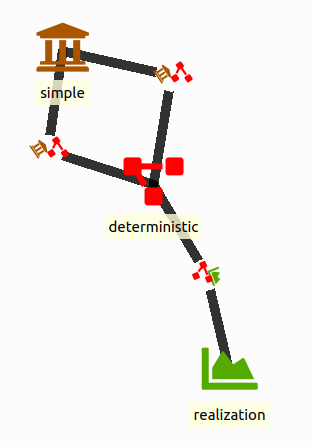
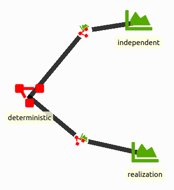
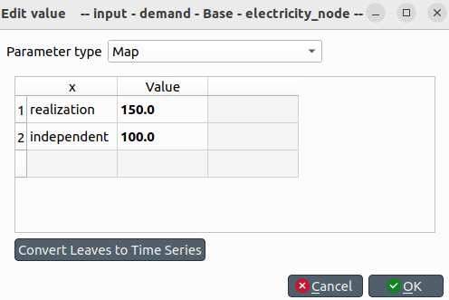
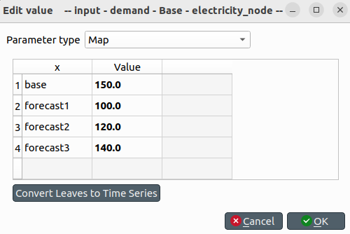
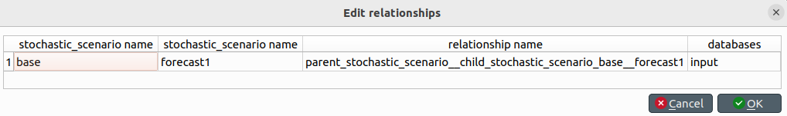
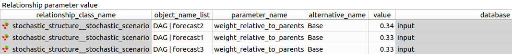
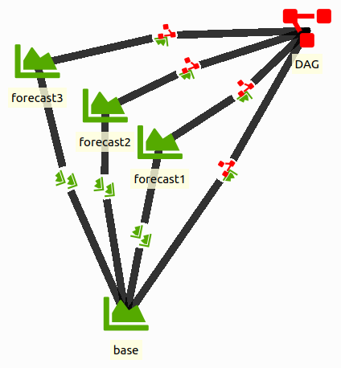
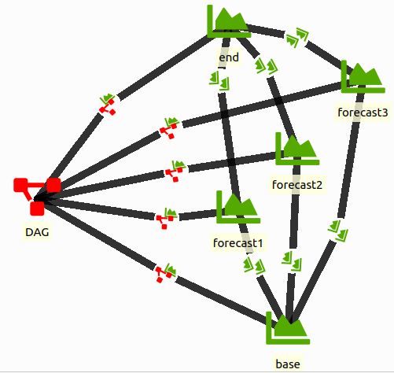

# Stochastic structure tutorial

Welcome to Spine Toolbox's Stochastic System tutorial.

This tutorial provides a step-by-step guide to get started with the stochastic structure.
More information can be found in the [documentation on the stochastic structure](@ref stochastic_framework).
It is recommended to make sure you are able to get the simple system tutorial working first.

In this tutorial we will take a look at independent scenarios and stochastic paths.

!!! info
    In theory it is also possible to have different stochastic structures in different parts of your system. In practice that is very much prone to errors. As much of the functionality of different stochastic structures can be accomplished with a clever DAG, it is recommended to work with a single stochastic structure at all times.

## Setup starting from simple system tutorial

We create a new Spine Toolbox project and start from the simple system tutorial.

For the Spine Toolbox project
- Open Spine Toolbox
- Create a new Spine Toolbox project
- Add two data store items (input and output)
    - set the dialect to `sqlite`
    - push the new database button
- Add the run SpineOpt tool
    - connect the databases to the SpineOpt tool
    - in the properties pane of the SpineOpt tool,
    move the available resources to the tool arguments

For the simple system tutorial
- Download the simple system database (`json` file)
from the `./examples/` folder in the SpineOpt repository
(you can save the `json` file in your Spine Toolbox project folder)
- Enter the input database such that you are in the spine DB editor
- Go to the hamburger menu (Alt+F) and select import
- Locate the downloaded file to import the simple system
- We save our results when we commit to the database,
so go again to the hamburger menu and select commit.
The update message can be something like this: import simple system tutorial.

!!! note
    The graph view is not always enabled by default. If you want to see the simple system,
    go to the hamburger menu and select graph.

## Independent scenarios
Recall from the simple system tutorial that there actually already is a stochastic structure present.
Let us take a closer look at that structure.

The scenarios are the labels that are available to the user to label their data.
Don't worry, we'll come back to that later.
Here, there is currently one scenario *realization*.

The [stochastic\_scenario](@ref)s are managed by the [stochastic\_structure](@ref)s.
The [stochastic\_structure](@ref)s are connected to different parts of the energy system
to manage them.
With the [model\_\_default\_stochastic\_structure](@ref) relationship we can connect a [stochastic\_scenario](@ref)
to the entire energy system.
Here, there is one [stochastic\_structure](@ref) *deterministic* which is also the systems default.

It is quite simple to add an independent [stochastic\_scenario](@ref) to this existing [stochastic\_structure](@ref).
- Add a [stochastic\_scenario](@ref) object and call it *independent*
- Add a [stochastic\_structure\_\_stochastic\_scenario](@ref) relationship between *independent* and *deterministic*
either from the tree view (right-click -> new relationship) or from the graph view (right-click -> add relationship)

Now we can use these labels in the values for the energy system.
- Change the [demand](@ref) parameter at the *electricity\_node* from 150.0 to a map
(right-click -> edit, parameter type map)
- for the *x* column we can use our [stochastic\_scenario](@ref) labels, for the *Value* column we can choose our values
- Choose *realization* 150.0 and *independent* 100.0
- Save/Commit the results

That is it!
We can now run the model and the output database will show the results for both [stochastic\_scenario](@ref)s.
In the *realization* [stochastic\_scenario](@ref) *power plant b* produces an output of 50.
In the *independent* [stochastic\_scenario](@ref) *power plant b* does not produce anything
as the [demand](@ref) is low enough for *power plant a* to produce all the necessary energy.

## Stochastic path
SpineOpt always works with *stochastic paths*.
The *stochastic path* describes which [stochastic\_scenario](@ref)s are active at each time step.
The [stochastic\_structure](@ref) collects the *stochastic paths* in a direct acyclic graph (DAG).

But let's make that more clear with an example.
We can continue from the previous structure,
but let's rename the [stochastic\_structure](@ref) and [stochastic\_scenario](@ref). (optional step)
- Right-click the object (either in the tree view or the graph view) and select *edit*
- Rename the [stochastic\_structure](@ref) from *deterministic* to *DAG*
- Rename the *realization* [stochastic\_scenario](@ref) to *base*
- Rename the *independent* [stochastic\_scenario](@ref) to *forecast1*

Perhaps from the name you already guessed it, we are going to add some [stochastic\_scenario](@ref)s.
- Add two [stochastic\_scenario](@ref) objects *forecast2* and *forecast3*
- Connect the two [stochastic\_scenario](@ref)s to [stochastic\_structure](@ref)

And we need to adjust the `Map` for the electricity [demand](@ref) accordingly.
- Edit the `Map` and provide a value for each [stochastic\_scenario](@ref)
(see image below)

All these [stochastic\_scenario](@ref) are independently available to the [stochastic\_structure](@ref),
but now we want to define the underlying relationships to make a *stochastic path*.
In particular, we want to start from a *base* [stochastic\_scenario](@ref) and later
split into the forecast [stochastic\_scenario](@ref).
For SpineOpt, that means that the *base* [stochastic\_scenario](@ref) is the *parent*,
and the following forecast [stochastic\_scenario](@ref)s are its children.
- add the [parent\_stochastic\_scenario\_\_child\_stochastic\_scenario](@ref)
for each forecast [stochastic\_scenario](@ref) and select the *base* [stochastic\_scenario](@ref) as its parent
(the first [stochastic\_scenario](@ref) is the *parent* and the second [stochastic\_scenario](@ref) is its *child*)

We also need to tell SpineOpt what the probability is that we end up in a certain *child*.
That information is stored in the [stochastic\_structure](@ref) so you'll find the corresponding parameter
in the [stochastic\_structure\_\_stochastic\_scenario](@ref) relationship.
Here we assume that each forecast is equally likely to happen.
- for each DAG | forecast relationship, add a value for
the [weight\_relative\_to\_parents](@ref) parameter;
the sum needs to be equal to 1

That results in the [stochastic\_structure](@ref) below.

We can run the SpineOpt tool on this database, but we will only see the values for the *base* [stochastic\_scenario](@ref).
That is because SpineOpt assumes that a [stochastic\_scenario](@ref) runs forever.
So, we need to tell SpineOpt when the *base* [stochastic\_scenario](@ref) ends.
- The current [resolution](@ref) of the system is 1D,
but we need a higher [resolution](@ref) if we want to switch [stochastic\_scenario](@ref)s.
So, set the [resolution](@ref) parameter of the [temporal\_block](@ref) *flat* to 1h.
- To end the *base* [stochastic\_scenario](@ref) after 6 h,
we go to the DAG | *base* relationship and set the parameter
[stochastic\_scenario\_end](@ref) to a 6h duration value
(to obtain a duration value we need to right-click the value field
and select the parameter type duration)

Do not forget to save/commit from time to time.

When we run the model now, we will obtain values for all [stochastic\_scenario](@ref)s.

!!! note
    For the sake of completion we will also tell you what to do
    when you want to merge the forecasts into an *end* [stochastic\_scenario](@ref).
    - add a [stochastic\_scenario](@ref) called *end*
    - `Map` the *end* [stochastic\_scenario](@ref) for the electricity [demand](@ref) to the value 200.0
    - connect the *end* [stochastic\_scenario](@ref) to the [stochastic\_structure](@ref)
    - connect the *end* [stochastic\_scenario](@ref) to each of the forecasts,
    where the forecasts are considered as the *parents*
    - set the [weight\_relative\_to\_parents](@ref) of the *end* [stochastic\_scenario](@ref) to 1
    - set the [stochastic\_scenario\_end](@ref) of the forecast [stochastic\_scenario](@ref)s to 16 hours

    

!!! warning
    The [stochastic\_scenario\_end](@ref) parameter starts counting from the start of the simulation!
    In the examples above, when the *base* [stochastic\_scenario](@ref) has a duration of 6h and the forecast [stochastic\_scenario](@ref)s have a duration of 16h,
    the forecast [stochastic\_scenario](@ref)s will only be active for 10 hours between hour 6 and hour 16!