# Unit commitment constraints tutorial

This tutorial provides a step-by-step guide to include unit commitment constraints in a simple energy system with Spine Toolbox for SpineOpt.

## Introduction

Welcome to our tutorial, where we will walk you through the process of adding unit commitment constraints in SpineOpt using Spine Toolbox. To get the most out of this tutorial, we suggest first completing the Simple System tutorial, which can be found [here](https://spine-tools.github.io/SpineOpt.jl/latest/tutorial/simple_system/).

### Model assumptions

This tutorial is built on top of the Simple System. The main changes to that system are:

- The demand at *electricity\_node* is a 24-hour time series instead of a unique value
- The *power\_plant\_b* has new parameters to account for the unit commitment constraints, such as minimum operating point, minimum uptime, and minimum downtime
- The optimization is done a mixed-integer programming (MIP) to account for the binary nature of the unit commitment decision variables

This tutorial includes a step-by-step guide to include the parameters to help analyze the results in SpineOpt and the unit commitment concepts.

## Step 1 - Update the demand

### Opening the Simple System project

- Launch the Spine Toolbox and select **File** and then **Open Project** or use the keyboard shortcut **Ctrl + O** to open the desired project.
- Locate the folder that you saved in the Simple System tutorial and click *Ok*. This will prompt the Simple System workflow to appear in the *Design View* section for you to start working on.
- Select the 'input' Data Store item in the *Design View*.
- Go to *Data Store Properties* and hit **Open editor**. This will open the database in the *Spine DB editor*.

In this tutorial, you will learn how to add unit commitment constraints to the Simple System using the *Spine DB editor*, but first let's start by updating the electricity demand from a single value to a 24-hour time series.

### Editing demand value

- Always in the Spine DB editor, locate the *Object tree* (typically at the top-left). Expand the [root] element if not expanded.
- Expand the [node] class, and select the *electricity\_node* from the expanded tree.
- Locate the *Object parameter* table (typically at the top-center).
- In the *Object parameter* table, identify the *demand* parameter which should have a 150 value from the Simple System first run.
- Right click on the value cell and then select *edit* from the context menu. The *Edit value* dialog will pop up.
- Change the *Parameter type* to *Time series fixed resolution*, *Resolution* to *1h*, and the demand values to the time series as in the image below. You can copy and paste the values from the file: [uc_electricity_node_demand.csv](figs_unit_commitment/uc_electricity_node_demand.csv)
- Finish by pressing *OK* in the *Edit value* menu. In the *Object parameter* table you will see that the value of the *demand* has changed to *Time series*.

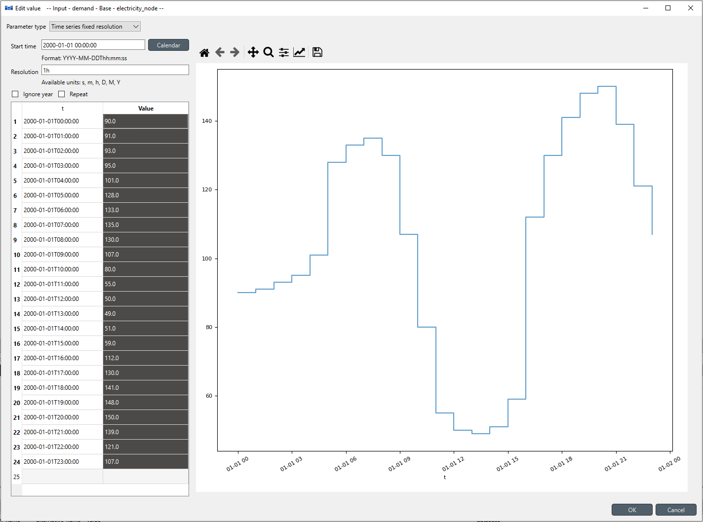

### Editing the temporal block

You might or might not notice that the Simple System has, by default, a temporal block resolution of *1D* (i.e., one day); wait, what! Yes, by default, it has *1D* in its template. So, we want to change that to *1h* since our unit commitment case study is for a day-ahead dispatch of 24 hours.

- Locate again the *Object tree* (typically at the top-left). Expand the [root] element if not expanded.
- Expand the [temporal_block] class, and select the *flat* from the expanded tree.
- Locate the *Object parameter* table (typically at the top-center).
- In the *Object parameter* table, identify the *resolution* parameter which should have a *1D* value from the Simple System first run.
- Right click on the value cell and then select *edit* from the context menu. The *Edit value* dialog will pop up.
- Change the *Duration* from *1D* to *1h* as shown in the image below.

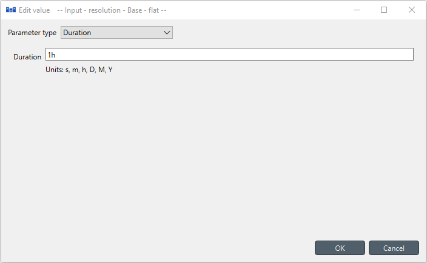

### Establishing new output relationships

Since we will have the new unit commitment variables, we want to see the results of these variables and their total cost in the objective function. So, we will create new relationships to report these results:

- In the Spine DB editor, locate the *Relationship tree* (typically at the bottom-left). Expand the *root* element if not expanded.
- Right click on the *report\_\_output* class, and select *Add relationships* from the context menu. The *Add relationships* dialog will pop up.
- Enter *report1* under *report*, and *units\_on* under *output*. Repete the same procedure for the following outputs as seen in the image below; then press *OK*.
- This will write the unit commitment variable values and costs in the objective function to the output database as a part of *report1*.

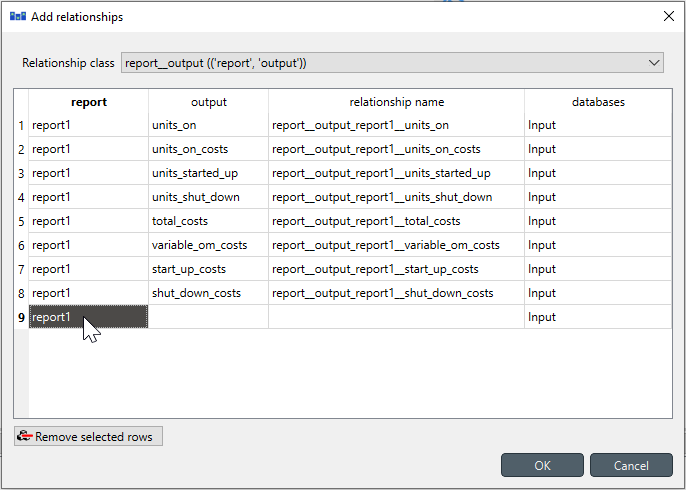

When you're ready, commit all changes to the database.

### Executing the workflow

- Go back to Spine Toolbox's main window, and hit the **Execute project** button  from the tool bar. You should see 'Executing All Directed Acyclic Graphs' printed in the *Event log* (at the bottom left by default).

- Select the 'Run SpineOpt' Tool. You should see the output from SpineOpt in the *Julia Console* after clicking the *object activity control*.

### Examining the results

- Select the output data store and open the Spine DB editor. You can already inspect the fields in the displayed tables.
- You can also activate the table view by pressing **Alt + F** for the shortcut to the hamburger menu, and select **View -> Table**.
- Remember to select the latest run in the *Alternative tree*. Expand the *Output* element if not expanded.
- In the *Relationship parameter value* table, double click in the *Time series* values to explore the results of the different variables.
- The image below shows the electricity flow results for both power plants. As expected, the *power\_plant\_a* (i.e., the cheapest unit) always covers the demand first until its maximum capacity, and then the *power\_plant\_b* (i.e., the more expensive unit) covers the demand that is left. This is the most economical dispatch since the problem has no extra constraints (so far!).

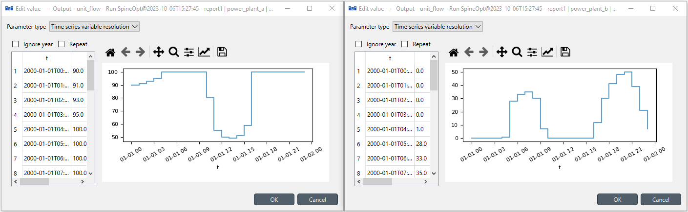

To explore the cost results, the pivot table view shows a more user-friendly option to analyze the results. Remember that you can find a description of how to create the pivot table view in the Simple System tutorial [here](https://spine-tools.github.io/SpineOpt.jl/latest/tutorial/simple_system/). The cost components in the objective function are shown in the image below. As expected, all the costs are associated with the *variable\_om\_costs* since we haven't included the unit-commitment constraints yet.

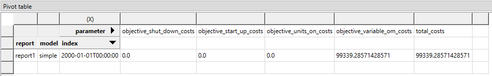

## Step 2 - Include the minimum operating point

Let's assume that the *power\_plant\_b* has a minimum operating point of *10%*, meaning that if the power plant is *on*, it must produce at least *20MW*.

### Adding the minium operating point

- In the Spine DB editor, locate the *Relationship tree* (typically at the bottom-left). Expand the *root* element if not expanded.
- In *Relationship tree*, expand the *unit\_\_to\_node* class and select *power\_plant\_b | electricity\_node*.
- In the *Relationship parameter* table (typically at the bottom-center), select the *minimum\_operating\_point* parameter and the *Base* alternative, and enter the value *0.1* as seen in the image below. This will set the minimum operating point of *power\_plant\_b* when producing electricity.

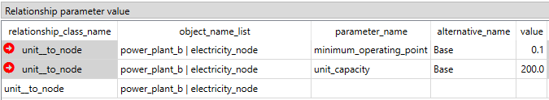

### Adding the unit commitment costs and initial states

- Locate the *Object tree* (typically at the top-left). Expand the [root] element if not expanded.
- Expand the [unit] class, and select the *power\_plant\_b* from the expanded tree.
- In the *Object parameter* table (typically at the top-center), select the following parameter as seen in the image below:
  - *online\_variable\_type* parameter and the *Base* alternative, and select the value *unit\_online\_variable\_type\_binary*. This will define that the unit commitment variables will be binary. SpineOpt identifies this situation from the input data and internally changes the model from LP to MIP.
  - *shut\_down\_cost* parameter and the *Base* alternative, and enter the value *7*. This will establish that there's a cost of '7' EUR per shutdown.
  - *start\_up\_cost* parameter and the *Base* alternative, and enter the value *5*. This will establish that there's a cost of '5' EUR per startup.
  - *units\_on\_cost* parameter and the *Base* alternative, and enter the value *3*. This will establish that there's a cost of '3' EUR per units on (e.g., idling cost).
  - *initial\_units\_on* parameter and the *Base* alternative, and enter the value *0*. This will establish that there are no units 'on' before the first time step.

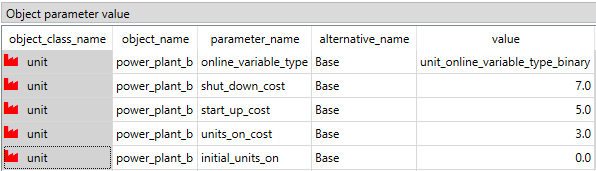

When you're ready, commit all changes to the database.

### Executing the workflow including the minimum operating point

- Go back to Spine Toolbox's main window, and hit the **Execute project** button  from the tool bar. You should see 'Executing All Directed Acyclic Graphs' printed in the *Event log* (at the bottom left by default).

- Select the 'Run SpineOpt' Tool. You should see the output from SpineOpt in the *Julia Console* after clicking the *object activity control*.

- Do you notice something different in your solver log? Depending on the solver, the output might change, but you should be able to see that the solver is using MIP to solve the problem. For instance, if you are using the solver **HiGHS** (i.e., the default solver in SpineOpt), then you will see something like *"Solving MIP model with:"* and the *Branch and Bound* (B&B) tree solution. Since this is a tiny problem, sometimes the solver can find the optimal solution from the presolve step, avoiding going into the *B&B* step.

### Examining the results including the minimum operating point

- Select the output data store and open the Spine DB editor. You can already inspect the fields in the displayed tables.
- You can also activate the table view by pressing **Alt + F** for the shortcut to the hamburger menu, and select **View -> Table**.
- Remember to select the latest run in the *Alternative tree*. Expand the *Output* element if not expanded.
- In the *Relationship parameter value* table, double click in the *Time series* values to explore the results of the different variables.
- The image below shows the electricity flow results for both power plants. Any difference? What happended to the flows in *power\_plant\_a* and *power\_plant\_b*?

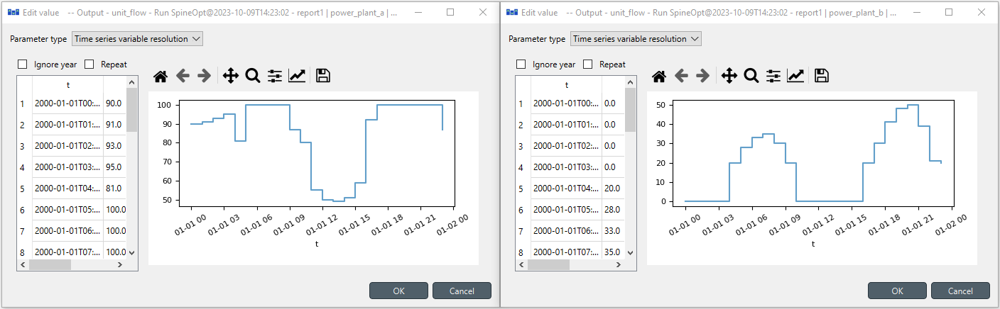

- Let's take a look to the *units\_on* and *units\_started\_up* in the image below to get wider perspective.

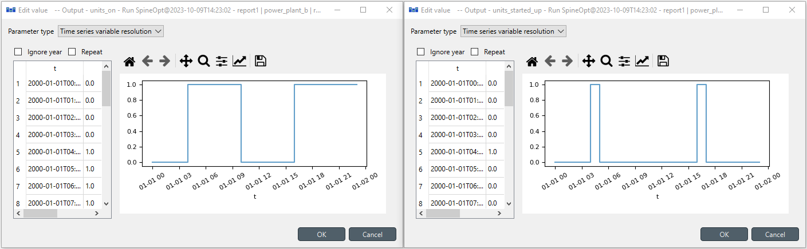

- So, since *power\_plant\_b* needs to be at least producing *20MW* when it is 'on', then *power\_plant\_a* needs to reduce its output even though it has the lower variable cost, making the total system cost (i.e., objective function) more expensive than in the previous run. The image below shows the cost components, where we can see the costs of having the *power\_plant\_b* on, its start-up and shutdown costs, and the increase in the *variable\_om\_costs* due to flow changes.

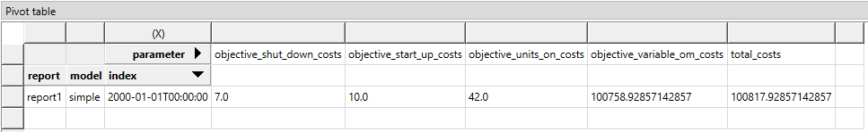

## Step 3 - Include the minimum uptime

Let's assume that the *power\_plant\_b* also has a minimum uptime of 8 hours, meaning that if the power plant starts up, it must be *on* at least eight hours.

### Adding the minimum uptime

- Locate the *Object tree* (typically at the top-left). Expand the [root] element if not expanded.
- Expand the [unit] class, and select the *power\_plant\_b* from the expanded tree.
- In the *Object parameter* table (typically at the top-center), select the *min\_up\_time* parameter, the *Base* alternative, and then right click on the value and select the *Edit* option in the context menu, as shown in the image below.

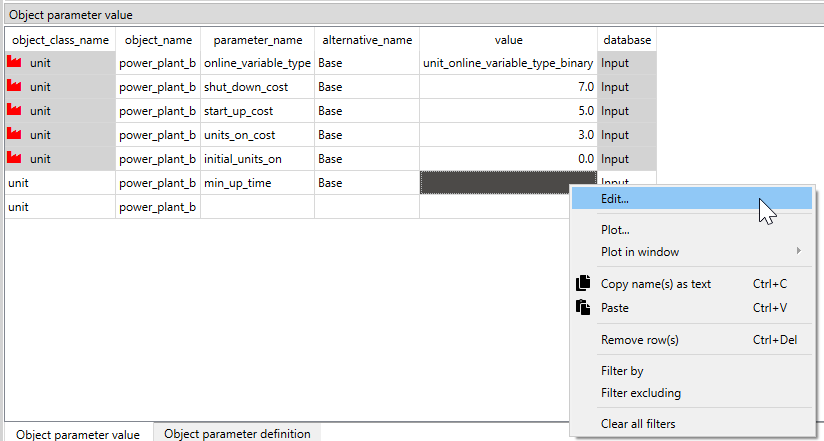

- The *Edit value* dialog will pop up. Select the *Parameter\_type* as *Duration* and enter the value *8h*. This will establish that minimum uptime is eight hours.

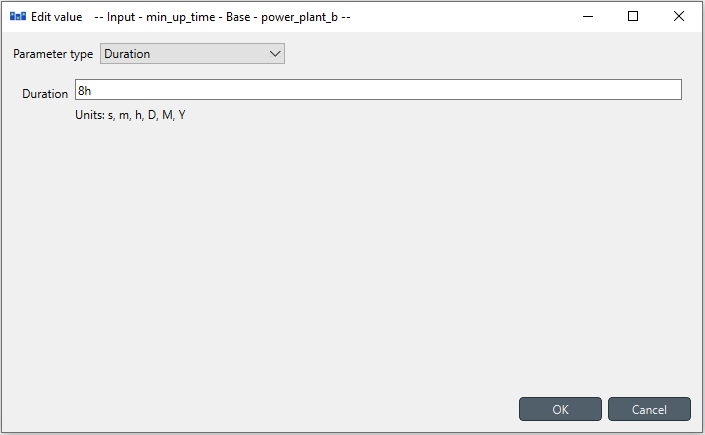

When you're ready, commit all changes to the database.

### Executing the workflow including the minimum uptime

You know the drill, go ahead :wink:

### Examining the results including the minimum uptime

- Select the output data store and open the Spine DB editor. You can already inspect the fields in the displayed tables.
- You can also activate the table view by pressing **Alt + F** for the shortcut to the hamburger menu, and select **View -> Table**.
- Remember to select the latest run in the *Alternative tree*. Expand the *Output* element if not expanded.
- In the *Relationship parameter value* table, double click in the *Time series* values to explore the results of the different variables.
- The image below shows the electricity flow results for both power plants. Interesting. Don't you think?

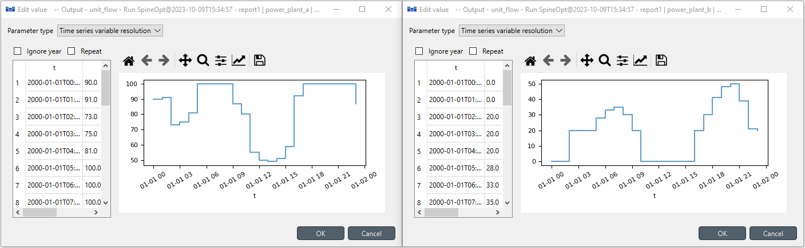

- Let's take a look again to the *units\_on* and *units\_started\_up* in the image below.

- So, since *power\_plant\_b* needs to be at least producing *20MW* when it is 'on' and also needs to be at least *8h* 'on' each time it starts, then *power\_plant\_b* starts even before the demand is greater than the capacity of *power\_plant\_a*. Therefore, *power\_plant\_a* needs to reduce even further its output, making the total system cost more expensive than in the previous runs. The image below shows the cost components, where we can see the costs of having the *power\_plant\_b* on, its start-up and shutdown costs, and the increase in the *variable\_om\_costs* due to flow changes.

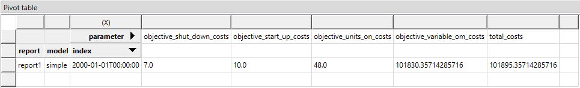

## Step 4 - Include the minimum downtime

Let's assume that the *power\_plant\_b* also has a minimum downtime of 8 hours, meaning that if the power plant shuts down, it must be *off* at least eight hours.

### Adding the minimum downtime

- Locate the *Object tree* (typically at the top-left). Expand the [root] element if not expanded.
- Expand the [unit] class, and select the *power\_plant\_b* from the expanded tree.
- In the *Object parameter* table (typically at the top-center), select the *min\_down\_time* parameter, the *Base* alternative, and then right click on the value and select the *Edit* option in the context menu, as shown in the image below.

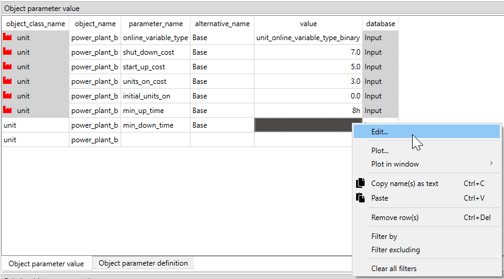

- The *Edit value* dialog will pop up. Select the *Parameter\_type* as *Duration* and enter the value *8h*. This will establish that minimum downtime is eight hours.

When you're ready, commit all changes to the database.

### Executing the workflow including the minimum downtime

One last time, don't give up!

### Examining the results including the minimum downtime

- Select the output data store and open the Spine DB editor. You can already inspect the fields in the displayed tables.
- You can also activate the table view by pressing **Alt + F** for the shortcut to the hamburger menu, and select **View -> Table**.
- Remember to select the latest run in the *Alternative tree*. Expand the *Output* element if not expanded.
- In the *Relationship parameter value* table, double click in the *Time series* values to explore the results of the different variables.
- The image below shows the electricity flow results for both power plants. Wow! This result is even more interesting :stuck_out_tongue_winking_eye:. Do you know what happened?

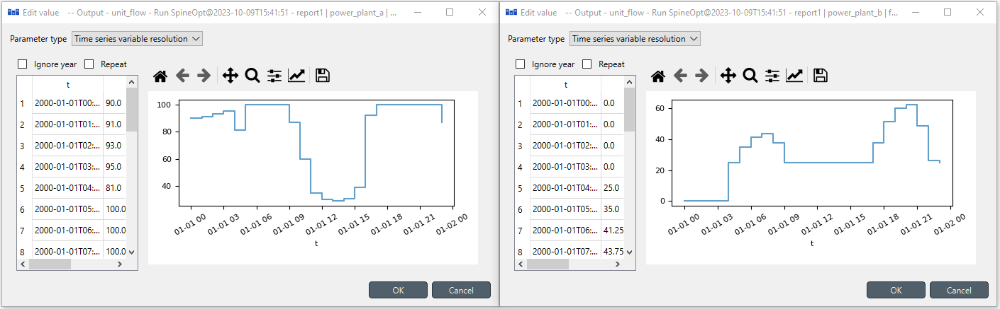

- Let's take a look again to the *units\_on* and *units\_started\_up* in the image below. Instead of two start-ups, the *power\_plant\_b* only starts once. Why?

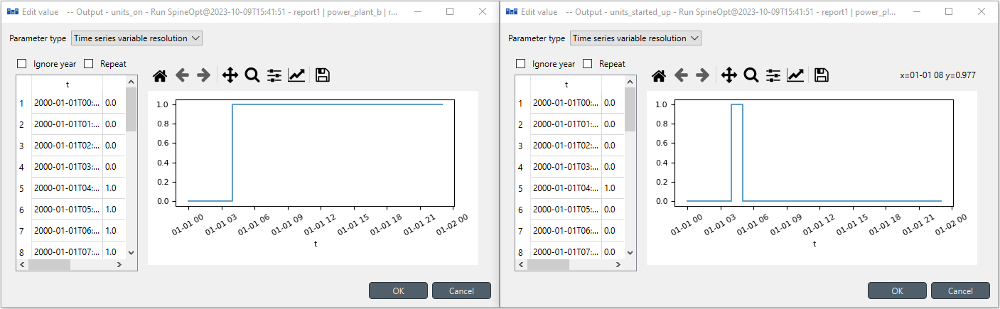

- Since *power\_plant\_b* needs to be at least producing *20MW* when it is 'on' plus also needs to be at least *8h* 'on' each time it starts, and it needs to be at least *8h* 'off' if it shutdowns, then *power\_plant\_b* never shuts down and stays 'on' after it starts because it is the only way to fulfil the unit commitment constraints. Therefore, *power\_plant\_a* needs to reduce even further its output, making the total system cost more expensive than in the previous runs. The image below shows the cost components, where we can see the costs of having the *power\_plant\_b* on, its start-up and shutdown costs (which is zero this time), and the increase in the *variable\_om\_costs* due to flow changes.

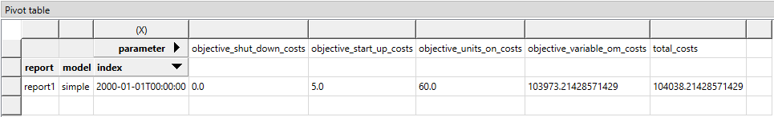

If you have completed this tutorial, congratulations! You have mastered the basic concepts of unit commitment using SpineToolbox and SpineOpt. Keep up the good work!
